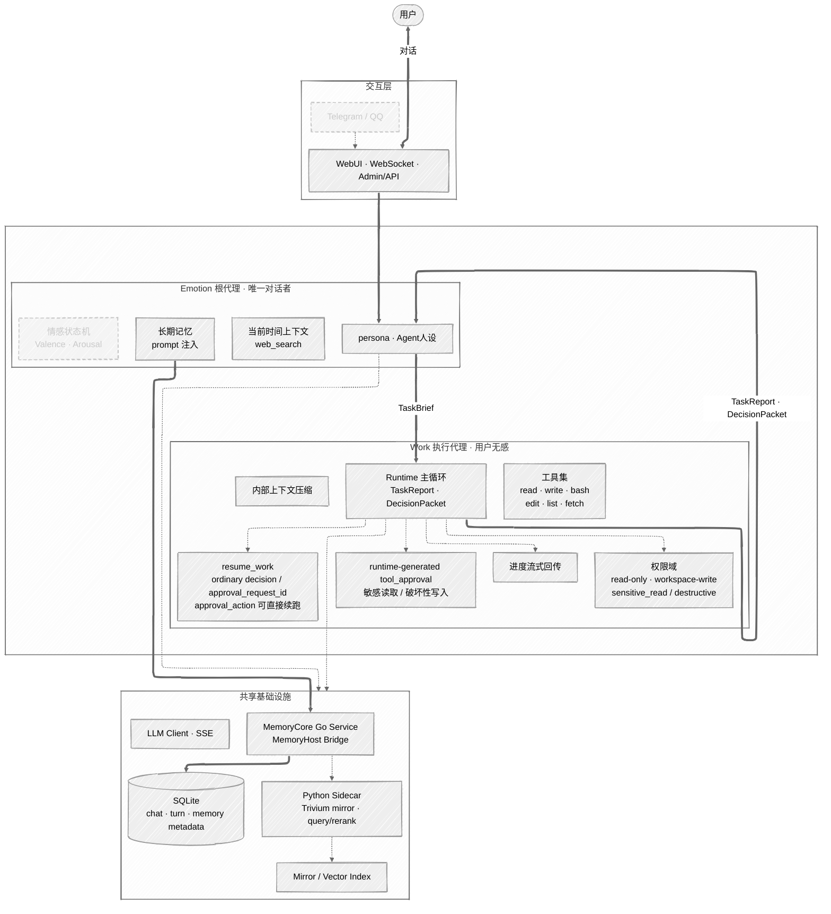
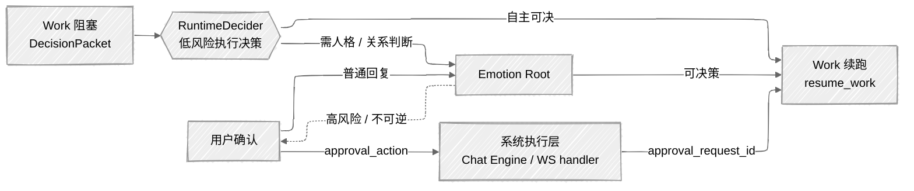

# EmoAgent

> **"构建一个会陪伴的存在"**

EmoAgent 是一个部署在本地的个人情感陪伴 Agent。它有记忆、有性格、有情感连续性 —— 用户在与它交互时，能感受到"被关心"和"被记住"。同时它也具备任务执行能力，能在不破坏陪伴对话连贯性的前提下，完成文件处理等工作。

## 设计理念

**会话所有权不可转移** — 用户永远在和同一个"人"对话。Emotion 根代理层始终拥有会话，Work 执行代理仅在幕后工作，用户无感知。

**上下文隔离** — 工具执行的噪音（文件内容、搜索结果、错误堆栈）不会涌入主对话。Emo层的世界里只有用户、记忆和关系；Work 的世界里只有任务、工具和结果。

**记忆是关系的载体，不是日志** — 长期记忆服务于"关系感"，执行日志归执行日志。两者的写入路径被架构显式分离。

**表达控制归 Emotion** — Work 只接收任务语义与执行约束，不接收人格派生的文风 side channel。若任务产物本身需要“正式”“简短”等风格要求，必须写进 `goal`、`background` 或 `constraints`，最终对用户的表达仍由 Emotion 统一组织。

## 系统架构

> 虚线节点 = 规划中；点线箭头 = 可降级的外部增强依赖；粗箭头 = 核心协议流。



### 决策升级流（Work 阻塞时）



三层递进：先由 Work 运行时的 **RuntimeDecider** 自主决断执行细节；需要人格或关系上下文时升级到 **Emotion**；涉及高风险或不可逆操作时再升级到 **用户**。区别在于恢复执行现在分两条路径：普通决策与 `permission_escalation_required` 仍由 Emotion 调用 `resume_work`；审批门控的 `tool_approval` 在用户点击审批后，由系统执行层直接携带 `approval_request_id` 续跑 Work，再把恢复结果交回 Emotion 组织最终对外表达。每一层的决策都以 `append-only` 的 Resume Note 注入 Work 原上下文，不泄漏工具痕迹。

详细架构设计见 [docs/architecture/架构.md](docs/architecture/架构.md)

## 当前状态

WebUI、Admin API、Session、Persona、Work 运行时、工具审批、Turn Pipeline、长期记忆桥、异步记忆抽取队列和 MemoryCore 集成已接入。

长期记忆的权威层： MemoryCore Go Service + SQLite。
Python sidecar 是 loopback HTTP 增强依赖，用于 Trivium mirror、query analysis / rerank 等能力；EmoAgent 会读取 sidecar URL 并调用它，但不会在自身启动流程中自动拉起 Python sidecar。

插件系统已有实验骨架：`internal/plugin` 提供 hook bus、能力声明、内置插件和 Turn stage / outbound sink 包裹能力；默认配置里 `plugins.enabled: false`，适合继续作为受控实验开关。

## 运行与配置

最小开发命令：

```powershell
go run ./cmd/emoagent -config ./config.yaml
go build -o ./bin/emoagent ./cmd/emoagent
go test ./...
```

默认服务监听 `127.0.0.1:8080`。WebUI 和 Admin 静态资源通过 `embed.FS` 打包在 Go 二进制内。

主要配置入口：

- `config.yaml`：EmoAgent 外层配置，包含 server、LLM provider、agent/persona、Turn Pipeline、plugins、memory、work、db、websearch、bash。
- `config/memorycore.yaml`：MemoryCore 配置，包含 MemoryCore SQLite、retrieval、query analysis、sidecar、mirror、write policy。
- `config/memory_manual_rules.yaml`：手动记忆固定和忘记规则。

当 `memory.enabled=true` 时，EmoAgent 会通过 `memoryhost.OpenFromConfig` 打开 MemoryCore。当前 `config.yaml` 依赖默认 `memory.config_path=./config/memorycore.yaml`；如果改成显式配置，必须保持该路径有效。

## 长期记忆链路

聊天热路径只追加 user / assistant episode，并在回复前检索长期记忆 prompt block；抽取 LLM 不在聊天热路径同步执行。更多 prompt 注入细节见 [docs/emoagent_integration.md](docs/emoagent_integration.md)。

抽取由 EmoAgent 侧 `memory_extraction_jobs` 队列驱动：

- session finalize、手动固定记忆、扫描记忆按钮/API、idle scheduler 都会入队抽取 job。
- 后台 worker claim job 后调用 MemoryCore `RunExtraction`。
- apply 成功后默认触发 `RunMirrorSync`。
- mirror / sidecar 失败默认只记录 degraded 结果，不影响 SQLite 权威抽取成功，除非显式配置为 fail-closed。

可观察和手动触发入口：

- `POST /api/memory/extractions`
- `GET /api/memory/extractions`
- `GET /api/memory/segments?session_id=...`

## Web、工具与审批

HTTP API 覆盖 LLM providers、agent configs、chat settings、personas、sessions、approvals、memory extractions 和 memory segments。WebSocket `/ws` 支持 session resume、persona query、流式输出、工具/推理活动和审批事件。

内置工具包括 `get_current_time`、`read_file`、`list_dir`、`write_file`、`edit_file`、`web_search`、`web_fetch`、`bash`。其中 `web_search`、`web_fetch`、`bash` 按配置和 provider 可用性注册。`read_file` / `list_dir` 支持 `read_scope=workspace|all`；外部敏感读取和破坏性写入都会进入 `tool_approval`。

## 技术栈

|        | 选型                                                     |
|--------|----------------------------------------------------------|
| 主语言    | Go（单二进制部署）                                           |
| AI 工具链 | MemoryCore Go Service；Python Sidecar 作为可降级 loopback 增强 |
| 存储     | SQLite（chat / turn / memory metadata / MemoryCore authority） |
| LLM    | HTTP + SSE 流式，兼容 OpenAI / Anthropic 协议               |
| 前端     | 轻量 WebUI + Admin API，embed.FS 打包                       |

## Roadmap

- [x] Phase 0 · 基础实验 — 基于 [learn-claude-code](https://github.com/shareAI-lab/learn-claude-code) 构建最小 Harness 原型
- [x] Phase 1 · 架构设计 — 确定 Emotion + Work 双核架构方案
- [x] Phase 2 · 基础骨架 — Go 项目结构、配置、日志、SQLite、LLM Client
- [x] Phase 3 · 主循环、persona、Session、WebSocket 聊天界面
  - [x] 主循环
  - [x] 人格注入
  - [x] Session 对话记录
  - [x] WebUI 管理页面
  - [x] WebSocket 聊天界面
  - [x] Persona 切换
  - [x] 对话管理 --消息恢复、默认Persona选择、greeting是否显示
- [x] Phase 4 · 工具系统 — Tool 定义规范、Handler 注册、内置基础工具
  - [x] 工具框架、注册
  - [x] `Dispatcher.ClassifyCall` 单入口权限分类与工具自声明 `DestructiveClassifier`
  - [x] 基础工具 -- 时间获取、web_search
  - [ ] 额外内置工具 -- calculator、memory_note、set_reminder
  - [x] Worker工具 -- read_file、write_file、bash、edit_file、list_dir、web_fetch
  - [x] `read_scope=workspace|all` 与敏感读取审批
  - [ ] Worker -- deep_search
- [x] Phase 5 · 上下文管理 — Token 估算、摘要压缩、KeepRecent 策略
- [x] Phase 6 · Work 运行时 / Turn Pipeline — TaskReport、DecisionPacket、权限域、审批续跑
  - [x] TaskReport
  - [x] DecisionPacket
  - [x] 自循环执行
  - [x] 完整工具
  - [x] 决策升级
    - [x] 三层决策流：RuntimeDecider（低风险执行决策）→ Emotion Root（人格/关系上下文决策）→ User（必要时确认）
    - [x] `resume_work` 普通决策续跑 / `approval_request_id` 续跑
    - [x] `PendingRegistry`（内存态 TTL）与 Resume Note 注入：支持跨轮恢复，不泄漏 Work 原始工具痕迹
    - [x] 风险与不可逆操作升级到 Emotion/User 确认
    - [x] runtime-generated `tool_approval` 用于 destructive calls
    - [x] 适当扩展 max tool rounds
    - [x] 增强 Work 对系统环境的判断，针对环境确定使用的 bash，减少试错
    - [x] 优先用专用文件工具，避免写临时脚本再删脚本
    - [x] 操作副产物 task_report 日志位置调整
    - [x] Paused 持久化
  - [x] Work 进度流式回传
  - [x] 内部上下文压缩
  - [x] Turn Pipeline 配置、journal、idempotency、memory/approval stages
- [x] Phase 7 · 长期记忆系统 — MemoryCore 集成、prompt 注入、异步抽取、mirror sync
  - [x] MemoryHost Bridge 与 MemoryCore Go Service 集成
  - [x] 长期记忆 prompt 注入与当前轮 episode 排除
  - [x] `memory_segments` 与 `memory_extraction_jobs` 队列
  - [x] 后台 extraction worker、idle scheduler、manual scan API
  - [x] 手动固定记忆与手动忘记预览/确认
  - [x] Python sidecar / Trivium mirror 配置接入
  - [ ] sidecar 一键监督启动与操作文档完善
- [x] Phase 8 · 插件接口实验骨架
  - [x] PluginHost、HookBus、能力声明和内置插件加载
  - [x] Turn stage / outbound sink / tool hook 包裹
  - [ ] 外部插件 runner 与资源隔离
- [ ] MVP 剩余项
- [ ] 情感状态机（Valence/Arousal 2D 模型）
- [ ] 第三方平台接入（Telegram / QQ）
- [ ] 定时任务 / 主动关心

## 灵感来源

- [learn-claude-code](https://github.com/shareAI-lab/learn-claude-code) — Harness 工程理念
- [PeroCore](https://github.com/YoKONCy/PeroCore) — 记忆系统参考
- [AstrBot](https://github.com/AstrBotDevs/AstrBot) — 多平台 Bot 架构参考


## License

Apache-2.0
