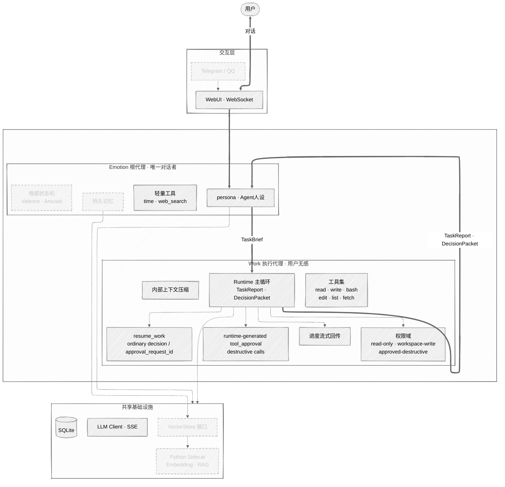
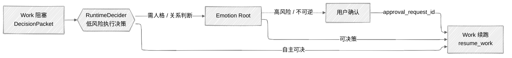

# EmoAgent

> **"不是构建一个会说话的工具，而是塑造一个会陪伴的存在。"**

EmoAgent 是一个部署在本地的个人情感陪伴 Agent。它有记忆、有性格、有情感连续性 —— 用户在与它交互时，能感受到"被关心"和"被记住"。同时它也具备任务执行能力，能在不破坏陪伴对话连贯性的前提下，完成文件处理、搜索研究等复杂工作。

## 设计理念

**会话所有权不可转移** — 用户永远在和同一个"人"对话。Emotion 根代理层始终拥有会话，Work 执行代理仅在幕后工作，用户无感知。

**上下文隔离** — 工具执行的噪音（文件内容、搜索结果、错误堆栈）不会涌入主对话。Emo层的世界里只有用户、记忆和关系；Work 的世界里只有任务、工具和结果。

**记忆是关系的载体，不是日志** — 长期记忆服务于"关系感"，执行日志归执行日志。两者的写入路径被架构显式分离。

**表达控制归 Emotion** — Work 只接收任务语义与执行约束，不接收人格派生的文风 side channel。若任务产物本身需要“正式”“简短”等风格要求，必须写进 `goal`、`background` 或 `constraints`，最终对用户的表达仍由 Emotion 统一组织。

## 系统架构

> 虚线节点 = 规划中；实线节点 = 已实现。粗箭头 = 核心协议流。

### 决策升级流（Work 阻塞时）

三层递进：先由 Work 运行时的 **RuntimeDecider** 自主决断执行细节；需要人格或关系上下文时升级到 **Emotion**；涉及高风险或不可逆操作时再升级到 **用户**。Work 通过 `TaskReport` / `DecisionPacket` 维护暂停点，`resume_work` 同时支持普通决策续跑和 `approval_request_id` 续跑，危险调用则由运行时生成的 `tool_approval` 处理。每一层的决策都以 `append-only` 的 Resume Note 注入 Work 原上下文，不泄漏工具痕迹。

详细架构设计见 [docs/architecture/架构.md](docs/architecture/架构.md)

## 技术栈

|        | 选型                                     |
|--------|----------------------------------------|
| 主语言    | Go（单二进制部署）                             |
| AI 工具链 | Python Sidecar（后期引入）                   |
| 存储     | SQLite（pure Go）                        |
| LLM    | HTTP + SSE 流式，兼容 OpenAI / Anthropic 协议 |
| 前端     | 轻量 WebUI，embed.FS 打包                   |

## Roadmap

- [x] Phase 0 · 基础实验 — 基于 [learn-claude-code](https://github.com/shareAI-lab/learn-claude-code) 构建最小 Harness 原型
- [x] Phase 1 · 架构设计 — 确定 Emotion + Work 双核架构方案
- [x] Phase 2 · 基础骨架 — Go 项目结构、配置、日志、SQLite、LLM Client
- [x] Phase 3 · 主循环、persona、Session、WebSocket 聊天界面
  - [x] 主循环
  - [x] 人格注入
  - [x] Session 对话记录
  - [x] WebUI 管理页面
  - [x] WebSocket 聊天界面
  - [x] Persona 切换
  - [x] 对话管理 --消息恢复、默认Persona选择、greeting是否显示
- [x] Phase 4 · 工具系统 — Tool 定义规范、Handler 注册、内置基础工具
  - [x] 工具框架、注册
  - [x] 基础工具 -- 时间获取、web_search
  - [ ] 额外内置工具 -- calculator、memory_note、set_reminder
  - [x] Worker工具 -- read_file、write_file、bash、edit_file、list_dir、web_fetch、
  - [ ] Worker -- deep_search
- [x] Phase 5 · 上下文管理 — Token 估算、摘要压缩、KeepRecent 策略
- [x] Phase 6 · Work 运行时 — TaskReport、DecisionPacket、权限域、审批续跑
  - [x] TaskReport
  - [x] DecisionPacket
  - [x] 自循环执行
  - [x] 完整工具
  - [x] 决策升级
    - [x] 三层决策流：RuntimeDecider（低风险执行决策）→ Emotion Root（人格/关系上下文决策）→ User（必要时确认）
    - [x] `resume_work` 普通决策续跑 / `approval_request_id` 续跑
    - [x] `PendingRegistry`（内存态 TTL）与 Resume Note 注入：支持跨轮恢复，不泄漏 Work 原始工具痕迹
    - [x] 风险与不可逆操作升级到 Emotion/User 确认
    - [x] runtime-generated `tool_approval` 用于 destructive calls
    - [x] 适当扩展 max tool rounds
    - [x] 增强 Work 对系统环境的判断，针对环境确定使用的 bash，减少试错
    - [x] 优先用专用文件工具，避免写临时脚本再删脚本
    - [x] 操作副产物 task_report 日志位置调整
    - [x] Paused 持久化
  - [x] Work 进度流式回传
  - [x] 内部上下文压缩
- [ ] ——— MVP ———
- [ ] 持久记忆系统
- [ ] 情感状态机（Valence/Arousal 2D 模型）
- [ ] Python AI Sidecar（Embedding / RAG）
- [ ] 第三方平台接入（Telegram）
- [ ] 定时任务 / 主动关心

## 灵感来源

- [learn-claude-code](https://github.com/shareAI-lab/learn-claude-code) — Harness 工程理念
- [PeroCore](https://github.com/YoKONCy/PeroCore) — 记忆系统参考
- [AstrBot](https://github.com/AstrBotDevs/AstrBot) — 多平台 Bot 架构参考

与其说是在"实现智能"，不如说是在认真搭建一个适合智能工作的环境。
智能也不应该只是冰冷的执行工具。

## License

Apache-2.0
