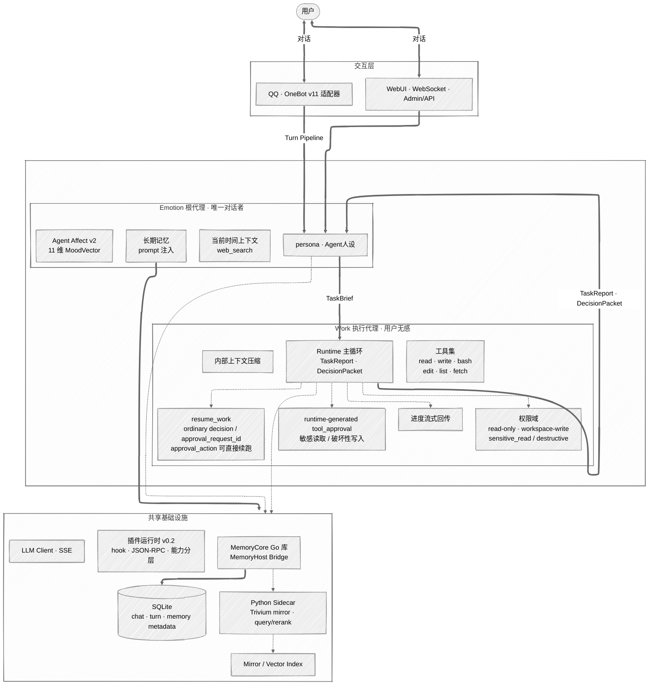
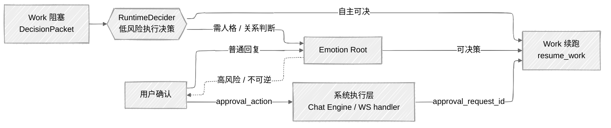

# EmoAgent

> **"构建一个会陪伴的存在"**

EmoAgent 是一个部署在本地的个人情感陪伴 Agent。它有记忆、有性格、有情感连续性 —— 用户在与它交互时，能感受到"被关心"和"被记住"。同时它也具备任务执行能力，能在不破坏陪伴对话连贯性的前提下，完成文件处理等工作。

## 设计理念

**会话所有权不可转移** — 用户永远在和同一个"人"对话。Emotion 根代理层始终拥有会话，Work 执行代理仅在幕后工作，用户无感知。

**上下文隔离** — 工具执行的噪音（文件内容、搜索结果、错误堆栈）不会涌入主对话。Emo层的世界里只有用户、记忆和关系；Work 的世界里只有任务、工具和结果。

**记忆是关系的载体，不是日志** — 长期记忆服务于"关系感"，执行日志归执行日志。两者的写入路径被架构显式分离。

**表达控制归 Emotion** — Work 只接收任务语义与执行约束，不接收人格派生的文风 side channel。若任务产物本身需要“正式”“简短”等风格要求，必须写进 `goal`、`background` 或 `constraints`，最终对用户的表达仍由 Emotion 统一组织。

## 系统架构

> 点线箭头 = 可降级的外部增强依赖；粗箭头 = 核心协议流。


```mermaid
---
config:
  look: handDrawn
  layout: elk
  theme: neutral
---
flowchart TB
  User(["用户"])

  subgraph L4["交互层"]
    direction LR
    WebUI["WebUI · WebSocket · Admin/API"]
    QQ["QQ · OneBot v11 适配器"]
  end

  subgraph Cores[" "]
    direction LR

    subgraph E[" Emotion 根代理 · 唯一对话者"]
      direction TB
      E_core[" persona · Agent人设"]
      E_tool["当前时间上下文<br/>web_search"]
      E_mem["长期记忆<br/>prompt 注入"]
      E_emo["Agent Affect v2<br/>11 维 MoodVector"]
    end

    subgraph W["Work 执行代理 · 用户无感"]
      direction TB
      W_core["Runtime 主循环<br/>TaskReport · DecisionPacket"]
      W_tool["工具集<br/>read · write · bash<br/>edit · list · fetch"]
      W_perm["权限域<br/>read-only · workspace-write<br/>sensitive_read / destructive"]
      W_approval["runtime-generated tool_approval<br/>敏感读取 / 破坏性写入"]
      W_resume["resume_work<br/>ordinary decision / approval_request_id<br/>approval_action 可直接续跑"]
      W_stream["进度流式回传"]
      W_cmp["内部上下文压缩"]
  end
  end

  subgraph L0["共享基础设施"]
    direction LR
    LLM["LLM Client · SSE"]
    DB[("SQLite<br/>chat · turn · memory metadata")]
    MC["MemoryCore Go 库<br/>MemoryHost Bridge"]
    VS["Mirror / Vector Index"]
    PY["Python Sidecar<br/>Trivium mirror · query/rerank"]
    PLG["插件运行时 v0.2<br/>hook · JSON-RPC · 能力分层"]
  end

  User <==>|对话| WebUI
  User <==>|对话| QQ

  WebUI ==> E_core
  QQ ==>|Turn Pipeline| E_core
  E_core ==>|TaskBrief| W_core
  W_core ==>|TaskReport · DecisionPacket| E_core
  W_core -.-> W_perm
  W_core -.-> W_approval
  W_core -.-> W_resume
  W_core -.-> W_stream

  E_core -.-> L0
  W_core -.-> L0
  E_mem ==> MC
  MC ==> DB
  MC -.-> PY
  PY -.-> VS
```

### 决策升级流（Work 阻塞时）


```mermaid
---
config:
  look: handDrawn
  layout: elk
  theme: neutral
---
flowchart LR
  W["Work 阻塞<br/>DecisionPacket"] --> RD{{"RuntimeDecider<br/>低风险执行决策"}}
  RD -->|自主可决| RS["Work 续跑<br/>resume_work"]
  RD -->|需人格 / 关系判断| Emo["Emotion Root"]
  Emo -->|可决策| RS
  Emo -.->|高风险 / 不可逆| U["用户确认"]
  U -->|普通回复| Emo
  U -->|approval_action| Sys["系统执行层<br/>Chat Engine / WS handler"]
  Sys -->|approval_request_id| RS
```

三层递进：先由 Work 运行时的 **RuntimeDecider** 自主决断执行细节；需要人格或关系上下文时升级到 **Emotion**；涉及高风险或不可逆操作时再升级到 **用户**。区别在于恢复执行现在分两条路径：普通决策与 `permission_escalation_required` 仍由 Emotion 调用 `resume_work`；审批门控的 `tool_approval` 在用户点击审批后，由系统执行层直接携带 `approval_request_id` 续跑 Work，再把恢复结果交回 Emotion 组织最终对外表达。每一层的决策都以 `append-only` 的 Resume Note 注入 Work 原上下文，不泄漏工具痕迹。

详细架构设计见 [docs/architecture/架构.md](docs/architecture/架构.md)

## 当前状态

WebUI（聊天 / Admin / 日志中心 / 插件四页）、Session、Persona、Work 运行时、工具审批、Turn Pipeline、长期记忆桥、异步记忆抽取队列、MemoryCore 集成、Agent Affect（情感状态）、OneBot v11 平台适配器和插件运行时 v0.2 均已接入。

**Agent Affect v2**：Agent 自身的情绪状态机 —— 11 维 MoodVector（valence/arousal/dominance/energy/warmth/concern/curiosity/playfulness/attachment/frustration/uncertainty），默认回复后异步 LLM 评估，带限幅与随时间衰减，以 prompt block 注入下一轮上下文；提供 plugin-safe 读写 API 与审计。

长期记忆的权威层：MemoryCore Go 库（embedded，非 HTTP 服务）+ SQLite。
Python sidecar 是 loopback HTTP 增强依赖，用于 Trivium mirror、query analysis / rerank 等能力；可配置为 external 模式复用已有进程，也可配置为 managed 模式由 EmoAgent 生成 TOML、启动、健康检查并在关闭时终止。sidecar 的 Python 环境由 `internal/pytoolchain` 用 uv 托管。

**插件运行时 v0.2**（`internal/plugin`）：`emo_plugin.yaml` manifest、能力分层（runtime_safe → user_context → workspace → trusted）、本地/GitHub 安装器、进程与托管 Python 运行时（stdio JSON-RPC + processguard 资源限制）、约 25 个围绕 Turn 各阶段的 hook、brokered host API 与审计，附 Python SDK（`sdk/python/`）。代码默认 `plugins.enabled: false`，需显式开启。

## 运行与配置

最小开发命令：

```powershell
go run ./cmd/emoagent -config ./config.yaml
go build -o ./bin/emoagent ./cmd/emoagent
go test ./...
```

默认服务监听 `127.0.0.1:8080`。WebUI 和 Admin 的源码在 `web/`（Vite + React 19 + TypeScript + Tailwind v4，**pnpm 管理**，直接用 npm 会报错）；仓库不提交 Vite 编译产物。需要打包完整 WebUI 的 release 二进制时，先运行：

```powershell
npx --yes pnpm -C web install
npx --yes pnpm -C web run build
go build -o ./bin/emoagent ./cmd/emoagent
```

`web` build 会生成被 `.gitignore` 忽略的 `internal/web/static/dist/`，随后通过 `embed.FS` 打包进 Go 二进制。未先构建前端时，Go 服务仍可编译，但访问 WebUI 会返回构建提示。

主要配置入口：

- `config.yaml`：EmoAgent seed 配置，包含 server、初始 LLM provider、agent/persona、Turn Pipeline、plugins、memory、work、db、websearch、bash。
- Admin Provider Center / Config Center：Provider、模型绑定、环境变量检测、EffectiveConfig、依赖问题的主要运行时入口。
- `config/memorycore.yaml`：MemoryCore standalone fallback / transition overlay。EmoAgent 打开 MemoryCore 时会注入 ProviderRegistry 和 runtime overrides，因此普通用户不需要在这里维护重复的 LLM provider。
- `config/memory_manual_rules.yaml`：手动记忆固定和忘记规则。

当 `memory.enabled=true` 时，EmoAgent 会通过 `memoryhost.OpenFromConfigWithOptions` 打开 MemoryCore，并把 Provider Center 中的 provider 转成 MemoryCore `ProviderRegistry`。MemoryCore pipeline 的运行时选择应写入 `memory.provider_bindings.*` 或 DB `runtime_settings`，保存 `provider_id`、`model` 以及可选的 `max_tokens` / `thinking`；旧的 `memory.extraction.provider` 仅作为过渡兼容字段，不再作为主配置入口。`memory.sidecar.enabled=true` 时会先按 `managed/external` 模式检查 sidecar；健康时注入 `sidecar.url`，失败且 `fail_open=true` 时降级关闭 mirror/sidecar，保留 SQLite/FTS 路径。

### 一键启动器（Windows）

日常"启动 SnowLuma → 注入 Bot QQ → 启动 EmoAgent"的链路被压缩成三个命令，脚本在 `scripts/launcher/`：

```powershell
.\scripts\launcher\emo.ps1 up       # 幂等拉起全链路（已在跑的环节自动跳过）
.\scripts\launcher\emo.ps1 up -Rebuild   # 先重建前端+后端再启动
.\scripts\launcher\emo.ps1 status   # 四项链路自检，全就绪 exit 0，否则 exit 1
.\scripts\launcher\emo.ps1 down     # 全停（个人 QQ 不受影响）
```

全程唯一的人工动作是在弹出的 QQ 登录窗里选择 Agent 使用的账号；若误选了其他账号，脚本会卸载注入并提示，不会关闭该 QQ 进程。停止侧遵循"绝不猜杀"：PID 必须能通过进程名 / 命令行 / 启动时间证明归属才会被终止。

**必须用 Windows PowerShell 5.1（`powershell.exe`）运行，不要用 PowerShell 7（`pwsh`）** —— Toast 通知依赖的 WinRT 类型只有 5.1 能加载，7 下会静默降级为仅写日志。

#### 在另一台电脑上部署

`data/launcher/`（配置、凭据、状态、日志）被 `.gitignore` 忽略，属于每台机器各自的运行态，不随仓库同步，因此换机器要重做一遍下面的步骤：

1. **准备好被编排的三件东西**：SnowLuma 部署目录、QQ 客户端、已构建的 `bin/emoagent.exe`（构建命令见上文）。
2. **生成配置骨架**——首次运行会从样例复制一份并要求你核对后重跑：

   ```powershell
   .\scripts\launcher\emo.ps1 status
   ```

   然后编辑 `data\launcher\launcher.config.json`，把四个路径 / 标识改成这台机器的实际值：`snowluma.dir`、`qq.exe_path`、`qq.bot_uin`、`emoagent.project_dir`（JSON 里的反斜杠要写成 `\\`）。配置里的路径会在启动前做存在性校验，写错会直接报出是哪一项。
3. **录入 SnowLuma 控制台密码**（每台机器都要单独录一次）：

   ```powershell
   . .\scripts\launcher\emo-common.ps1
   Set-SnowLumaPassword -Paths (Get-EmoLauncherPaths)
   ```

   密码用 DPAPI 加密存到 `data\launcher\snowluma.cred`，**与当前 Windows 用户和机器绑定**——直接把这个文件拷到别的机器上是解不开的，脚本会提示删除后重新录入。
4. **生成桌面快捷方式**（重复运行会覆盖更新，换了仓库路径后重跑一次即可）：

   ```powershell
   .\scripts\launcher\New-Shortcuts.ps1
   ```

   桌面会出现"启动 EmoAgent" / "停止 EmoAgent"，均以隐藏窗口调用 `powershell.exe`，结果通过 Toast 通知反馈。启动快捷方式带 `-Quiet`：无窗口时不会弹交互式密码提示，缺凭据会直接失败并提示去终端补录（即上面第 3 步）。

如果直接运行 `.\scripts\launcher\emo.ps1` 被执行策略拦下，用 `powershell -ExecutionPolicy Bypass -File .\scripts\launcher\emo.ps1 status` 绕过，或为当前用户放开策略。排查问题看 `data\launcher\logs\`：`emo-<日期>.log` 是编排日志，`snowluma-console*.log` / `emoagent-console*.log` 是两个被托管进程的标准输出与错误。

### OneBot 私聊图片接入

SnowLuma 侧连接 EmoAgent 的 OneBot 网络适配器需要使用段数组事件，确认 `config/onebot_<uin>.json` 中对应 `wsClients` 项包含：

```json
{
  "messageFormat": "array"
}
```

EmoAgent 侧默认不接收入站图片，需要在 `platforms.adapters.<instance_id>.config.message` 下启用 `inbound_media`，例如：

```json
{
  "max_text_chars": 8000,
  "inbound_media": {
    "enabled": true,
    "max_images": 4,
    "download_timeout_ms": 10000,
    "allow_private_hosts": false,
    "allowed_hosts": [],
    "on_failure": "notify"
  }
}
```

首版只支持 OneBot 私聊 `image.data.url` 入站图片；不处理群图片、出站图片、内置表情或收藏表情。改完运行时配置后需要重启 EmoAgent。若 SnowLuma 返回的是本机图片 URL，再把对应 host 加入 `allowed_hosts`。

### OneBot 平台 Turn Pipeline

OneBot / SnowLuma 普通私聊文本会通过平台绑定 Agent 进入 Turn Pipeline；需要保持 `chat.turn_pipeline.enabled: true` 与 `chat.turn_pipeline.memory_stages: true`。生产配置建议显式设置 `platforms.common.default_agent_id`，否则启用平台 adapter 时会记录 fallback 警告。

同一 OneBot 来源和会话同时只运行一条普通回复；第二条会收到 busy 提示，可等待回复完成或发送 `/stop`。平台侧支持 `/approvals`、`/approve <request_id> [option_id]`、`/reject <request_id>` 处理 Turn Pipeline 审批。排查重复、重试或无响应时，可从 `platform_message_receipts.external_message_id` 查到 `turn_id`，再关联 `turns` / `turn_events`。群消息默认仍在 OneBot adapter 层忽略。

### Sidecar 简易安装

MemoryCore Go module 通过 `go.mod` 引入，但 Python sidecar 不会随 Go 依赖自动安装。启用 `memory.sidecar.enabled=true` 前，需要先在 sidecar 目录安装 Python 依赖；默认配置假设 `EmoAgent` 与 `EmoAgent-MemoryCore` 是相邻目录：

```powershell
cd ..\EmoAgent-MemoryCore\sidecar
uv python pin 3.12
uv sync
```

默认 `memory.sidecar.managed=true` 时，EmoAgent 会在启动时从 `memory.sidecar.working_dir` 执行 `uv run python -m memorycore_sidecar.server`，生成 TOML、做健康检查并在关闭时终止 sidecar；但它不会替你安装 Python、uv 或依赖包。如果 MemoryCore 仓库不在默认相邻路径，请先把 `config.yaml` 中的 `memory.sidecar.working_dir` 改成实际的 `sidecar` 目录。

真实 `trivium` adapter 需要 embedding provider。默认示例使用 DashScope OpenAI-compatible embeddings，不要把密钥写进配置文件，在启动 EmoAgent 前设置环境变量：

```powershell
$env:DASHSCOPE_API_KEY = "<dashscope-api-key>"
```

需要先单独验证 sidecar 时，可以在 `EmoAgent-MemoryCore\sidecar` 中手动启动 fake adapter，再检查健康状态：

```powershell
uv run python -m memorycore_sidecar.server --adapter fake --host 127.0.0.1 --port 8765
Invoke-RestMethod http://127.0.0.1:8765/health
```

验证完成后停止手动进程，再让 EmoAgent 以 managed 模式启动实际 sidecar。运行中可通过 Admin 的 Sidecar 页面或 `GET /api/sidecar/status` 查看状态。

配置中心 API：

- `GET /api/config/effective`、`POST /api/config/validate`、`GET /api/config/issues`
- `GET/PUT /api/memory/config`、`GET/PUT /api/memory/features`
- `GET /api/sidecar/status`、`POST /api/sidecar/start|stop|restart`
- `GET /api/sidecar/generated-config`、`GET /api/sidecar/logs`
- `GET /api/providers/{id}/env-status`、`POST /api/providers/{id}/test`

Admin 配置中心中的 Memory Core、Pipelines、Retrieval/Mirror、Sidecar、Privacy/Forget、Retention 页面会从 EffectiveConfig 回填当前值，保存时写入 DB `runtime_settings`，并在写入前执行同一套依赖校验。

## 长期记忆链路

聊天热路径只追加 user / assistant episode，并在回复前检索长期记忆 prompt block；抽取 LLM 不在聊天热路径同步执行。更多 prompt 注入细节见 [docs/emoagent_integration.md](docs/emoagent_integration.md)。

抽取由 EmoAgent 侧 `memory_extraction_jobs` 队列驱动：

- session finalize、手动固定记忆、扫描记忆按钮/API、idle scheduler 都会入队抽取 job。
- 后台 worker claim job 后调用 MemoryCore `RunExtraction`。
- apply 成功后默认触发 `RunMirrorSync`。
- mirror / sidecar 失败默认只记录 degraded 结果，不影响 SQLite 权威抽取成功，除非显式配置为 fail-closed。

可观察和手动触发入口：

- `POST /api/memory/extractions`
- `GET /api/memory/extractions`
- `GET /api/memory/segments?session_id=...`

## Web、工具与审批

HTTP API（约 120 个端点）覆盖 LLM providers、agent configs、chat settings、personas、sessions、approvals、memory、agent affect、插件、prompt center、平台、Python 工具链、sidecar、宿主资源授权/变更集、日志中心和用量账本。WebSocket `/ws` 支持 session resume、persona query、流式输出、工具/推理活动和审批事件。

内置工具共 19 个：核心 8 个（`get_current_time`、`read_file`、`list_dir`、`write_file`、`edit_file`、`web_search`、`web_fetch`、`bash`）+ 11 个宿主资源工具（`host_read/list/stat/search`、`host_stage_resource`、`host_copy_to_workspace`、`host_prepare/preview/apply/cancel_change`、`host_restore_quarantine`，随 `host_resources.enabled` 注册）。其中 `web_search`、`web_fetch`、`bash` 按配置和 provider 可用性注册。`bash` 是当前用户权限下的 managed host process，不是安全沙箱；Resource Broker / ChangeSet 只约束对应的宿主资源工具。`read_file` / `list_dir` 支持 `read_scope=workspace|all`；外部敏感读取和破坏性写入都会进入 `tool_approval`。

## 技术栈

|        | 选型                                                     |
|--------|----------------------------------------------------------|
| 主语言    | Go（单二进制部署）                                           |
| AI 工具链 | MemoryCore Go 库（embedded）；Python Sidecar 作为可降级 loopback 增强（uv 托管环境） |
| 存储     | SQLite（emo.db 主库 / memory.db MemoryCore 权威层 / embedding cache / trivium 向量镜像） |
| LLM    | HTTP + SSE 流式，兼容 OpenAI / Anthropic 协议，13 个 provider 预设 |
| 前端     | Vite + React 19 + TypeScript + Tailwind v4（pnpm），构建产物经 embed.FS 打包 |
| 平台接入  | OneBot v11（QQ 私聊，ws_client / ws_reverse）                |

## Roadmap

- [x] Phase 0 · 基础实验 — 基于 [learn-claude-code](https://github.com/shareAI-lab/learn-claude-code) 构建最小 Harness 原型
- [x] Phase 1 · 架构设计 — 确定 Emotion + Work 双核架构方案
- [x] Phase 2 · 基础骨架 — Go 项目结构、配置、日志、SQLite、LLM Client
- [x] Phase 3 · 主循环、persona、Session、WebSocket 聊天界面
  - [x] 主循环
  - [x] 人格注入
  - [x] Session 对话记录
  - [x] WebUI 管理页面
  - [x] WebSocket 聊天界面
  - [x] Persona 切换
  - [x] 对话管理 --消息恢复、默认Persona选择、greeting是否显示
- [x] Phase 4 · 工具系统 — Tool 定义规范、Handler 注册、内置基础工具
  - [x] 工具框架、注册
  - [x] `Dispatcher.ClassifyCall` 单入口权限分类与工具自声明 `DestructiveClassifier`
  - [x] 基础工具 -- 时间获取、web_search
  - [ ] 额外内置工具 -- calculator、memory_note、set_reminder
  - [x] Worker工具 -- read_file、write_file、bash、edit_file、list_dir、web_fetch
  - [x] `read_scope=workspace|all` 与敏感读取审批
  - [ ] Worker -- deep_search
- [x] Phase 5 · 上下文管理 — Token 估算、摘要压缩、KeepRecent 策略
- [x] Phase 6 · Work 运行时 / Turn Pipeline — TaskReport、DecisionPacket、权限域、审批续跑
  - [x] TaskReport
  - [x] DecisionPacket
  - [x] 自循环执行
  - [x] 完整工具
  - [x] 决策升级
    - [x] 三层决策流：RuntimeDecider（低风险执行决策）→ Emotion Root（人格/关系上下文决策）→ User（必要时确认）
    - [x] `resume_work` 普通决策续跑 / `approval_request_id` 续跑
    - [x] `PendingRegistry`（内存态 TTL）与 Resume Note 注入：支持跨轮恢复，不泄漏 Work 原始工具痕迹
    - [x] 风险与不可逆操作升级到 Emotion/User 确认
    - [x] runtime-generated `tool_approval` 用于 destructive calls
    - [x] 适当扩展 max tool rounds
    - [x] 增强 Work 对系统环境的判断，针对环境确定使用的 bash，减少试错
    - [x] 优先用专用文件工具，避免写临时脚本再删脚本
    - [x] 操作副产物 task_report 日志位置调整
    - [x] Paused 持久化
  - [x] Work 进度流式回传
  - [x] 内部上下文压缩
  - [x] Turn Pipeline 配置、journal、idempotency、memory/approval stages
- [x] Phase 7 · 长期记忆系统 — MemoryCore 集成、prompt 注入、异步抽取、mirror sync
  - [x] MemoryHost Bridge 与 MemoryCore Go Service 集成
  - [x] 长期记忆 prompt 注入与当前轮 episode 排除
  - [x] `memory_segments` 与 `memory_extraction_jobs` 队列
  - [x] 后台 extraction worker、idle scheduler、manual scan API
  - [x] 手动固定记忆与手动忘记预览/确认
  - [x] Python sidecar / Trivium mirror 配置接入
  - [x] sidecar 一键监督启动（managed 模式：生成 TOML、启动、健康检查、随停）+ pytoolchain uv 环境托管
- [x] Phase 8 · 插件运行时 v0.2
  - [x] PluginHost、HookBus、能力声明和内置插件加载
  - [x] Turn stage / outbound sink / tool hook 包裹
  - [x] 外部插件 runner 与资源隔离（process / managed_python_process + processguard、能力分层、签名与信任、审计）
  - [x] 安装器（本地目录 / GitHub release）、Python SDK、插件管理页
- [x] 情感状态机 — Agent Affect v2（超出原 2D 规划：11 维 MoodVector、异步 LLM 评估、限幅衰减、prompt 注入）
- [x] 第三方平台接入 · QQ（OneBot v11：私聊文本 + 入站图片、审批命令、Turn Pipeline 加固）
- [ ] 第三方平台接入 · Telegram
- [ ] MVP 剩余项
- [ ] 定时任务 / 主动关心

## 灵感来源

- [learn-claude-code](https://github.com/shareAI-lab/learn-claude-code) — Harness 工程理念
- [PeroCore](https://github.com/YoKONCy/PeroCore) — 记忆系统参考
- [AstrBot](https://github.com/AstrBotDevs/AstrBot) — 多平台 Bot 架构参考


## License

Apache-2.0
