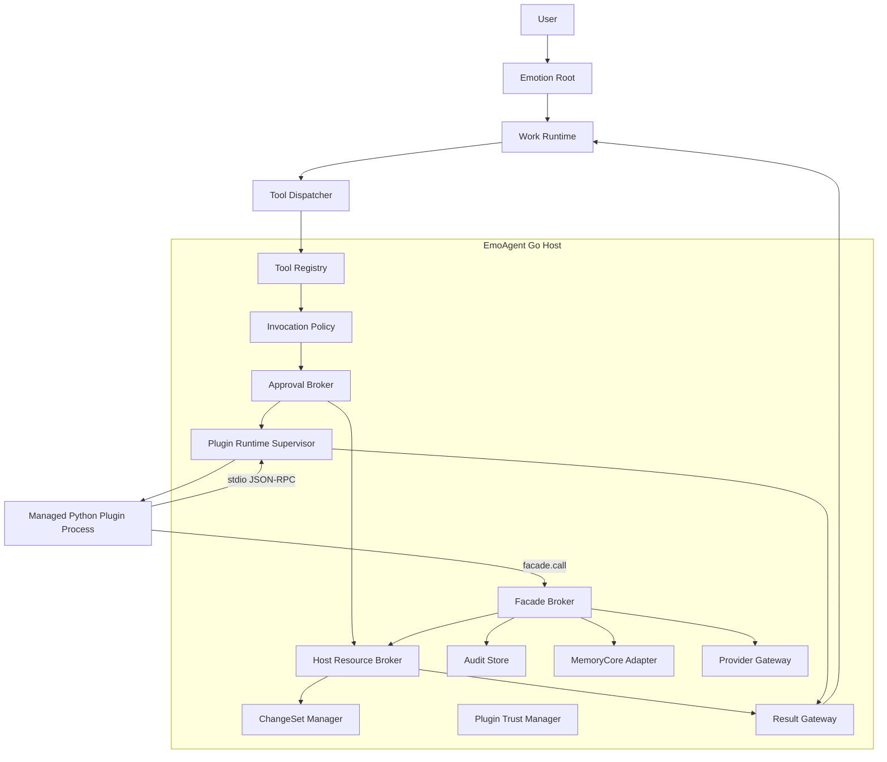

# EmoAgent Managed Local Runtime v0.4 架构

> **Document status**: Target Architecture
> **Version**: 0.4
> **Date**: 2026-06-20
> **Scope**: Windows-first 一键安装产品、Host Resource Broker、Managed Bash、可信 Python 插件、Host API Capability、插件调用策略、轻量 Tool Result Provenance。
> **Architecture name**: **Managed Local Runtime with Trusted Python Extensions and Brokered Host Operations**
> **Supersedes**: Capability Runtime v0.3 中强制 Docker/WSL2/AppContainer 的普通用户路径。

---

## 0. 一句话定义

EmoAgent v0.4 将第三方 Python 插件视为**用户主动信任的本地扩展代码**，通过独立进程、私有 Python、依赖隔离、Job Object、Host API Capability、工具调用审批、包签名和审计进行管理；同时继续由 Host Resource Broker 和 ChangeSet 安全管理 EmoAgent 自己的宿主文件操作，但不虚假承诺阻止恶意 Python 插件直接访问操作系统资源。

---

## 1. 产品决策

### 1.1 已确认

```text
- Windows 是主要开发和发布平台。
- 普通用户不需要安装 Docker、WSL2、Hyper-V 或 Python。
- 应用安装包携带私有 Python Runtime。
- 第三方插件以 Python 兼容为主。
- 插件风险由安装并启用插件的用户承担。
- 插件系统不承诺安全运行恶意 Python 代码。
- 不使用 AppContainer 作为 v1 必选架构。
- 不使用 Docker 作为普通插件默认运行时。
- 权限架构轻量化。
- Host Resource Broker 与 ChangeSet 继续用于 EmoAgent 内置宿主操作。
- Tool Result 保留轻量来源标记。
```

### 1.2 安全诚实原则

产品不能使用以下表述：

```text
安全沙箱插件
只读插件
插件无法访问本地文件
插件只能访问声明的域名
插件不能启动子进程
```

除非未来真的运行在可验证的 OS/VM 沙箱中。

正确表述：

> 插件以当前用户身份运行。EmoAgent 会隔离插件进程和依赖，限制其通过 EmoAgent 内部 API 获取的数据，并管理插件调用和资源使用；但恶意插件仍可能直接访问当前用户可访问的本地资源和网络。

---

## 2. 威胁模型

### 2.1 保护目标

```text
主进程稳定性
插件依赖隔离
插件生命周期和资源上限
MemoryCore 与 Provider Key 的正式 API 边界
插件工具未经允许的自动调用
高风险 Hook 的启用
包完整性、发布者身份和更新扩权
日志与审计中的 Secret 最小化
工具结果来源与控制权边界
Host 内置文件操作的可审批和可恢复性
```

### 2.2 非保护目标

```text
恶意插件直接 os.open 用户文件
恶意插件直接 socket.connect 上传数据
恶意插件 subprocess/ctypes/Win32 调用
恶意插件绕过 Python Audit Hook
高级 Shell 在当前用户权限内执行
用户安装来源不可信插件后的 OS 级损害
```

### 2.3 风险分配

| 风险 | 责任 |
|---|---|
| 插件包来源与发布者 | Plugin Trust / 用户 |
| 插件调用 EmoAgent 内部 API | Host Capability Gate |
| Agent 是否自动调用插件工具 | Invocation Policy |
| 插件崩溃和资源失控 | Runtime Supervisor / Job Object |
| 插件直接访问 OS | 用户信任，不在 v1 强制隔离范围 |
| 内置 Host File 操作 | Resource Broker / ChangeSet |
| 工具结果伪造控制指令 | Result Gateway / Dispatcher |

---

## 3. 总体拓扑



---

## 4. 五层轻量控制模型

### 4.1 Layer 1：Code Trust

决定插件代码是否可以运行：

```text
blocked
developer
user_trusted
verified_publisher
official
```

含义：

| Trust | 说明 | 默认 |
|---|---|---|
| `blocked` | 禁止运行 | 拒绝 |
| `developer` | 本地目录/未签名插件 | 仅 Developer Mode |
| `user_trusted` | 用户明确接受此版本 | 可启用 |
| `verified_publisher` | 签名有效且发布者受信 | 首次确认 |
| `official` | EmoAgent 官方 | 可按策略启用 |

Trust 是是否运行当前用户权限本地代码的风险决定：

```text
“是否允许这段本地代码以我的身份运行”
```

### 4.2 Layer 2：Host API Capability

决定插件能通过 EmoAgent 正式接口获得什么：

```text
plugin.kv
plugin.files
provider.generate
provider.embed
memory.read.safe
memory.candidate.submit
memory.forget.request
work.observe
work.dispatch.annotate
approval.observe
agent_affect.read
network.web
tool.register
tool.observe
```

计算：

```text
effective_host_api =
    manifest_requested
  ∩ user_grant
  ∩ host_policy
```

这一层可以可靠执行，因为所有调用都经过 `FacadeBroker`。

它不代表插件无法使用 Python 标准库直接接触 OS。

### 4.3 Layer 3：Agent Invocation Policy

决定 Agent 能否调用插件工具。

```go
type EffectivePluginToolPolicy struct {
    Exposure   string // hidden | work | emotion
    Invocation string // auto | ask | deny
}
```

默认：

```text
第三方插件：
  exposure = work
  invocation = ask

官方插件：
  由 Host Preset 决定

Emotion 暴露：
  需要宿主或用户明确开启
```

插件自报 `Scope` 和 `Permission` 只作为兼容 Hint，不能覆盖宿主策略。

### 4.4 Layer 4：Process Supervision

决定进程如何被管理，而不是声明 OS 沙箱：

```text
独立进程
启动/关闭超时
Job Object / process group
KILL_ON_JOB_CLOSE
子进程数量
内存上限
CPU/运行时间上限
stdout protocol
bounded stderr
lazy start
idle stop
crash backoff
crash quarantine
环境变量白名单
敏感环境变量过滤
```

### 4.5 Layer 5：Result Provenance

决定结果从哪里来以及能否成为控制指令：

```go
type ResultProvenance struct {
    ProducerKind         string
    ProducerID           string
    RuntimeKind          string
    InstructionAuthority string
    InputHash            string
    OutputHash           string
    GeneratedAt          time.Time
}
```

规则：

```text
builtin policy/approval -> host_control
plugin/web/file/memory data -> data_only
```

---

## 5. Host Resource Broker

### 5.1 定位

Host Resource Broker 继续作为 EmoAgent 内置工具的宿主资源权威入口。

支持：

```text
list/search/stat/read
copy to workspace
create/overwrite
move/delete
mkdir/rmdir
external directory operations
ChangeSet staging/diff/apply/rollback
protected path
ResourceGrant
```

### 5.2 边界

可以保证：

```text
EmoAgent 内置工具只能按 Broker 策略操作
外部写入可审批、可预览、可检测冲突
删除默认 quarantine
Result 有 host_file provenance
```

不能保证：

```text
任意 Python 插件只能通过 Broker 访问文件
任意高级 Shell 只能通过 Broker 访问文件
```

### 5.3 用户体验

Workspace 是自由修改区域；个人目录是 Broker 可发现/读取区域。

```text
用户远程要求查看文件
→ Broker 搜索/读取
→ 必要时 Grant/审批
→ Agent 分析

用户要求修改外部文件
→ staging
→ ChangeSet
→ Diff/影响摘要
→ 审批
→ Broker 应用
```

---

## 6. Managed Bash / Command Runtime

### 6.1 定位

Bash 不再被描述为强沙箱。

```text
runtime_kind = managed_host_process
security_level = user_trusted_execution
```

### 6.2 运行管理

Windows：

```text
Job Object
KILL_ON_JOB_CLOSE
不允许 breakaway
最大子进程数
内存/CPU/运行时间限制
timeout/cancel 终止进程树
环境变量白名单
敏感变量过滤
stdout/stderr 上限
```

Unix：

```text
process group
kill process group
rlimit（可用时）
环境变量白名单
```

### 6.3 工具策略

推荐保留现有 `bash` Tool，避免一次性破坏 Agent 能力。

新增配置：

```yaml
bash:
  enabled: true
  execution_mode: managed_host
  invocation_policy: ask_destructive
  expose_scope: work
  timeout_sec: 120
  max_output_bytes: 262144
  max_processes: 64
  memory_mb: 1024
  inherit_environment: allowlist
```

`invocation_policy`：

```text
always_ask
ask_destructive
auto
deny
```

危险命令分类器只用于提示和审批，不作为安全边界。

### 6.4 高级风险提示

首次开启时展示：

> 本机命令以当前 Windows 用户权限运行，可能读取或修改当前用户可访问的文件并访问网络。EmoAgent 会限制运行时间、进程树和敏感环境变量，但不会提供完整操作系统沙箱。

---

## 7. Managed Python Plugin Runtime

### 7.1 默认路径

```text
runtime.kind = managed_python_process
```

兼容旧值：

```text
python_process -> managed_python_process
process -> developer/external runtime，需显式开启
```

### 7.2 私有 Python

产品安装包携带应用管理的 CPython：

```text
EmoAgent/
  runtime/python/
  runtime/bootstrap/
  plugins/store/
  plugins/envs/
  plugins/state/
  plugins/cache/
  plugins/run/
```

原则：

```text
用户无需安装 Python
不依赖用户 PATH
不读取用户 site-packages
插件不能选择任意 Python executable
Developer Mode 可显式使用外部解释器
```

启动建议：

```text
python -I -P -u host_owned_bootstrap.py
```

Bootstrap：

```text
验证 plugin id/version
设置受控 sys.path
加载插件入口
预留 stdout 给 JSON-RPC
日志写 stderr
执行 initialize handshake
```

### 7.3 每插件依赖环境

基准实现：

```text
plugins/envs/<plugin_id>/<version>/
```

第一版优先每插件虚拟环境，换取兼容和简单性。

安装策略：

```text
固定 requirements.lock
使用应用私有 Python
默认只安装 Windows binary wheel
共享下载缓存，环境不共享 site-packages
安装结果绑定 lock digest
更新创建新版本环境
回滚切换版本
删除清理对应环境
```

Developer Mode 可允许未锁定依赖和源码构建，但明确标记。

### 7.4 进程通信

继续复用：

```text
stdio JSON-RPC
initialize
invoke_hook
invoke_tool
shutdown
health
facade.call
log.emit
metric.emit
```

无需引入容器网络、端口或 Docker API。

### 7.5 Runtime Supervisor

状态：

```text
cold
starting
ready
idle
stopping
stopped
failed
backoff
quarantined
```

职责：

```text
lazy start
idle stop
deadline
bounded concurrency
Job Object
stderr tail
protocol violation
crash backoff
crash loop quarantine
status/admin diagnostics
```

---

## 8. Plugin Manifest v0.3-lite

不要求立即更换所有 Manifest，可在 v0.2 上增加轻量字段。

示例：

```yaml
schema_version: emoagent.plugin.v0.3-lite
id: com.example.echo
name: Echo
version: 0.3.0
emoagent_version: ">=0.3.0"

runtime:
  kind: managed_python_process
  entry: main.py
  python_requires: ">=3.11"

trust:
  publisher_id: example
  package_digest: "sha256:..."

access:
  capabilities:
    - turn.read
    - tool.register
    - plugin.kv

tools:
  defaults:
    exposure: work
    invocation: ask

hooks:
  - name: after_turn_end
    mode: observe
    failure_policy: fail_open
```

删除/弃用作为安全声明的字段：

```text
tool permission=read-only/workspace-write
tool scope=both 作为最终权威
container host_path
network domain permission
process spawn permission
```

可保留为：

```text
declared_behavior
risk_disclosure
tool hints
```

UI 必须标注“插件声明”，不能称为强制权限。

---

## 9. 插件工具与 Hook

### 9.1 Tool 注册

插件返回：

```text
name
description
input schema
optional output schema
```

宿主生成：

```text
plugin.<plugin_id>.<tool>
exposure
invocation
source metadata
```

v0.2 插件返回 Scope/Permission：

```text
忽略或记录为 requested hint
默认 exposure=work
默认 invocation=ask
```

### 9.2 Hook 分类

```text
observe:
  读取 Safe View
  返回 annotation/metrics
  已信任插件可启用

active:
  transform
  side_effect
  before_tool_call policy
  before_memory_commit
  outbound modification
  必须单独启用
```

配置：

```text
allow_observe_hooks=true
allow_active_hooks=false by default
```

---

## 10. Plugin Trust 与供应链

### 10.1 安装记录

保留并加强：

```text
package digest
manifest digest
signature status
publisher id
source
installed version
dependency lock digest
runtime digest
```

### 10.2 启用确认

确认文案必须包含：

```text
插件发布者和签名
Host API capabilities
工具 exposure/invocation
observe/active hooks
本地代码风险
依赖数量和来源
```

### 10.3 更新扩权

以下变化要求重新确认：

```text
新增 Host API capability
新增 active hook
新增 Emotion exposure
invocation ask -> auto
发布者变化
签名失效
runtime kind 变化
dependency lock 显著变化
```

### 10.4 Kill Switch

```text
本地 denylist
撤销发布者信任
禁用指定 digest/version
crash quarantine
可选远程 revocation feed
```

---

## 11. Facade Broker

### 11.1 保留原因

FacadeBroker 仍是真实可执行的内部边界：

```text
Provider Key 不给插件
MemoryCore DB 不给插件
Safe Memory DTO
Plugin KV/File scope
Provider usage audit
Host API grant
```

### 11.2 语义

UI 应写：

```text
允许插件通过 EmoAgent API 读取安全记忆摘要
允许插件通过 EmoAgent API 使用模型
```

不能写：

```text
插件无法通过其他方式读取本地数据
```

---

## 12. Python Audit Observer

当前 `sitecustomize.py` 从“安全 Shim”降级为“行为审计观察器”。

用途：

```text
记录 open/socket/subprocess/import 等事件
生成插件行为摘要
辅助插件调试
异常行为告警
```

非用途：

```text
阻止恶意插件
证明插件没有联网
证明插件只能访问声明文件
Marketplace 安全边界
```

记录应采样、脱敏、限量，避免审计本身泄露文件名和 Secret。

---

## 13. 轻量 Result Provenance

### 13.1 最小字段

```go
type ResultProvenance struct {
    ProducerKind         string // builtin | python_plugin | web | memory | host_file
    ProducerID           string
    RuntimeKind          string // host | managed_python | remote
    InstructionAuthority string // host_control | data_only
    InputHash            string
    OutputHash           string
    GeneratedAt          time.Time
}
```

### 13.2 固定规则

```text
Approval/Policy host event -> host_control
Plugin/Web/File/Memory content -> data_only
```

插件无法自行设置 `host_control`。

### 13.3 Provider Rendering

Tool Result 可包含紧凑 `_emo_meta`：

```json
{
  "data": {},
  "_emo_meta": {
    "producer": "plugin.com.example.echo",
    "runtime": "managed_python",
    "instruction_authority": "data_only"
  }
}
```

Dispatcher 仍对后续工具调用重新执行权限和审批。

---

## 14. 数据持久化

建议新增或调整：

```text
plugin_enabled_state:
  trust_level
  trust_accepted_at
  allow_active_hooks
  default_tool_exposure
  default_invocation_policy

plugin_runtime_records:
  runtime_kind
  python_runtime_version
  env_path
  env_digest
  job_object_managed
  status
  crash_count
  quarantined_reason

plugin_installations:
  dependency_lock_digest
  runtime_requirements_json

plugin_access_events:
  host API capability
  invocation policy decision
  input/output hash
```

不再新增：

```text
plugin_sandbox_instances
plugin_images
sandbox_events
container plan hash
mount plan authority
```

如果旧 Phase 已新增这些表但未发布，可移除迁移；已经发布则保留空表并标记 deprecated，避免破坏升级。

---

## 15. 配置草案

```yaml
plugins:
  enabled: true

  trust:
    allow_unsigned_dev: false
    require_signature_for_remote: true
    reconsent_on_capability_expansion: true

  runtime:
    default_kind: managed_python_process
    bundled_python_enabled: true
    bundled_python_dir: runtime/python
    external_python_dev_enabled: false
    startup_timeout_ms: 10000
    shutdown_timeout_ms: 3000
    idle_timeout_seconds: 900
    crash_backoff_initial_seconds: 5
    crash_backoff_max_seconds: 300
    crash_quarantine_threshold: 5
    max_stderr_bytes: 262144
    max_processes: 32
    memory_mb: 512

  tools:
    default_exposure: work
    default_invocation: ask

  hooks:
    allow_observe: true
    allow_active: false

  audit:
    enabled: true
    include_payload: false
    python_observer_enabled: true
```

---

## 16. 失败和降级

| 情况 | 行为 |
|---|---|
| 私有 Python 缺失/损坏 | 插件不可用，主应用继续运行，显示修复入口 |
| 插件依赖安装失败 | 插件不启用，不污染其他插件环境 |
| Job Object 创建失败 | 可按产品策略拒绝插件启动；不称为 sandbox |
| 插件 Crash Loop | quarantine |
| Plugin Facade 不可用 | 对应调用 fail-closed |
| Provider Gateway 不可用 | 插件拿不到 Provider Key，调用失败 |
| Audit Observer 被绕过 | 不推断“插件安全”；只记录 observer unavailable |
| Plugin Tool Policy 缺失 | exposure=work, invocation=ask |
| Result Provenance 缺失 | legacy/data_only 包装 |
| Host Resource Broker 不可用 | 内置外部资源操作 fail-closed |
| 高级 Bash 开启 | 明确风险标识和审计 |

---

## 17. 一键安装产品形态

安装包携带：

```text
EmoAgent.exe
Go service components
private Python runtime
host-owned Python bootstrap
built-in plugins
Web assets
database migrations
diagnostics
```

首次启动：

```text
验证私有 Python
创建 plugin store/env/state/cache/run
运行 Python bootstrap self-test
探测 Job Object 支持
验证数据库迁移
显示插件安全模型
```

用户无需：

```text
安装 Python
配置 PATH
安装 Docker
安装 WSL2
配置虚拟化
```

---

## 18. 测试重点

```text
Process:
- plugin crash 不拖垮主进程
- timeout/cancel 杀进程树
- Job close 清理子进程
- memory/process count limit
- no sensitive env inheritance
- lazy start/idle stop/backoff/quarantine

Python:
- private runtime used
- user site-packages ignored
- per-plugin dependency conflict isolation
- update/rollback env
- binary wheel install
- invalid lock rejected

Policy:
- plugin ScopeBoth/read-only 不成为最终策略
- third-party default Work + Ask
- active hooks default denied
- Facade capability enforced
- capability expansion re-consent

Trust:
- package digest/signature
- publisher change
- local dev warning
- blocked digest

Result:
- plugin result data_only
- cannot forge host_control
- Provider adapters compatible
- logs do not include raw secrets

Resource:
- Broker/ChangeSet 继续通过原测试
```

---

## 19. 外部事实依据

- Windows Job Object 可统一管理进程组、限制资源并终止整组进程：
  <https://learn.microsoft.com/en-us/windows/win32/procthread/job-objects>
- CPython Windows 私有/嵌入式发行版可作为应用的一部分，并与用户环境、注册表和已安装包基本隔离；这种隔离是 Python 环境隔离，不是 OS 安全沙箱：
  <https://docs.python.org/3/using/windows.html#the-embeddable-package>
- Python 官方说明 `sys.addaudithook` 不适合实现 Sandbox，恶意代码可绕过：
  <https://docs.python.org/3/library/sys.html#sys.addaudithook>

---

## 20. 最终工程不变量

```text
1. Third-party Python plugin = trusted local code.
2. Process isolation != security sandbox.
3. Host API capability is real; OS file/network permission is not promised.
4. Plugin Scope/Permission is not authority.
5. Third-party tool defaults to Work + Ask.
6. Active hooks default off.
7. Job Object governs lifecycle/resources.
8. External CPython 3.12 + uv toolchain and per-owner uv env govern compatibility/dependencies.
9. Host Resource Broker governs built-in host operations.
10. Plugin/web/file/memory results are data_only.
11. No Docker/WSL2/AppContainer prerequisite for normal users.
12. No silent claim that an untrusted plugin is safe.
```
