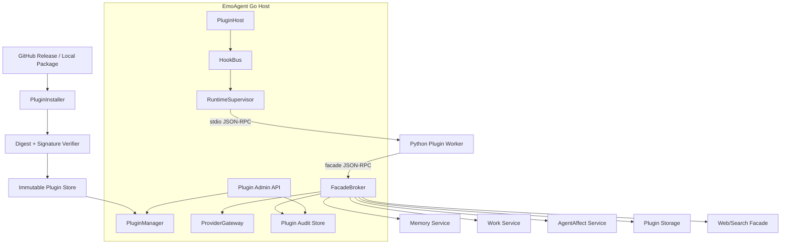

# EmoAgent Plugin Runtime v0.2 Architecture

> Document status: implementation architecture draft
> Target path: `docs/architecture/plugin_runtime_v0.2.md`
> Architecture name: **Host-managed Python Worker with Facade-gated Data Access**
> Scope: third-party plugin package/install/runtime/data-access/provider/admin architecture for the next plugin-system update.
> Non-goal: this document does not implement future autonomous-life-script plugins, screen/process observation, or full marketplace governance. It defines the platform those plugins will later use.

---

## 0. One sentence definition

EmoAgent Plugin Runtime v0.2 extends the existing Go-side `PluginHost + HookBus + Capability + Safe View` foundation into a third-party plugin platform where external plugins are installed from verified packages, run as Host-managed lightweight Python workers over stdio JSON-RPC, access all EmoAgent data only through Facade APIs, use models only through the EmoAgent Provider Gateway, and are shown in the admin UI with explicit data-access tier, runtime state, mounted directories, and audit records.

```text
GitHub Release / local package
        ↓ verify digest + signature
Immutable plugin store
        ↓ enable
PluginManager + RuntimeSupervisor
        ↓ stdio JSON-RPC
Python plugin worker
        ↓ facade calls only
Memory / Work / Approval / AgentAffect / Provider / Storage / Web facades
        ↓
Go authority services + SQLite audit
```

---

## 1. Current repository baseline

The current repository already has a usable v0.1 plugin core. The update should build on it rather than rewrite it.

### 1.1 Existing strengths

Current reusable foundation:

- `internal/plugin` already defines `Manifest`, `RuntimeKind`, `Capability`, `HookName`, `HookSpec`, `HookResult`, `Patch`, `Authorizer`, `PluginRegistry`, `HookBus`, `PluginHost`, `BuiltinRunner`, `Registrar`, and several Facade stubs.
- `RuntimeKind` already contains `builtin` and `process`; `process` is currently a placeholder and should become the external-worker runtime.
- `PluginHost` wraps Turn pipeline stages and outbound sink. This is the right insertion point: plugins observe/patch pipeline state without becoming a new conversation actor.
- `HookBus` already handles priority ordering, timeouts, fail-open/fail-closed, panic recovery, patch authorization, patch conflict handling, and TurnJournal audit.
- Current typed safe views (`TurnView`, `MemoryView`, `ToolCallView`, `WorkView`, `OutboundView`) already avoid raw prompt/tool/reasoning exposure.
- Current `Registrar` already checks declared hooks and hook capabilities.
- Current plugin tools are namespaced as `plugin.<plugin_id>.<tool_name>` and still go through the existing `tool.Dispatcher` and approval gate.
- Current app lifecycle already creates `PluginService`, wires it into `ChatService`, `WorkService`, and `AgentAffectService`, and closes it through `Kernel.Close`.
- Current admin app is tab-based and can accept a `PluginsTab` with a `usePluginAdmin` hook and `pluginApi` protocol module.

### 1.2 Missing pieces

The current system lacks:

```text
- third-party plugin package installation
- digest/signature verification
- immutable plugin version store
- enable/disable/update/rollback state
- process runner and runtime supervisor
- stdio JSON-RPC bridge
- Python plugin SDK/template
- Provider Gateway for plugin model calls
- plugin-scoped storage/workspace APIs
- plugin data-access tiers and UI display
- plugin management HTTP API
- persistent plugin audit/usage tables beyond TurnJournal events
- process stdout/stderr log collection
- container mount planner / future container runner boundary
```

---

## 2. Design goals

1. **Low friction development**: the default third-party template is Python.
2. **Lightweight runtime**: plugins do not each bind a TCP port; default transport is stdio JSON-RPC.
3. **No direct secrets**: plugins never receive Provider API keys or direct database handles.
4. **Facade-only access**: every plugin access to Memory, Work, Provider, file storage, web search/fetch, Agent Affect, and approvals goes through Host-controlled Facades.
5. **Visible authorization**: plugin page prominently displays declared access tier, capabilities, runtime, package source, digest/signature status, mounts, provider usage, and access events.
6. **No absolute privacy promise**: EmoAgent exposes access controls and audit visibility, but does not claim that all privacy risks are eliminated.
7. **Future container compatibility**: v0.2 defines stable mount semantics and policy; container execution can be enabled later without changing plugin manifests.
8. **Do not weaken existing pipeline invariants**: plugins are not new final responders and must not bypass Emotion, Memory authority, Work approval, or Agent Affect safety.

---

## 3. Non-goals for this update

Not in v0.2 implementation:

```text
- plugin marketplace ranking/reviews/payment
- arbitrary dashboard JavaScript from plugins
- direct MemoryCore/TriviumDB access
- direct Provider key exposure
- plugin-controlled TCP/gRPC ports
- screen capture / process observation implementation
- full Docker sandbox execution requirement
- token/cost hard quotas
- automatic pip dependency solving without lockfile
- strong legal privacy compliance claims
```

Container support in v0.2 should be limited to schema, policy, mount planning, validation, and disabled-by-default runner interface unless explicitly chosen later.

---

## 4. Core invariants

```text
1. Emotion remains the only user-facing assistant speaker.
2. Plugins cannot directly generate canonical assistant final text.
3. Plugins cannot directly write long-term facts.
4. Plugins can submit memory candidates and forget requests only through Memory Facade.
5. Provider calls from plugins must go through ProviderGateway.
6. Plugins cannot read hidden/forgotten/purged memory through any facade.
7. Plugin process stdout is reserved for JSON-RPC. Human logs go to stderr.
8. Process plugins must be started, stopped, timed out, and killed by RuntimeSupervisor.
9. Plugin package code is immutable after installation.
10. Plugin data/state/cache/workspace directories are plugin-scoped.
11. Data access is declared in manifest, user-visible in UI, enforced by FacadeBroker, and auditable.
12. Access tiers are disclosure and routing boundaries, not privacy guarantees.
```

---

## 5. System topology



---

## 6. Package and installation model

### 6.1 Package source

Supported sources:

```text
- local dev folder: for plugin authors and tests
- local zip file: for drag-and-drop installation
- GitHub Release asset: certified/common installation path
```

GitHub installation is based on:

```text
owner/repo + tag + asset name
or a release descriptor URL
```

### 6.2 Immutable store layout

Recommended host layout:

```text
data/plugins/
  store/
    <plugin_id>/
      <version>/
        package/                 # immutable extracted package
        package.sha256
        release.json
        signature.sig
        install_record.json
  enabled/
    <plugin_id>.json             # selected version + user grant state
  state/
    <plugin_id>/                 # plugin persistent private state
  cache/
    <plugin_id>/                 # plugin cache, safe to clear
  run/
    <plugin_id>/                 # pid, stderr log, JSON-RPC state
  workspaces/
    <plugin_id>/                 # optional user-visible plugin workspace
```

Rules:

```text
- `store/<id>/<version>/package` is read-only from runtime perspective.
- `state`, `cache`, `run`, and `workspaces` are never shared between plugins.
- update installs a new immutable version; rollback changes enabled pointer.
- delete disables first, stops runtime, then removes selected stored version if no longer referenced.
```

### 6.3 Release descriptor

A release should contain:

```text
emo_plugin.yaml
emo_plugin.release.json
<plugin package files>
```

`emo_plugin.release.json` signs package identity and digest:

```json
{
  "schema_version": "emoagent.plugin_release.v0.2",
  "plugin_id": "com.example.daily-news",
  "version": "0.1.0",
  "publisher_id": "example",
  "asset_name": "emoagent-daily-news-0.1.0.zip",
  "asset_digest": "sha256:...",
  "manifest_digest": "sha256:...",
  "signature_algorithm": "ed25519",
  "signature": "base64..."
}
```

Verification order:

```text
1. Download asset.
2. Compute package sha256.
3. Compare with release descriptor or GitHub asset digest.
4. Read `emo_plugin.yaml`.
5. Compute manifest digest.
6. Verify Ed25519 signature against trusted publisher registry.
7. Validate plugin id/version/runtime/capabilities/hooks/access tier.
8. Install into immutable store.
```

Dev mode may allow unsigned local folders, but UI must show `unsigned_dev`.

---

## 7. Manifest v0.2

The existing `Manifest` should remain as the compatibility core. v0.2 adds package/runtime/access/provider/sandbox sections.

```yaml
schema_version: emoagent.plugin.v0.2
id: com.example.daily-news
name: Daily News Summary
version: 0.1.0
emoagent_version: ">=0.2.0"
runtime:
  kind: python_process
  entry: main.py
  python: ">=3.11"
  startup_timeout_ms: 5000
  shutdown_timeout_ms: 3000
  idle_timeout_seconds: 600
  max_concurrency: 1
  keep_alive: false
package:
  source: github_release
  repository: example/emoagent-daily-news
  tag: v0.1.0
  asset: emoagent-daily-news-0.1.0.zip
publisher:
  id: example
  trust_level: certified
access:
  tier: memory_safe
  capabilities:
    - turn.read
    - memory.read.safe
    - provider.generate
    - network.web
provider:
  allowed: true
  default_purpose: summarization
hooks:
  - name: after_memory_retrieve
    mode: observe
    failure_policy: fail_open
    priority: 50
    timeout_ms: 200
sandbox:
  mode: process
  mounts:
    state: rw
    cache: rw
    workspace: none
```

Compatibility mapping:

```text
runtime.kind=builtin        -> existing BuiltinRunner
runtime.kind=python_process -> new ProcessRunner
runtime.kind=container      -> future ContainerRunner / disabled unless configured
```

---

## 8. Runtime model

### 8.1 Default transport

Default third-party runtime:

```text
Python process + stdio JSON-RPC 2.0
```

Rationale:

```text
- no TCP port conflicts
- no per-plugin HTTP/gRPC server requirement
- cross-platform enough for Windows/macOS/Linux
- easy supervision by Go parent process
- low idle cost when combined with lazy start and idle stop
```

### 8.2 Worker lifecycle

```text
installed
  ↓ enable
cold
  ↓ first hook/tool/schedule/facade trigger
starting
  ↓ initialize handshake ok
ready
  ↓ idle timeout
sleeping/stopped
  ↓ disable/delete/crash
stopping/failed
```

Supervisor responsibilities:

```text
- lazy start plugin workers
- serialize or bound concurrent invokes per plugin
- pass per-invocation deadline
- collect stderr into bounded log
- treat stdout non-JSON as protocol error
- graceful shutdown then kill
- crash backoff
- stop idle workers
- expose runtime state to admin API
```

### 8.3 JSON-RPC methods

Host → plugin:

```text
initialize
invoke_hook
invoke_tool
shutdown
health
```

Plugin → Host through same connection:

```text
facade.call
log.emit
metric.emit
```

Minimum `initialize` response:

```json
{
  "protocol_version": "emoagent.plugin_rpc.v0.2",
  "sdk": "python",
  "sdk_version": "0.2.0",
  "plugin_id": "com.example.daily-news",
  "hooks": ["after_memory_retrieve"],
  "tools": []
}
```

### 8.4 Process invocation bridge

Existing HookBus should remain Go-authoritative. A process plugin registers a Go-side adapter handler:

```text
HookBus Dispatch
  ↓
ProcessHookAdapter.Handle(ctx, HookContext)
  ↓
RuntimeSupervisor.EnsureReady(plugin_id)
  ↓
JSON-RPC invoke_hook(ctx deadline)
  ↓
Python plugin returns HookResult
  ↓
Host validates result patches/events/decisions by existing Authorizer
  ↓
HookBus merges and audits
```

---

## 9. Facade Broker

The Facade Broker is the only callable Host surface for third-party plugins.

### 9.1 Required facade groups

```text
plugin.info
plugin.kv
plugin.files
memory.safe_context
memory.candidate
memory.forget
work.observe
work.annotate
approval.observe
agent_affect.safe
provider.generate
provider.embed       # optional if embedding provider configured
web.search           # optional through existing web/search settings
web.fetch            # optional through existing web/fetch settings
log.emit
metric.emit
```

### 9.2 Provider Gateway

Provider Gateway is mandatory for all model calls.

Rules:

```text
- plugin never receives raw provider API key
- plugin never chooses arbitrary provider endpoint
- plugin may request provider_id/model/purpose only within allowed capability/config
- gateway records usage and errors
- gateway returns normalized llm.ChatResponse-compatible data
- streaming can be added later; v0.2 may implement non-streaming only
```

Provider usage record:

```text
plugin_id
provider_id
model
purpose
input_tokens_reported
output_tokens_reported
token_estimate_if_missing
status
duration_ms
created_at
```

No hard token quota in v0.2; record only.

### 9.3 Memory Facade

Memory access rules:

```text
- `memory.safe_context.read` returns only authority-filtered safe DTOs.
- no hidden/forgotten/purged/source-redacted raw content.
- no direct SQLite/MemoryCore/Trivium access.
- `memory.candidate.submit` queues candidates; it does not write facts.
- `memory.forget.request` requests Forget Manager action; destructive levels require stronger capability and still need policy approval.
```

### 9.4 Storage Facade

Plugin storage is scoped:

```text
plugin.kv: small JSON values
plugin.files: files under plugin state/cache/workspace only
```

No arbitrary host path access.

---

## 10. Access tiers

Access tiers are shown prominently in UI. They are disclosure + routing boundaries; capabilities remain the exact enforcement mechanism.

| Tier | Name | Meaning |
|---:|---|---|
| L0 | `no_data` | plugin config/state only |
| L1 | `runtime_safe` | turn/session IDs, hashes, sizes, statuses |
| L2 | `current_turn` | current message safe view when explicitly provided by HookContext |
| L3 | `memory_safe` | authority-filtered memory summaries and usage guidance |
| L4 | `workspace` | plugin private files and optionally workspace files |
| L5 | `external_network` | web/search/fetch through Host facade |
| L6 | `provider_access` | model calls through ProviderGateway |
| L7 | `screen_process` | future user-enabled screen/process summaries |
| L8 | `sensitive_or_destructive` | destructive forget, high-sensitivity APIs, broad writes |

Effective permission:

```text
effective = min(plugin manifest capability,
                user granted access tier,
                runtime sandbox policy,
                current task permission scope,
                approval gate)
```

---

## 11. Sandbox and mounts

### 11.1 Process mode

Process mode isolation is policy + directory discipline, not a hard OS sandbox. UI must not call it a privacy guarantee.

Host environment for Python worker:

```text
EMO_PLUGIN_ID
EMO_PLUGIN_VERSION
EMO_PLUGIN_RUNTIME=python_process
EMO_PLUGIN_ROOT=<immutable package dir>
EMO_PLUGIN_STATE_DIR=<state dir>
EMO_PLUGIN_CACHE_DIR=<cache dir>
EMO_PLUGIN_RUN_DIR=<run dir>
```

Do not pass provider API keys.

### 11.2 Container mode mount plan

Future container mode uses fixed paths only:

```text
/plugin     plugin code, read-only
/data       plugin persistent state, read-write
/cache      plugin cache, read-write
/run        runtime IPC/log/temp, read-write
/workspace  optional plugin workspace, none/ro/rw
/input      optional one-shot input files, read-only
```

Forbidden:

```text
- arbitrary host paths
- project root mount
- MemoryCore database directory mount
- provider config directory mount
- user home root mount
- plugin code mounted rw
```

v0.2 should implement mount planning and validation even if container runner remains disabled.

---

## 12. Admin UI

Add a `插件` tab.

Required surfaces:

```text
- list installed plugins
- install from local zip / release descriptor URL
- enable / disable / restart / uninstall / rollback
- show package source, version, publisher, digest/signature status
- show runtime state: cold/starting/ready/sleeping/stopped/failed
- show access tier and capabilities
- show provider access warning if provider capability is present
- show mounts and directories
- show recent errors/log tail
- show recent data access events
- show recent provider usage
```

UI wording must say:

```text
EmoAgent 会按层级限制和记录插件访问，但不承诺插件不会带来隐私风险。启用高层级插件表示你允许该插件通过 EmoAgent 接口访问对应类别的数据。
```

---

## 13. Persistent records

Add storage tables for:

```text
plugin_installations
plugin_enabled_state
plugin_runtime_state
plugin_access_events
plugin_provider_usage
plugin_logs
plugin_kv
```

Use SQLite as authority for installed/enabled state. Runtime in-memory state can be rebuilt from DB + filesystem.

---

## 14. Failure policy

```text
- hook fail_open/fail_closed remains per HookSpec
- process crash under fail_open hook returns empty HookResult and records error
- process crash under fail_closed hook fails the pipeline stage as existing HookBus semantics require
- protocol error marks runtime failed and starts backoff
- ProviderGateway failure returns structured error to plugin and records usage status=error
- invalid patch/facade response is rejected by Host, never trusted
```

---

## 15. Testing strategy

Minimum tests:

```text
- manifest v0.2 parsing and unknown-field rejection
- access tier + capability validation
- plugin package digest verification
- Ed25519 signature verification
- installer path traversal rejection
- immutable store layout creation
- stdio JSON-RPC echo worker
- process lazy start / invoke_hook / shutdown
- timeout and crash backoff
- facade capability denial
- ProviderGateway records usage without exposing API key
- tool registration bridge keeps plugin namespace and existing approval gate
- admin API list/enable/disable/restart/status
- UI tab renders access tier and warnings
```

---

## 16. Recommended implementation phases inside one Codex task

Although this can be one Codex goal, implement internally in focused slices:

```text
1. Config + manifest v0.2 + storage migrations.
2. Package installer + signature/digest tests.
3. ProcessRunner + JSON-RPC + Python SDK fixture.
4. Hook adapter + tool adapter + FacadeBroker.
5. ProviderGateway + usage audit.
6. PluginService lifecycle + app wiring.
7. Admin API.
8. Admin UI tab.
9. Integration tests + docs.
```
