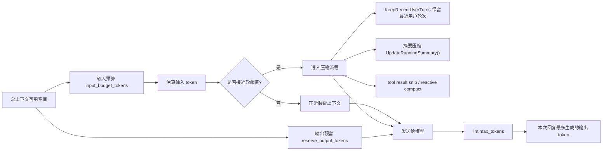
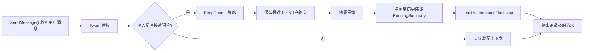
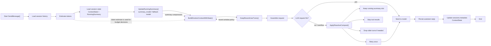

# EmoAgent Token 预算与压缩说明

本文整理 EmoAgent 当前运行时里几类容易混淆的 token 配置项，说明它们各自的作用、上限含义，以及在 `SendMessage()` 链路中的位置。

---

## 1. 术语总览

| 字段 | 所属配置 | 作用 | 上限含义 | 是否直接控制压缩 |
|---|---|---|---|---|
| `llm.max_tokens` | `config.llm` / `LLMProfile` | 单次模型回复的最大输出 token 数 | 这是“这次最多生成多少 token” | 否 |
| `context.input_budget_tokens` | `config.context` / `LLMProfile` 可覆盖 | 单次请求可用的输入上下文预算 | 这是“输入侧总预算上限” | 是 |
| `context.reserve_output_tokens` | `config.context` / `LLMProfile` 可覆盖 | 给输出预留的 token 空间 | 这是“给模型回复留多少空间” | 间接是 |
| `context.soft_compact_ratio` | `config.context` / `LLMProfile` 可覆盖 | 软压缩触发阈值 | 达到 `input_budget_tokens * ratio` 后进入压缩区 | 是 |
| `context.hard_compact_ratio` | `config.context` / `LLMProfile` 可覆盖 | 硬压缩触发阈值 | 达到更高阈值后必须更激进压缩 | 是 |
| `context.keep_recent_user_turns` | `config.context` | 保留最近多少个用户轮次 | 不是 token 上限，而是轮次上限 | 是 |
| `context.tool_result_soft_tokens` | `config.context` | tool 结果软截断阈值 | 小于该值时尽量保留原文 | 是 |
| `context.tool_result_hard_tokens` | `config.context` | tool 结果硬截断阈值 | 超过该值时保留更短摘要或空内容 | 是 |
| `summary_model` | `config.llm` / `LLMProfile` | 摘要更新时使用的模型 | 不是 token 上限 | 否 |

### 1.1 一句话结论

- `llm.max_tokens` 是**输出上限**
- `context.input_budget_tokens` 是**输入预算上限**
- `context.reserve_output_tokens` 是**给输出预留的空间**
- `soft_compact_ratio` / `hard_compact_ratio` 是**压缩触发阈值**
- `keep_recent_user_turns` 是**保留最近对话轮次的策略参数**

---

## 2. Token 上限关系图

### 2.1 图中各项含义

- `input_budget_tokens`：输入侧总预算
- `reserve_output_tokens`：给模型回复预留的输出空间
- `llm.max_tokens`：这次回复的输出上限
- `KeepRecentUserTurns`、摘要压缩、reactive compact：在输入预算不够时腾空间

---

## 3. 三种压缩方式的分工图

### 3.1 三种方式的职责

| 方式 | 作用 | 什么时候用 | 典型结果 |
|---|---|---|---|
| Token 估算 | 计算当前上下文大概有多大 | 每次组装上下文前 | 决定是否需要压缩 |
| KeepRecent 策略 | 保留最近用户轮次，丢掉更老消息 | 摘要和压缩前 | 让最近对话优先留在上下文里 |
| 摘要压缩 | 把更老历史压成结构化摘要 | 历史过长时 | 用更少 token 表达更久远的信息 |

---

## 4. `SendMessage()` 运行流程图

### 4.1 这条链路里三类能力的位置

- `Token 估算`：`EstimateTokens()` 和 `NewBudget()`，负责算预算，不直接删内容
- `KeepRecent`：`KeepRecentUserTurns()`，决定最近窗口保留多少轮
- `摘要压缩`：`UpdateRunningSummary()`，把旧历史压成 `RunningSummary`

---

## 5. 代码里的实际落点

| 能力 | 主要函数 / 文件 |
|---|---|
| Token 估算 | [internal/context/budget.go](../../internal/context/budget.go) |
| KeepRecent 策略 | [internal/context/compact.go](../../internal/context/compact.go) |
| 摘要更新 | [internal/context/summary.go](../../internal/context/summary.go) |
| 上下文装配 | [internal/context/assembler.go](../../internal/context/assembler.go) |
| Reactive compact | [internal/context/compact.go](../../internal/context/compact.go) |
| 运行时接入 | [internal/chat/engine.go](../../internal/chat/engine.go) |

---

## 6. 简短结论

如果只看“上限”这件事：

- `llm.max_tokens` 管输出上限
- `context.input_budget_tokens` 管输入预算上限
- `context.reserve_output_tokens` 给输出留空间

如果看“怎么缩”：

- `KeepRecentUserTurns` 先保最近对话
- `UpdateRunningSummary()` 再把更老历史压成摘要
- `ApplyReactiveCompact()` 在 provider 溢出时做紧急重试压缩

