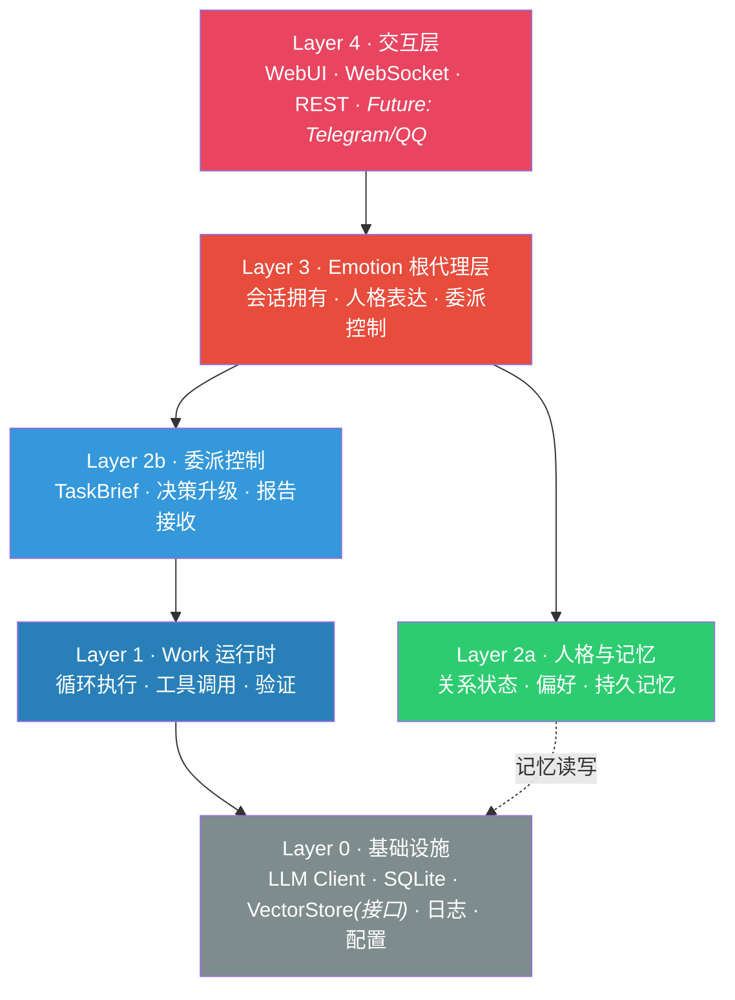
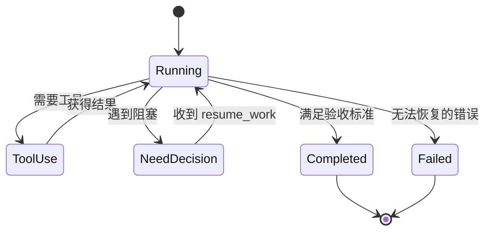
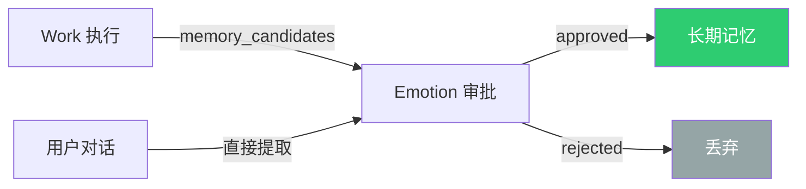
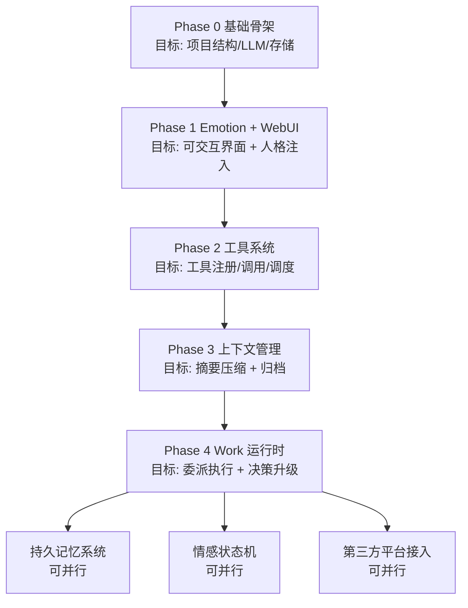

# EmoAgent Architecture Whitepaper

> **"不是构建一个会说话的工具，而是塑造一个会陪伴的存在。"**

**版本：** 1.0
**日期：** 2026-03-29
**状态：** Approved

---

## 目录

1. [愿景与定位](#1-愿景与定位)
2. [设计哲学](#2-设计哲学)
3. [系统架构总览](#3-系统架构总览)
4. [双核角色模型](#4-双核角色模型)
5. [委派与协作机制](#5-委派与协作机制)
6. [上下文治理](#6-上下文治理)
7. [记忆体系](#7-记忆体系)
8. [技术选型](#8-技术选型)
9. [开发路线图](#9-开发路线图)
10. [风险与应对](#10-风险与应对)
11. [远期演进方向](#11-远期演进方向)

---

## 1. 愿景与定位

EmoAgent 是一个部署在用户本地的个人情感陪伴 Agent。

它的目标不是成为一个更好的聊天机器人，而是成为一个 **有记忆、有性格、有情感连续性的长期伙伴** —— 用户在与它交互时，能感受到"被关心"和"被记住"。

同时，它也具备执行能力：当用户需要处理文件、搜索资料、完成复杂任务时，EmoAgent 能以更干净的上下文高效完成，而不破坏陪伴对话的连贯性。

### 1.1 核心命题

| 命题 | 回答 |
|---|---|
| EmoAgent 是什么？ | 一个有人格的本地情感陪伴 Agent，兼具轻量任务执行能力 |
| 用户在跟谁说话？ | 始终是同一个"人" —— Emotion 根代理 |
| 执行任务时会"换人"吗？ | 不会。用户无感知，Emotion 委派 Work 执行，自己组织最终回复 |
| 它记得我吗？ | 记得。关系记忆由 Emotion 独占管理，不被执行噪音污染 |

### 1.2 设计边界

**做：**

- 稳定的情感陪伴体验
- 复杂任务的委派执行与结果回传
- 长期记忆与关系连续性
- 本地部署、单二进制、零外部依赖

**不做（初期）：**

- 多个对等协作代理
- 全自动高风险系统控制
- 完整的语义记忆 / RAG 系统
- 允许 Work 直接面向用户

---

## 2. 设计哲学

EmoAgent 的架构建立在三个核心设计原则之上。

### 原则一：会话所有权不可转移

```
  用户 ←——→ Emotion（唯一对话者）
                ↓ 委派
              Work（执行者，用户无感知）
```

传统 Agent 架构常用"路由器在多个 Harness 间切换"的模式。但对情感陪伴场景，这意味着用户在和不同的"人格"交替说话 —— 这破坏了关系连续性。

EmoAgent 的回答是：**Emotion 始终拥有对外会话，Work 仅在幕后执行。** 用户永远在和同一个"人"对话。

### 原则二：上下文隔离保护陪伴感

```
  Emotion 上下文                Work 上下文
  ┌─────────────────┐          ┌─────────────────┐
  │ 用户对话          │          │ 任务说明          │
  │ 人格与关系状态     │          │ 工具调用与结果     │
  │ 记忆摘要          │          │ 中间推理          │
  │ 情感状态          │          │ 验证过程          │
  └─────────────────┘          └─────────────────┘
       互不污染 ←——→ 仅通过协议通信
```

工具执行过程天然会产生大量噪音（文件内容、搜索结果、错误堆栈）。如果这些内容涌入主会话，会同时造成两个问题：**token 膨胀** 和 **陪伴感稀释**。

分离上下文的本质是：让 Emotion 的世界里只有用户、记忆和关系，让 Work 的世界里只有任务、工具和结果。

### 原则三：记忆是关系的载体，不是日志

```
  Work 执行产物 ──→ memory_candidates ──→ Emotion 审批 ──→ 长期记忆
                                              ↑
                                        仅保留关系级信息
                                        过滤执行细节
```

长期记忆必须服务于"关系感"，而不是记录系统发生了什么。执行日志归执行日志，关系记忆归关系记忆。两者的写入路径被架构显式分离。

---

## 3. 系统架构总览

### 3.1 高层架构

```mermaid
graph TD
    U["fa:fa-user 用户"] -->|对话| E["fa:fa-heart Emotion 根代理"]

    E --> P["人格状态"]
    E --> M["Memory 模块"]
    E --> CTX["主会话上下文"]

    E -.->|轻量调用| TOOL["工具运行时"]
    E -->|"TaskBrief"| W["fa:fa-cog Work 执行代理"]

    W -->|多轮调用| TOOL
    TOOL --> OPS["文件 / 搜索 / 研究 / 验证"]
    W --> LOG["执行日志"]

    W -->|"request_decision / permission_escalation_required / DecisionPacket"| E
    E -->|"resume_work"| W
    W -->|"TaskReport"| E

    E -->|最终回复| U

    style E fill:#e74c3c,color:#fff
    style W fill:#3498db,color:#fff
    style M fill:#2ecc71,color:#fff
    style TOOL fill:#f39c12,color:#fff
```



### 3.2 分层视图



**各层职责一句话概括：**

| 层级 | 职责 |
|---|---|
| Layer 4 | 将外部消息转换为内部协议，将内部响应推送给用户 |
| Layer 3 | 系统的"自我"—— 理解用户、维持人格、决定委派、组织最终表达 |
| Layer 2a | Emotion 的长期状态 —— 记住用户是谁、喜欢什么、经历过什么 |
| Layer 2b | Emotion 与 Work 之间的契约层 —— 定义任务、接收报告、处理升级 |
| Layer 1 | Work 的执行引擎 —— 多轮工具调用、自循环直到完成 |
| Layer 0 | 所有层共享的基础能力 —— LLM、存储、日志、配置 |

---

## 4. 双核角色模型

### 4.1 Emotion 根代理 —— 系统的"自我"

Emotion 是 EmoAgent 的人格主体，也是唯一面向用户的会话接口。

**核心职责：**

```
理解 → 决策 → 委派（可选）→ 表达
 ↑                              |
 └───── 记忆读取/写入 ───────────┘
```

- 拥有全部用户会话
- 持有人格、表达方式与关系连续性
- 判断是否需要委派 Work
- 将用户意图整理为 TaskBrief
- 处理 Work 的决策升级请求（`request_decision` / `DecisionPacket`）
- 处理 runtime 生成的 `permission_escalation_required` 暂停，并转为面向用户的人审请求
- 接收 TaskReport，组织最终回复
- 审批并管理长期记忆写入

**Emotion 也可以直接使用轻量工具**，前提是：

| 条件 | 要求 |
|---|---|
| 步数 | 1-2 步即完成 |
| 输出 | 体积小 |
| 风险 | 低 |
| 上下文污染 | 无或极低 |

典型场景：查时间、查天气、简单格式转换。

**人格与关系设计：**

Emotion 不只是一个带 persona prompt 的 LLM 调用。它需要维护三层状态：

| 层 | 内容 | 实现方式 |
|---|---|---|
| 人格定义 | 性格、语气、口头禅 | 可配置 persona 文件，注入 system prompt |
| 关系连续性 | 互动历史、关键事件、承诺、偏好 | Memory 模块，对话中自然引用 |
| 情感状态（后期） | Valence(效价) + Arousal(唤醒度) 2D 模型 | 加权移动平均渐变，注入 prompt 影响风格 |

### 4.2 Work 委派执行代理 —— 系统的"手"

Work 是执行型子代理。它不面向用户，不持有人格，只在 Emotion 委派时启动。

**核心职责：**

```
接收 TaskBrief → 多轮执行循环 → 产出 TaskReport
                    ↓ (如遇阻塞)
      request_decision / permission_escalation_required / DecisionPacket → Emotion
```

- 在独立上下文中执行任务
- 多轮工具调用与自验证，直到完成
- 产出执行日志用于排查
- 阻塞时向 Emotion 发起 `request_decision`
- 破坏性调用若 scope 不足，则由 runtime 生成 `permission_escalation_required`
- 将简洁结果报告返回 Emotion

**Work 承接的典型任务：**

- 文件读写与受控修改
- 复杂搜索与研究
- 多步骤验证
- 高噪音工具调用
- 需要结构化报告的执行

### 4.3 Memory 模块 —— 关系的守护者

Memory 是跨会话的持久状态层，服务于 Emotion 的关系连续性。

**关键规则：**

- 仅接受 Emotion 审批后的写入
- Work 可提交 `memory_candidates`，但不能直接写入
- 关系记忆以用户和长期互动价值为中心
- 执行日志不得自动进入长期记忆

---

## 5. 委派与协作机制

### 5.1 委派边界判定

Emotion 是否委派 Work，由任务特征而非任务名称决定：

| 判断维度 | Emotion 直接处理 | 委派给 Work |
|---|---|---|
| 工具调用步数 | 1-2 步 | 多步循环 |
| 输出体积 | 小 | 大 |
| 是否需要文件写入 | 否 | 是 |
| 是否需要验证/研究 | 否或很轻 | 是 |

### 5.2 委派原则

Emotion 不直接照搬用户原话给 Work，而是将用户意图、自身判断与执行约束整理为一份受控任务契约 —— **TaskBrief**。

TaskBrief 包含：任务目标、必要背景、约束条件、验收标准。

这样做的目的是让 Work 保持执行效率，同时保留 Emotion 对最终用户表达的控制权。

### 5.3 通信协议

Emotion 与 Work 之间通过四种消息类型通信，具体字段在实现时根据实际需要定义：

```
Emotion ──TaskBrief────────→ Work     任务契约：目标、背景、约束、验收标准、权限范围

Work ────request_decision──→ Emotion  普通决策升级：携带 DecisionPacket
Runtime ─permission_escalation_required→ Emotion  scope 不足，需要 Emotion 转给用户拍板

Emotion ──resume_work──────→ Work     恢复执行：返回决策结果与增量约束

Work ────TaskReport────────→ Emotion  结果报告：状态、摘要、关键发现、遗留问题
```

**DecisionPacket 的核心约束：**

- `category` 由运行时语义决定，不由模型随意发明
- `risk_level` 由 `category` 派生，不由模型直接填写
- `request_decision` 只负责普通决策升级；`workspace-write` 下的破坏性调用由运行时生成 `permission_escalation_required`；审批门控的破坏性工具调用由运行时生成 `tool_approval`
- `permission_scope` 仍由 TaskBrief 控制，当前仅允许：`read-only`、`workspace-write`、`approved-destructive`

**决策类别：**

- `auto`：运行时可自动继续，无需升级
- `emotion_judgment`：需要 Emotion 做偏好、表达或取舍判断
- `human_confirmation`：普通的人类确认或澄清，不等同于工具审批
- `permission_escalation_required`：runtime-only，表示当前 scope 不足，Emotion 必须先问用户
- `tool_approval`：运行时拦截到的审批门控破坏性工具调用

`resume_work` 继续采用增量回传语义：只追加新的决策结果，只传递必要的约束变化，不重发完整任务和完整人格。

### 5.4 运行时序

```mermaid
sequenceDiagram
    participant U as 用户
    participant E as Emotion
    participant W as Work
    participant T as Tools

    U->>E: 用户消息
    E->>E: 理解意图，判断是否委派

    alt 轻量任务
        E->>T: 直接调用轻量工具
        T-->>E: 结果
    else 复杂任务
        E->>W: TaskBrief
        loop Work 自循环
            W->>T: 工具调用
            T-->>W: 结果
            opt 遇到阻塞
                W->>E: request_decision / DecisionPacket
                E-->>W: resume_work
            opt workspace-write 下命中破坏性操作
                T-->>W: permission_escalation_required
                E->>U: 以 Emotion 人设发起人工决策请求
                U-->>E: approve / reject
                E-->>W: resume_work (decision=approve/reject, optional permission_scope_override)
            end
            opt approved-destructive 下命中审批门控
                T-->>W: tool_approval
                E->>U: human_confirmation
                U-->>E: approval result
                E-->>W: resume_work
            end
        end
        W-->>E: TaskReport
    end

    E-->>U: 最终回复
```

### 5.5 Work 运行时状态机



**必须升级给 Emotion 的场景：**

- 设计取舍、高风险修改、目标歧义、结果不确定、需要用户偏好判断

**Work 可自主处理的场景：**

- 文件读取、搜索、验证执行、结论汇总

---

## 6. 上下文治理

上下文治理是 EmoAgent 架构中最关键的设计之一。它决定了陪伴感与执行力能否共存。

### 6.1 分离策略

| | Emotion 上下文 | Work 上下文 |
|---|---|---|
| 内容 | 用户对话、人格规则、关系状态、记忆摘要 | 任务说明、工具结果、中间推理、验证过程 |
| 生命周期 | 随会话存续，跨多轮 | 随单次委派存续，任务结束即释放 |
| 膨胀风险 | 低（纯对话） | 高（工具输出噪音） |
| 核心保护 | 陪伴感、人格连续性 | 执行效率、推理纯净度 |

### 6.2 薄注入原则

Emotion 对 Work 的影响采用"薄注入" —— 只提供完成任务真正必要的最小信息：

```
注入 ✓                        不注入 ✗
─────────────────────────    ─────────────────────────
任务目标与约束                 完整 persona
必要背景信息                   完整长期记忆
任务产物语义要求               完整历史对话
  ("写正式邮件")               情绪变化全历史
```

硬规则：Emotion 拥有最终用户表达；Work 只负责任务执行与内部报告。若任务产物本身需要“正式”“简短”等风格，必须写入任务语义字段，而不是通过人格派生的独立风格通道传入。

### 6.3 上下文压缩（MVP）

当 Emotion 对话上下文超过 token 阈值时，触发摘要压缩：

```
1. 保留最近 N 轮对话（KeepRecent）
2. LLM 总结更早的对话
3. 归档原始对话到 JSONL 文件
4. 用摘要消息替换旧对话

默认参数：阈值 40,000 tokens · 保留最近 6 轮
```

---

## 7. 记忆体系

### 7.1 记忆所有权模型



**铁律：执行日志不得自动进入长期记忆。**

### 7.2 分层规划

| 层级 | 数据 | 存储 | 阶段 |
|---|---|---|---|
| 短期 | 当前会话对话 | 内存 | MVP |
| 排查 | 对话日志 | JSONL 文件 | MVP |
| 中期 | 偏好、关系摘要、关键事件 | SQLite | 后期 |
| 长期 | 知识库、用户文档 | SQLite + VectorStore | 后期 |

### 7.3 执行日志

Work 的执行过程留下可排查的日志，定位为调试工具而非审计系统。

内容：任务元信息、输入摘要、关键工具调用、决策记录、最终结果、失败原因。

路径：`logs/work/YYYY-MM-DD/<task_id>.jsonl`

---

## 8. 技术选型

| 决策项 | 选择 | 理由 |
|---|---|---|
| 主语言 | Go | 单二进制部署、交叉编译、高并发 |
| AI 工具链 | Python (Sidecar, 后期) | ML/NLP 生态不可替代 |
| 存储 | SQLite (`modernc.org/sqlite`) | 纯 Go、零依赖、单文件 |
| 向量检索 | VectorStore 接口 | MVP 不实现，后期可接入专业向量库 |
| LLM 调用 | HTTP + SSE 流式 | 兼容 Anthropic API 格式的多 provider |
| 前端 | 轻量 HTML/JS | embed.FS 打包进二进制 |
| 通信 | WebSocket（聊天）+ REST（配置） | 流式输出 + 结构化管理 |

### 8.1 Go + Python 分工

```
Go 主进程（始终运行）                Python Sidecar（后期引入）
──────────────────────              ──────────────────────
HTTP/WS Server                     Embedding 生成
Core Agent Loop                    记忆评分 (Scorer)
Emotion / Work 编排                 RAG Pipeline
Session / Context                  文本处理 (NLP)
SQLite / VectorStore 接口
LLM API 调用
配置 / 日志 / WebUI

          ←— localhost HTTP/gRPC —→
```

Go 主进程启动时可自动拉起 Python sidecar。用户感知上始终是"一个程序"。

### 8.2 可配置性设计

配置分三个层级，按变更频率和载体区分：

**配置文件（启动时加载，YAML）**

服务级基础配置，修改后需重启生效。

| 配置项 | 说明 | 示例 |
|---|---|---|
| LLM Provider | API 地址、密钥、协议格式 | `protocol: openai \| anthropic` |
| 模型 ID | 主对话模型、压缩摘要模型 | `model: kimi-k2.5` |
| 服务端口 | HTTP/WS 监听地址 | `server.port: 8080` |
| 数据库路径 | SQLite 文件位置 | `db.path: ./data/emo.db` |
| 日志配置 | 级别、输出路径、保留天数 | `log.level: info` |
| Python Sidecar | 是否启用、路径、端口 | `sidecar.enabled: false` |

**Persona 文件（热加载，Markdown/YAML）**

人格定义文件，独立于主配置，支持多套切换：

```
personas/
├── default.yaml      # 默认人格
├── good.yaml         # 好人型
└── baka.yaml         # 9型
```

每个 persona 文件定义：

| 字段 | 说明 |
|---|---|
| name | 人格名称 |
| description | 简介（供 WebUI 展示） |
| system_prompt | 注入 system prompt 的人格指令 |
| tone | 语气风格关键词 |
| quirks | 口头禅、表达习惯 |
| greeting | 初次见面 / 新会话的开场白 |

**WebUI 运行时配置（即时生效，REST API 读写）**

用户通过 WebUI 设置面板调整，无需重启：

| 配置项 | 说明 |
|---|---|
| 当前 Persona | 切换人格（从 personas/ 目录加载） |
| 当前模型 | 在已配置的 provider 中切换模型 |
| 上下文参数 | 压缩阈值、KeepRecent 轮数 |
| 工具开关 | 启用/禁用特定工具 |
| Work 委派开关 | 是否允许 Emotion 委派 Work |
| 流式输出 | 开启/关闭打字机效果 |
| 对话管理 | 新建会话、清除上下文、查看历史 |

**配置优先级：** WebUI 运行时 > 配置文件 > 默认值。运行时配置持久化到 SQLite，重启后恢复。

---

## 9. 开发路线图



### Phase 0 · 基础骨架

Go 项目结构、配置加载、日志、SQLite、LLM Client（HTTP + SSE）、基础消息类型。

### Phase 1 · Emotion 根代理 + 基础 WebUI

面向用户的主循环、persona 提示（可配置文件）、Session 管理、短期上下文（内存 + JSONL 日志）、WebSocket 聊天界面。**在真实交互中验证陪伴体验。**

### Phase 2 · 工具系统

Tool 定义规范（JSON Schema）、Handler 注册机制、工具调度（dispatch map）、内置基础工具（文件读写、时间查询等）。Emotion 直连轻量工具在此阶段即可使用。**工具是 Agent 的基础能力层，Emotion 和 Work 都依赖它。**

### Phase 3 · 上下文管理

Token 估算、摘要压缩（LLM 总结 + 归档）、KeepRecent 策略。

### Phase 4 · Work 运行时 + 决策升级

TaskBrief 协议、Work 自循环执行（基于已有的工具系统）、执行日志写入、TaskReport 返回、`request_decision` / `resume_work`、Emotion 决策处理、必要时向用户澄清、运行时 `permission_escalation_required` 触发提权拍板、运行时 `tool_approval` 拦截审批门控的破坏性工具调用。

**——— MVP 分界线 ———**

### Phase 6+ · 后续迭代（独立、按需排序）

- 持久记忆系统（偏好 / 关系摘要 / 关键事件）
- 情感状态机（Valence/Arousal 2D 模型）
- Python AI Sidecar（Embedding / Scorer / RAG）
- 第三方平台接入（Telegram Adapter）
- 定时任务 / 主动关心
- 知识库 / RAG
- 多 Agent 协作（低优先级）

---

## 10. 风险与应对

| 风险 | 影响 | 应对策略 |
|---|---|---|
| TaskBrief 过薄 | Work 完成度低，需频繁升级 | 实践中积累 Brief 模板，逐步丰富 |
| TaskBrief 过厚 | Token 成本高，违反薄注入原则 | 设定 Brief 字段上限，仅传必要信息 |
| `request_decision` 过频 | Emotion 成为瓶颈，响应延迟 | 明确自主处理 vs 升级的判断标准 |
| 长任务 token 膨胀 | Work 上下文溢出 | Work 内部也需要上下文压缩策略 |
| 人格漂移 | 长期对话中 persona 逐渐偏离 | persona 文件锚定 + 记忆系统强化核心特征 |

---

## 11. 远期演进方向

以下方向在当前阶段暂不实现，作为后期可选优化记录。

### 11.0 定时任务

主动性的来源，很关键。

### 11.1 分级权限模型

当前 MVP 的 Work 权限由 TaskBrief 中显式 `permission_scope` 控制，固定为 `read-only` → `workspace-write` → `approved-destructive`。Work 不得自行升级权限，也不能通过 `request_decision` 申请破坏性权限。`workspace-write` 下命中破坏性调用时，运行时会生成 `permission_escalation_required`，Emotion 必须先向用户发起人工决策请求，再把 `approve / reject` 回给 Work；只有已经进入 `approved-destructive` 路径后，运行时才会对审批门控的破坏性工具调用使用 `tool_approval` 拦截。普通 `human_confirmation` 仍然只是与用户确认，不等同于破坏性操作审批。

### 11.2 运行时可观测性

如需系统性优化委派策略，可引入层级化 trace（root span → emotion span → work span → tool span），以本地文件为载体。可参考 LangSmith 的 tracing 设计。

### 11.3 评测与反馈闭环

积累足够样本后，建立评测集覆盖：委派正确性、上下文纯净度、任务完成度、表达质量。支持用户正负反馈回流到提示词优化。

### 11.4 复杂任务拆解

为 Work 引入长任务拆解机制 —— 将大任务拆成可恢复的子任务列表，计划状态持久化到磁盘。可参考 `learn-claude-code` 的任务管理思路，但由 Work 内部维护，对用户仍由 Emotion 统一表达。

### 11.5 审计产物升级

如执行日志不足以支撑排查需求，可将 Work 产出升级为结构化审计产物，包含完整证据引用、工具调用链和决策记录。

---

## 附录 A · 可参考的外部设计

有选择地参考成熟设计：

| EmoAgent 设计点 | 可参考来源 | 参考内容 |
|---|---|---|
| Emotion 委派 Work | LangGraph / Deep Agents | subagent、supervisor、context quarantine |
| Work 原上下文继续执行 | LangGraph | interrupt、checkpoint、resume |
| 多轮工具调用 | LangChain / LangGraph | tool runtime、loop orchestration |
| 决策升级 | LangGraph | human-in-the-loop / interrupt |
| Work 上下文隔离 | Deep Agents | subagent 独立上下文、最小工具集 |

**参考原则：** 借鉴运行时机制，不让框架反向主导产品结构。以 Go 主架构为主，Python 生态作为后续 Sidecar 参考。

---

> **EmoAgent 的本质不是在 Emotion 和 Work 之间做路由切换，而是让 Emotion 始终作为稳定的"自我"存在，在需要时调动 Work 的执行力，在不需要时保持纯粹的陪伴。**
>
> 它既能作为情感陪伴体保持连贯表达，又能在需要时以更干净、更高效的上下文完成复杂任务。
