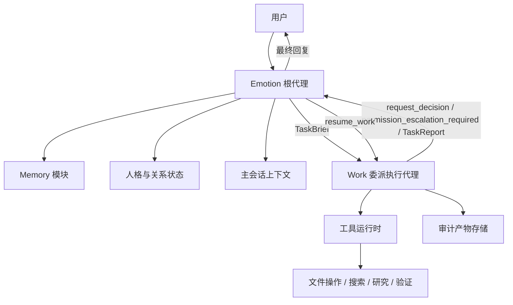
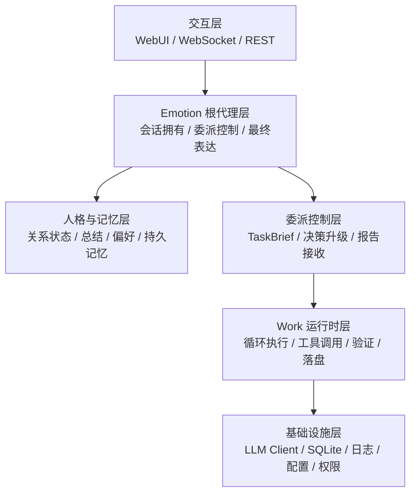
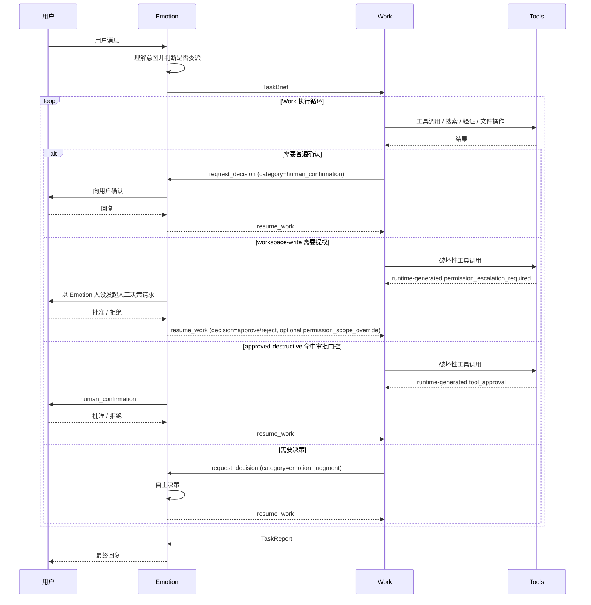
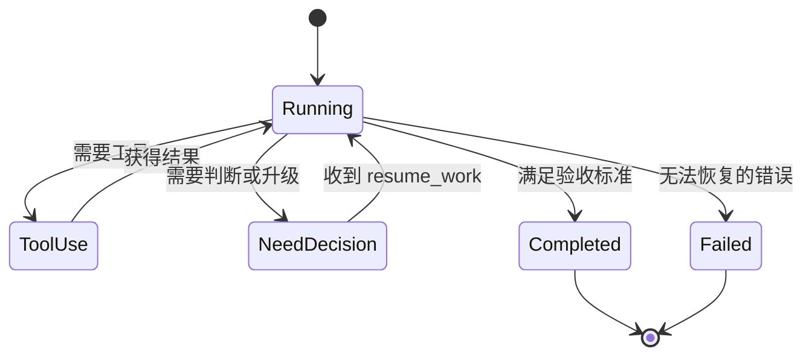

# EmoAgent 总体框架设计方案

**日期：** 2026-03-29  
**状态：** Approved  
**类型：** 初期总体架构设计

## 1. 概述

EmoAgent 是一个部署在本地的个人情感陪伴 Agent。它的目标不只是响应用户请求，还要在长期使用中维持稳定的人格感、情感连续性与关系记忆，并在需要执行复杂任务时，将执行压力委派给一个上下文更纯净的工作型 Agent。

本方案采用：

- `Emotion 根代理 + Work 委派执行代理`

其核心思想如下：

- `Emotion` 是唯一面向用户的会话拥有者
- `Work` 是由 Emotion 委派的执行型子代理
- `Emotion` 负责人格、情感、关系连续性与最终表达
- `Work` 负责工具调用、文件操作、复杂搜索、研究与验证
- `Work` 可在一次委派中进行多轮自循环，直到完成任务目标
- `Work` 在遇到需要判断、设计取舍或普通用户确认的问题时，向 `Emotion` 发起 `request_decision`
- `Work` 在 `workspace-write` 下命中破坏性操作时，由 runtime 生成 `permission_escalation_required` 暂停，由 Emotion 转述给用户拍板
- `Emotion` 可以自行决策，也可以进一步询问用户

本设计不再采用“每轮由路由器在 EmotionHarness 和 WorkHarness 间二选一”的模式，而是明确采用：

- `Emotion 始终拥有对外会话`
- `Work 仅在需要时被调用`

## 2. 设计目标

### 2.1 核心目标

- 保持稳定的情感陪伴体验
- 避免工具执行过程污染主会话上下文
- 支持复杂任务的自主执行与结果回传
- 为执行过程保留可审计的持久化产物
- 将长期记忆与最终表达控制在 Emotion 层

### 2.2 非目标

- 在初期版本中构建多个对等协作代理
- 在初期版本中实现全自动高风险系统控制
- 在初期版本中构建完整的长期语义记忆系统
- 允许 Work 直接接管用户会话

## 3. 关键设计决策

| 决策项 | 设计选择 |
|---|---|
| 用户会话所有权 | Emotion 唯一持有 |
| 执行代理 | Work 委派循环代理 |
| 用户交互入口 | 仅 Emotion |
| Work 与用户交互 | 不直接交互，只与 Emotion 通信 |
| Emotion 工具能力 | 可直接使用轻量、低风险、低污染工具 |
| 任务执行模型 | 多轮自循环直到完成 |
| 决策升级 | Work 通过 `request_decision` 发起普通决策升级；权限提权由 runtime 暂停触发 |
| 文件操作 | 默认由 Work 在权限边界内执行 |
| 长期记忆写入 | 仅 Emotion / MemoryModule |
| Work 输出 | 结构化报告 + 审计产物 |
| 上下文策略 | Emotion 与 Work 分离维护上下文 |

## 4. 总体架构

### 4.1 高层架构图



### 4.2 分层视图



### 4.3 可参考的框架实现来源

本项目的产品定义与架构边界由 EmoAgent 自身决定，不以 LangChain 为产品替代品。但在运行时机制层面，可以有选择地参考 LangChain 生态中的成熟设计。

建议参考原则：

- `参考实现思路，不直接照搬产品定义`
- `优先借鉴运行时能力，不让框架反向主导产品结构`
- `以 Go 主架构为主，LangChain / LangGraph 更适合作为机制参考或后续 Python sidecar 参考`

可参考的对应关系如下：

| EmoAgent 设计点 | 可参考来源 | 参考内容 |
|---|---|---|
| Emotion 委派 Work | LangGraph / Deep Agents | subagent、supervisor、context quarantine |
| Work 原上下文继续执行 | LangGraph | interrupt、checkpoint、resume |
| 多轮工具调用 | LangChain / LangGraph | tool runtime、middleware、loop orchestration |
| 决策升级 | LangGraph | human-in-the-loop / interrupt |
| Work 上下文隔离 | Deep Agents | subagent 独立上下文、最小工具集 |
| 任务持久化与恢复 | LangGraph | persistence、thread/checkpoint 模型 |
| 可观测性与评测 | LangSmith | tracing、eval、feedback、run 关联 |

其中最值得重点借鉴的不是通用 Agent 封装，而是以下机制：

- `subagent 的上下文隔离`
- `中断后恢复执行`
- `任务运行轨迹记录`
- `评测与人工反馈闭环`

## 5. 核心角色划分

### 5.1 Emotion 根代理

职责：

- 拥有全部用户会话
- 持有人格、表达方式与关系连续性
- 决定是否将任务委派给 Work
- 将用户需求与自身意图整理为 `TaskBrief`
- 接收并处理 Work 发起的 `request_decision`
- 接收 runtime 生成的 `permission_escalation_required` 暂停，并转为面向用户的人审请求
- 自主做出决策，必要时向用户追问
- 接收 `TaskReport` 并组织最终面向用户的回复
- 决定哪些信息可以提升为长期记忆

Emotion 是系统的稳定“自我”，不能被 Work 替代。

Emotion 也可以直接调用一组轻量工具，但这些工具必须满足：

- 单步或极少步即可完成
- 输出体积较小
- 风险较低
- 不会显著污染主会话上下文
- 不需要复杂验证、研究或审计落盘

### 5.2 Work 委派执行代理

职责：

- 在独立且更纯净的上下文中执行任务
- 在一次委派中进行多轮工具调用与验证，直到任务完成
- 执行复杂搜索、研究、文件操作和程序验证
- 产出可审计的持久化执行结果
- 在需要判断、澄清时向 Emotion 升级
- 在 `workspace-write` 命中破坏性操作时，由 runtime 暂停并等待 Emotion 转给用户拍板
- 将简洁的结构化任务报告返回给 Emotion

Work 是执行型子代理，不是对用户说话的人格主体。

Work 主要承接以下类型的任务：

- 文件读写与受控文件修改
- 复杂搜索与研究
- 多步骤验证
- 高噪音工具调用
- 需要结构化报告的执行任务
- 需要持久化审计产物的任务

### 5.3 Memory 模块

职责：

- 管理关系级记忆、用户偏好和长期事实
- 提供摘要状态与可注入的长期记忆片段
- 仅接受 Emotion 侧批准后的持久化写入
- 防止 Work 将执行噪音直接写入长期记忆

## 6. 委派模型

### 6.1 委派原则

Emotion 不直接照搬用户原话给 Work，而是将用户意图、自身判断与执行约束整理为一份受控任务契约。

TaskBrief 至少应包含：

- 任务目标
- 必要背景
- 约束条件
- 验收标准
- 权限范围
- 任务语义与执行约束

这样可以让 Work 保持执行效率，同时保留 Emotion 对最终用户表达的控制权。

### 6.2 Emotion 直连工具与 Work 委派的边界

是否委派给 Work，不应仅由任务名称决定，而应由以下因素共同判断：

- 执行复杂度
- 上下文污染风险
- 权限风险
- 是否需要多轮循环
- 是否需要审计产物

Emotion 适合直接处理的任务：

- 时间、日期、天气等轻量查询
- 简单只读信息获取
- 单步格式转换或轻量整理
- 不需要多轮验证的小任务

Work 适合承接的任务：

- 文件操作
- 复杂代码搜索与分析
- 长链路研究任务
- 多轮工具调用和验证
- 输出较大、过程较复杂的任务
- 需要审计与复盘的任务

可以采用如下判断表：

| 判断项 | Emotion 直接处理 | 委派给 Work |
|---|---|---|
| 工具调用步数 | 1-2 步 | 多步循环 |
| 输出体积 | 小 | 大 |
| 风险等级 | 低 | 中高 |
| 是否需要文件写入 | 否 | 是 |
| 是否需要验证/研究 | 否或很轻 | 是 |
| 是否需要审计产物 | 否 | 是 |

### 6.3 运行时序图



## 7. 上下文治理策略

### 7.1 上下文分离

Emotion 上下文包含：

- 用户主对话
- 人格规则
- 关系连续性
- 长短期记忆摘要
- 最终回复构造所需内容

Work 上下文包含：

- 当前委派任务说明
- 任务局部推理和中间结论
- 工具调用结果
- 验证过程
- 证据引用与产物路径

这种分离的核心目的有两个：

- 保持主会话的纯净度和陪伴感
- 减少复杂执行导致的 token 膨胀

### 7.2 Emotion 对 Work 的影响方式

Emotion 可以影响 Work，但不应将完整情绪历史或完整人格上下文灌入 Work。

推荐采用“薄注入”的方式：

```json
{
  "task_goal": "...",
  "task_context": "...",
  "constraints": ["..."],
  "acceptance_criteria": ["..."],
  "permission_scope": "read-only | workspace-write | approved-destructive"
}
```

约束规则：

- 不注入完整 persona
- 不注入完整长期记忆
- 不重放完整历史对话
- 只提供完成任务真正必要的信息和执行约束
- 若任务产物本身需要“正式”“简短”等风格，必须作为任务语义写入 `goal`、`background` 或 `constraints`
- 最终面对用户的表达风格始终由 Emotion 决定，不能通过独立风格 side channel 注入 Work

## 8. Emotion 与 Work 的协议设计

### 8.1 TaskBrief

Emotion 发给 Work 的任务契约。

建议字段：

- `task_id`
- `goal`
- `background`
- `constraints`
- `acceptance_criteria`
- `permission_scope`
- `artifact_policy`

### 8.2 request_decision / DecisionPacket

Work 在遇到判断阻塞或普通确认时，向 Emotion 发起的升级请求；`workspace-write` 下的破坏性工具调用由运行时生成独立的 `permission_escalation_required` 暂停；审批门控的破坏性工具调用则由运行时生成独立的 `tool_approval` packet。

建议字段：

- `task_id`
- `category`
- `question`
- `why_blocked`
- `options`
- `recommended_option`
- `risk_level`（由 `category` 派生，不由模型直接填写）

`category` 的约定值：

- `auto`：无需升级，运行时可自动继续
- `emotion_judgment`：需要 Emotion 做取舍或表达判断
- `human_confirmation`：普通的人类确认或澄清，不等于工具审批
- `permission_escalation_required`：runtime-only，表示当前 scope 不足，Emotion 必须转给用户拍板
- `tool_approval`：审批门控的破坏性工具调用，由 runtime 拦截触发

### 8.3 resume_work

Emotion 返回给 Work 的恢复执行结果。

核心规则：

- `append-only`
- `delta-only`

即：

- 仅追加新的决策结果
- 仅传递增量约束
- 不重发完整任务描述
- 不重发完整 persona
- 不重发已有证据

建议字段：

- `task_id`
- `decision`
- `reason`
- `constraints_delta`

Work 在收到 `resume_work` 后，继续在原上下文中执行，而不是重启新任务。

### 8.4 TaskReport

Work 最终返回给 Emotion 的任务结果报告。

建议字段：

- `task_id`
- `status`
- `goal`
- `summary`
- `findings`
- `evidence`
- `open_questions`
- `artifact_path`

## 9. Work 运行时状态机



### 9.1 必须升级给 Emotion 的场景

- 需要设计取舍
- 需要高风险文件修改
- 目标存在歧义或冲突
- 结果不够确定但需要对外表达
- 需要引入用户偏好或情感表达判断
- 需要普通决策升级
- 当前 `workspace-write` scope 不足以执行破坏性调用

### 9.2 Work 可自主处理的场景

- 读取文件
- 搜索代码或文档
- 运行验证
- 汇总结论候选
- 写入审计产物

## 10. 执行日志设计

Work 的执行过程留下可排查的日志，定位为 **调试工具而非审计系统**。

日志内容：

- 任务元信息
- 输入任务摘要
- 关键工具调用记录
- 关键观察结论
- 决策请求与响应记录
- 最终结果快照
- 失败信息和阻塞原因

路径：`logs/work/YYYY-MM-DD/<task_id>.jsonl`

作用：

- 方便人工排查
- 支撑 Emotion 在必要时做二次审阅

## 11. 远期演进：可观测性与评测

> 以下内容为远期演进方向，MVP 阶段不实现。记录于此作为后续参考。

如需系统性优化委派策略，可引入层级化 trace（root span → emotion span → work span → tool span），以本地文件为载体。可参考 LangSmith 的 tracing 设计。

积累足够样本后，可建立评测集覆盖：委派正确性、上下文纯净度、任务完成度、表达质量。支持用户正负反馈回流到提示词优化。

同样，已落地的进度回调仍可继续演进为更细粒度的前端状态展示、阶段聚合和用户可见进度摘要。

更完整的审计产物体系（结构化 `.json` + 可读 `.md`、证据引用、工具调用链）以及复杂任务拆解机制（将大任务拆成可恢复的子任务列表并落盘）也属于远期方向

## 12. 权限与安全策略

Work 是唯一允许执行工具型任务的层，但必须受权限模型约束。

**MVP 阶段：** 采用显式 `permission_scope` 控制，由 Emotion 在 TaskBrief 中定义。

执行规则：

- Emotion 在 TaskBrief 中定义初始 `permission_scope`
- Work 不得自行升级权限
- Work 不能通过 `request_decision` 申请破坏性权限升级
- `workspace-write` 命中破坏性调用时，runtime 生成 `permission_escalation_required`
- Emotion 遇到 `permission_escalation_required` 时不得自行判断，必须按自己的人设向用户发起人工决策请求，再把 `approve / reject` 原样回传给 Work
- `tool_approval` 只用于已进入 `approved-destructive` 路径后的审批门控破坏性工具调用
- `human_confirmation` 只表示普通的用户确认或澄清，不等同于权限审批

> **远期方向：** 后期可引入更细的权限表达，但当前实现中 `permission_scope` 仅允许 `read-only`、`workspace-write`、`approved-destructive`。

## 13. 记忆所有权

长期记忆不归 Work 管理。

规则：

- Work 可以输出 `memory_candidates`
- Emotion 决定是否提升为持久记忆
- 关系记忆必须以用户和长期互动价值为中心
- 执行日志不得自动进入长期记忆

这样可以防止执行细节污染陪伴型 Agent 的关系层记忆。

## 14. 初期开发阶段建议

### Phase 0：基础骨架

- Go 项目结构
- 配置加载
- 日志与 SQLite
- LLM Client
- 基础消息抽象

### Phase 1：Emotion 根代理 + 基础 WebUI

- 面向用户的主循环
- 基础 persona 提示（可配置文件）
- Session 状态管理
- 短期上下文维护（内存 + JSONL 日志）
- WebSocket 聊天界面
- 在真实交互中验证陪伴体验

### Phase 2：工具系统

- Tool 定义规范（JSON Schema）
- Handler 注册机制
- 工具调度（dispatch map）
- 内置基础工具（文件读写、时间查询等）
- Emotion 直连轻量工具在此阶段可用

### Phase 3：上下文管理

- Token 估算
- 摘要压缩（LLM 总结 + 归档）
- KeepRecent 策略

### Phase 4：Work 运行时 + 决策升级

- TaskBrief 协议
- Work 自循环执行（基于已有的工具系统）
- 执行日志写入
- TaskReport 返回
- `request_decision` / `resume_work`
- Emotion 决策处理
- 必要时向用户澄清
- runtime `tool_approval` 拦截审批门控的破坏性工具调用

**——— MVP 分界线 ———**

### Phase 6+：后续迭代（独立、按需排序）

- 持久记忆系统（偏好 / 关系摘要 / 关键事件）
- 情感状态机（Valence/Arousal 2D 模型）
- Python AI Sidecar（Embedding / Scorer / RAG）
- 第三方平台接入（Telegram Adapter）
- 定时任务 / 主动关心
- 更细粒度的进度策略与前端可视化
- 分级权限体系
- 运行时可观测性与评测
- 复杂任务拆解与磁盘计划

## 15. 主要优势

- 保持稳定的人格连续性
- 维持主会话上下文纯净
- 降低复杂执行带来的性能成本
- 将高噪音执行过程隔离到 Work
- 形成清晰的权限边界
- 让执行过程具备审计与复盘能力

## 16. 主要风险

- 若重新引入人格派生的风格 side channel，可能重新污染 Work 上下文
- TaskBrief 过薄会降低 Work 完成度
- TaskBrief 过厚会增加 token 成本
- `request_decision` 过于频繁会让 Emotion 成为瓶颈
- 长任务仍然需要 Work 内部自己的上下文压缩策略
- 审计产物可能增长过快，需要后续补 retention 策略
- tracing / eval 若缺失，后续难以系统性优化委派与记忆质量

## 17. 最终结论

EmoAgent 不应设计成两个对等的 Harness 在每轮会话中竞争控制权。

更合理的总体框架应为：

- `Emotion 根代理` 作为稳定人格与会话拥有者
- `Work 委派执行代理` 作为高执行密度的工具型子代理
- `Memory 模块` 作为受控的持久状态层
- `Artifact 审计产物` 作为执行与排查的中间载体

该结构最符合 EmoAgent 的产品目标：

- 既能作为情感陪伴体保持连贯表达
- 又能在需要时以更干净、更高效的上下文完成复杂任务
- 同时保留清晰的权限边界与执行审计能力
