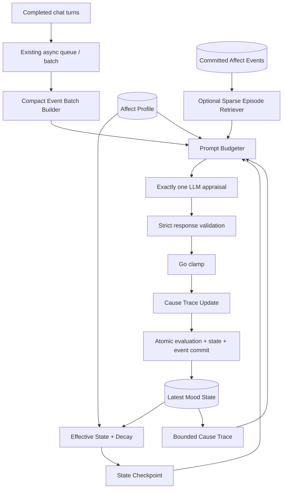

# EmoAgent Agent Affect：LLM-Only Checkpointed Appraisal 重构实施 Spec

> **文档状态**：Implementation Spec  
> **版本**：1.0  
> **日期**：2026-06-25  
> **目标仓库**：`LongYiSang/EmoAgent`  
> **建议落库路径**：`docs/specs/agent_affect_llm_only_checkpoint_refactor_spec.md`  
> **架构名称**：**LLM-Only Checkpointed Affect Appraisal with Bounded Trace**  
> **实施方式**：分阶段；每阶段独立可测试、可回滚，不允许跨阶段一次性大改。

---

## 0. 最终决策

普通聊天 turn 的 Agent Affect 评估只保留一条路径：

```text
eligible completed turn batch
  → exactly one LLM appraisal
  → Go-side decay + clamp + bounded cause-trace update
  → atomic evaluation/state/event commit
```

不实现以下路由：

```text
Tier 0 no-model scene skip
Tier 1 rule/classifier appraisal
基于场景类型的复杂本地 delta 模板
```

LLM 可以判断结果为 `no meaningful change` 并返回零 delta，但普通聊天 batch 是否调用 LLM，不由本地场景规则决定。

以下现有显式控制路径继续保留，不属于“场景路由”：

- 插件显式 `ApplyMoodDelta` / commit；
- Admin/debug 手动 delta、reset、preview；
- evaluator disabled / service disabled 的 neutral fallback；
- 输入无效、来源不可用、系统关闭等基础 guard。

---

## 1. 要解决的问题

当前在线推理把 `agent_affect_evaluations` 审计记录当作下一次 appraisal 上下文：

1. worker 读取默认最近 30 条 evaluation；
2. `buildBatchEvaluationInput()` 把 current mood、recent evaluations、limits 写进 batch JSON；
3. evaluator 外层又重复写入 current mood、previous evaluations、limits；
4. batch JSON 被保存进新的 `evaluation.input_summary`；
5. 后续读取完整 evaluation 时再次把这些嵌套历史序列化进 prompt。

这会造成：

- 同一请求内重复上下文；
- evaluation 历史递归嵌套；
- prompt 大小随历史增长，而不是保持常数上界；
- provider prefix cache 难以稳定命中；
- `MaxInputTokens` 只限制 job 粗略估算，不限制最终 prompt；
- `store_raw_inputs=false` 只清空 `input_text`，不能阻止巨大 `input_summary` 被保存；
- evaluator 错误当前可能退化为 no-change，并被异步 batch 当作成功提交；
- 零 delta 的 `significance()` 当前返回 `0.5`，不利于显著事件筛选。

本 Spec 的核心不是把 30 改成更小的 N，而是永久移除：

```text
AffectEvaluationRecord → online evaluator prompt
```

---

## 2. 当前仓库基线

本 Spec 编写时基于 `main` 的以下实现；开始编码前必须重新读取最新 `main` 并记录漂移。

| 文件 | 当前职责 | 需要保留 | 需要改变 |
|---|---|---|---|
| `internal/chat/turn_runtime.go` | 回复前读取 mood；回复提交后 enqueue job | turn 集成点、async-after-reply | 只保证传入当前 turn 数据，不承担 history 拼接 |
| `internal/agentaffect/service.go` | sync 评估、current state、recent evaluations、commit | Service API、owner 解析、commit/preview | 在线路径不再调用 `recentEvaluations()`；加入 effective state/decay |
| `internal/agentaffect/worker.go` | claim batch、拼 payload、调用 evaluator、原子提交 | batch、stale-state check、retry/atomic commit | payload 只描述当前 event batch；不嵌 current/history/limits |
| `internal/agentaffect/evaluator_llm.go` | 构造 one-shot prompt | 单次 non-streaming Chat、统一 client | 新 v3 prompt、固定前缀、硬预算、usage 回传 |
| `internal/agentaffect/evaluator.go` | JSON 解析和 fallback | no-change fallback、derive helper | 严格 v3 schema、appraisal/cause 解析和验证 |
| `internal/agentaffect/dto.go` | vector/state/evaluation/event DTO | 11 维 vector、`CauseStack`、现有 API | 增加 checkpoint、appraisal、budget、usage、cause 字段 |
| `internal/agentaffect/store_sqlite.go` | state/evaluation/event CRUD | SQLite authority、history/admin 查询 | history 只用于审计；新增 compact event candidate 查询 |
| `internal/agentaffect/store_jobs_sqlite.go` | queue、batch、粗略 token 估算 | 连续 claim、batch 原子状态 | 最终 budget 不再依赖 `chars/4`；UTF-8 安全截断 |
| `internal/storage/schema.go` | migrations | v20-v23 数据兼容 | 新增下一 migration，保存 v3 appraisal/usage/episode metadata |
| `internal/config/config.go` | Agent Affect config | enabled/update mode/limits | 增加 checkpoint/trace/budget 配置，旧 history 配置标记废弃 |
| `web/src/admin/tabs/AgentAffectTab.tsx` | Admin 配置和审计 | 当前 mood/profile/queue/history | 暴露真正影响成本的预算、trace、usage、truncation 状态 |

基线文件指纹：

```text
worker.go              c967a1f3...
evaluator_llm.go       49052622...
service.go             bac2f789...
dto.go                 e5605301...
config.go              adadf857...
storage/schema.go      ca413e81...
turn_runtime.go        38513df8...
AgentAffectTab.tsx     0aa23d39...
```

如文件职责已经明显变化，先更新本 Spec 的“基线差异”章节，不可机械套用旧行号。

---

## 3. 目标架构

### 3.1 总体结构



### 3.2 五个层次

#### A. Affect State Checkpoint

在线连续性的第一来源是最新 `MoodSnapshot`，而不是过去 evaluation 文本。Checkpoint 包含：

```text
current effective vector
label
confidence
state age
bounded active causes
```

#### B. Bounded Cause Trace

`agent_affect_states.cause_stack_json` 保存最多 5 个仍有影响的原因。它是路径依赖的常数大小摘要，不是聊天历史或 evaluation 历史。

#### C. Sparse Affective Episodes

仅作为可选补充，最多 0–2 条，每条为已提交 event 的安全短摘要。检索不允许新增 LLM 请求；默认先关闭，待 Phase 4 通过质量门后启用。

#### D. LLM-Only Appraisal

所有普通 eligible batch 都调用一次 evaluator。LLM 输出 appraisal、delta、cause 和 confidence；Go 不做场景分类或 delta 模板。

#### E. Slow Reflection

低频反思不在本次核心实施范围。只有在主链路成本与质量稳定后，才可另开 Spec 设计“每日/每 50 次 event 的压缩反思”。本次不得新增第二次在线 LLM 调用。

---

## 4. 强制架构不变量

1. **普通聊天 batch 只有一个 appraisal 路径，且调用一次 LLM。**
2. **在线 prompt 永远不得包含 `AffectEvaluationRecord` 列表。**
3. **`ListRecentEvaluations` 仅供 Admin、历史 API、离线 eval 和审计。**
4. **current state、limits、profile、event batch 在最终 prompt 中各出现一次。**
5. **最终 prompt 构造完成后必须通过 budgeter；claim 阶段估算不能作为最终保护。**
6. **Go 拥有 decay、clamp、cause trace、并发一致性和 commit 权威。**
7. **LLM 不能改变权限、memory 状态、clamp 上限或 source visibility。**
8. **evaluation 是审计日志，不是下一次推理状态。**
9. **`store_raw_inputs=false` 时不得持久化 user/assistant/memory event text，也不得保存完整 prompt。**
10. **所有截断必须 rune-safe；不得按 byte 切断中文 UTF-8。**
11. **provider/parse 失败时不得提交新 mood state。异步路径应按现有 retry policy 重试。**
12. **stale-state 检查必须继续阻止基于过期 state 的 commit。**
13. **Agent affect 不成为用户 fact，不进入 MemoryCore/Trivium 普通检索。**
14. **显式插件/debug delta 保留，并继续受 clamp、审计和 owner scope 约束。**

---

## 5. 新的在线数据契约

### 5.1 Go DTO

建议新增或重构为以下内部类型；命名可按现有风格调整，但语义必须保持。

```go
type AffectAppraisal struct {
    EventSignificance float64 `json:"event_significance"`
    Novelty           float64 `json:"novelty"`
    GoalRelevance     float64 `json:"goal_relevance"`
    RelationshipImpact float64 `json:"relationship_impact"`
    BoundaryImpact    float64 `json:"boundary_impact"`
    Uncertainty       float64 `json:"uncertainty"`
}

type AffectCauseProposal struct {
    Code           string   `json:"code"`
    Summary        string   `json:"summary"`
    VisibleSummary string   `json:"visible_summary"`
    Tags           []string `json:"tags"`
}

type AffectStateCheckpoint struct {
    Vector       MoodVector       `json:"vector"`
    Label        string           `json:"label"`
    Confidence   float64          `json:"confidence"`
    AgeSeconds   int64            `json:"age_seconds"`
    ActiveCauses []PromptCause    `json:"active_causes,omitempty"`
}

type AffectEventBatch struct {
    TurnCount int                 `json:"turn_count"`
    Turns     []CompactAffectTurn `json:"turns"`
    MemoryContext []string        `json:"memory_context,omitempty"`
}

type PromptBudgetReport struct {
    Strategy             string         `json:"strategy"`
    PromptChars          int            `json:"prompt_chars"`
    EstimatedInputTokens int            `json:"estimated_input_tokens"`
    LimitTokens          int            `json:"limit_tokens"`
    Truncated            bool           `json:"truncated"`
    DroppedSections      []string       `json:"dropped_sections,omitempty"`
    SectionEstimates     map[string]int `json:"section_estimates"`
}
```

`LLMEvaluationRequest` 的新路径必须包含：

```text
compact profile
state checkpoint
current event batch
optional affective episodes
dimension limits
prompt budget policy
```

不得再使用：

```go
Recent []AffectEvaluationRecord
```

可在一个兼容周期内保留字段定义，但 v3 builder 和 runtime 不得读取它。

### 5.2 扩展 `CauseContributor`

复用现有 `CauseStack`，以可选 JSON 字段向后兼容：

```go
type CauseContributor struct {
    Kind       string             `json:"kind"` // v3 中作为 cause code
    Summary    string             `json:"summary"`
    Weight     float64            `json:"weight"`
    Confidence float64            `json:"confidence,omitempty"`
    Delta      map[string]float64 `json:"delta,omitempty"` // 只保存显著非零维度
    OccurredAt time.Time          `json:"occurred_at,omitempty"`
}
```

不得把原始 user text、assistant text、memory prompt 或完整 appraisal 放入 cause stack。

### 5.3 LLM v3 输出

```json
{
  "schema_version": "agent_affect.v3.appraisal.v1",
  "appraisal": {
    "event_significance": 0.0,
    "novelty": 0.0,
    "goal_relevance": 0.0,
    "relationship_impact": 0.0,
    "boundary_impact": 0.0,
    "uncertainty": 0.0
  },
  "delta": {
    "valence": 0,
    "arousal": 0,
    "dominance": 0,
    "energy": 0,
    "warmth": 0,
    "concern": 0,
    "curiosity": 0,
    "playfulness": 0,
    "attachment": 0,
    "frustration": 0,
    "uncertainty": 0
  },
  "label": "steady",
  "cause": {
    "code": "neutral_interaction",
    "summary": "short internal cause",
    "visible_summary": "short safe cause",
    "tags": ["neutral"]
  },
  "confidence": 0.5
}
```

验证要求：

- `schema_version` 必须精确匹配；
- 所有 score 有限且在规定范围；
- `relationship_impact` 为 `[-1,1]`，其余 appraisal 为 `[0,1]`；
- `confidence` 为 `[0,1]`；
- `cause.code` 最长 64 rune，只允许安全 slug 字符或经规范化；
- summary 最长 120 rune，visible summary 最长 100 rune；
- tags 最多 4 个，每个最多 32 rune；
- delta 最终仍由现有 `ClampMoodDelta` 限幅；
- 不接受 hidden reasoning、response advice 或 memory permission 指令。

### 5.4 自然语言 mood 字段

v3 不要求 LLM 重复生成：

```text
mood_description
mood_reason
prompt_mood_text
```

本地生成：

```text
mood_description = normalized label
mood_reason = visible_summary，缺失时使用 summary
prompt_mood_text = buildPromptMoodTextFallback(mood_description, mood_reason)
```

现有数据库列、API 字段和 `FormatPromptAffectBlock` 保持兼容。

---

## 6. Checkpoint、衰减与 Cause Trace

### 6.1 Effective state

调用 LLM 前，基于 profile baseline 对最新存储状态做纯函数衰减：

```text
effective = baseline + (stored - baseline) * 2^(-elapsed_seconds / half_life_seconds)
```

要求：

- 对全部 11 个维度一致执行；
- 不在只读时自动插入 state；
- appraisal 成功 commit 时，以 effective state 作为 before state；
- `StateID` 仍引用原存储 checkpoint，用于 stale-state 检查；
- half-life 小于等于 0 时禁用 decay；
- 浮点异常回退到 stored state，并记录 warning；
- prompt 中数值最多保留 3 位小数，数据库保持原精度。

推荐默认：

```text
state decay half-life = 1800 seconds
cause trace half-life = 3600 seconds
```

### 6.2 Cause trace 更新算法

Go 侧执行，不做场景判断：

```text
1. 对旧 cause weight 进行时间衰减。
2. 丢弃 weight < min_weight 的条目。
3. new_weight = clamp(appraisal.event_significance * confidence, 0, 1)。
4. 如果 cause.code 非空且 new_weight >= min_weight：
   - 与相同 code 的 cause 合并；或
   - 追加新 cause。
5. 合并时更新摘要、confidence、occurred_at 和 sparse delta；weight 使用有上限的加权更新。
6. 按 weight DESC、occurred_at DESC 排序。
7. 最多保留 `cause_stack_max_items`，默认 5。
```

推荐合并公式：

```text
merged_weight = min(1, old_weight * 0.55 + new_weight)
```

零 delta 且 `event_significance` 很低时可以不追加 cause，但该 batch 仍然已经由 LLM 判断，不属于 Tier 0 路由。

### 6.3 Event significance

`agent_affect_events.significance` 优先使用 LLM 的 `appraisal.event_significance`。

兼容 fallback：

```text
max absolute committed delta
```

并修复：

```text
zero delta significance = 0
```

不得继续返回 `0.5`。

---

## 7. Sparse Affective Episodes

### 7.1 目的

Cause trace 只保存当前活跃原因；少量旧但高度相关的 committed event 可补充路径依赖。该能力不得恢复“最近 N 条完整 evaluation”。

### 7.2 数据源

只读取：

```text
agent_affect_events with committed state transition
visibility_status = visible
same persona + mood owner
safe cause_summary
significance
created_at
cause_code / affect tags
```

不得读取或序列化：

```text
evaluation.input_text
full evaluation.input_summary
before_state_json
response_json
prompt_snapshot
```

### 7.3 不增加 LLM 请求的本地检索

建议接口：

```go
type AffectEpisodeRetriever interface {
    Retrieve(ctx context.Context, q AffectEpisodeQuery) ([]AffectEpisodeSummary, error)
}
```

baseline 实现：

1. 从最近最多 100 个 eligible committed event 取 candidate；
2. 对当前 event batch 文本与 `cause_summary + tags` 做 Unicode n-gram/Jaccard 相似度；
3. 计算：

```text
score = 0.55 * text_similarity
      + 0.30 * significance
      + 0.15 * recency
```

4. 过滤低于阈值的结果；
5. 去掉已在 active cause trace 中的同 code 项；
6. 最多 top 2，每条最多 160 rune；
7. budget 不足时先丢 episode，不得挤占 current event 或 checkpoint。

该功能 Phase 4 前默认关闭。

---

## 8. Prompt 设计

### 8.1 稳定前缀

System prompt 按固定顺序组织：

```text
role and non-user-facing responsibility
simulation/safety invariants
vector dimension definitions
appraisal field definitions
strict v3 output schema
```

固定内容置于最前；动态内容全部放入单个 user message。不要依赖任何 provider 特有 cache 行为，但应提高稳定前缀可缓存性。

### 8.2 动态 payload

顺序固定：

```text
compact persona affect profile
current effective state checkpoint
active cause trace
optional affective episodes
current chronological event batch
dimension limits
```

要求：

- 使用 typed struct + `json.Marshal`；禁止 `json.MarshalIndent`；
- omission 使用 `omitempty`；
- 不发送 UUID、owner id、完整 timestamp，除非模型确实需要；
- batch turns 使用 ordinal，不把 session/turn UUID 当语义文本；
- current state、limits 只出现一次；
- 不再使用 XML 中套转义 JSON 字符串的多重嵌套；
- prompt hash 基于最终 system + user 内容计算。

### 8.3 Event batch

当前 batch 只包含：

```text
user text or existing job summary
assistant reply or existing job summary
最多一个去重后的 memory context 列表
```

Memory context：

- 仅使用上游已生成的 memory prompt block；
- 去重后按总字符预算截断；
- 不新增 summary LLM 调用；
- 默认总量不超过 600 rune；
- 可配置为完全关闭。

### 8.4 Hard prompt budget

新增 `AffectPromptBudgeter`，在最终 ChatRequest 创建前运行。

推荐默认：

```yaml
context:
  strategy: checkpoint_trace_v1
  max_input_tokens: 2800
  budget_safety_margin: 0.85
  max_user_chars_per_turn: 700
  max_assistant_chars_per_turn: 900
  max_memory_context_chars: 600
  cause_stack_max_items: 5
  cause_summary_max_chars: 120
  affective_episode_enabled: false
  affective_episode_candidate_limit: 100
  affective_episode_top_k: 2
  affective_episode_max_chars: 160
```

仓库当前没有统一 tokenizer。先实现保守、可替换的估算器：

```text
estimated_tokens = ceil(ascii_runes / 4) + non_ascii_runes + structural_margin
structural_margin = ceil(base * 0.10)
```

该估算对中文偏保守。实际 provider `Usage.InputTokens` 必须在返回后记录，用于校准。

### 8.5 截断优先级

超预算时按顺序处理：

```text
1. 丢弃最低分 affective episode。
2. 缩短/丢弃 memory context。
3. 缩短低权重 active cause summary，但保留 code/weight。
4. 缩短 assistant text 尾部。
5. 缩短 user text 尾部。
6. 对多 turn batch 做公平分配，保证每个 turn 至少保留一个最小 user/assistant 片段。
```

永不丢弃：

```text
system safety rules
output schema
current effective vector
current event batch 的存在性
limits
```

如果静态必需部分本身超过预算，返回配置错误，不调用 LLM，不静默发超大请求。

### 8.6 输出预算

推荐默认：

```yaml
evaluator:
  thinking_enabled: false
  reasoning_effort: minimal
  temperature: 0
  max_output_tokens: 512
```

仍允许用户显式开启 thinking，但 Admin 必须提示额外成本；默认和示例配置不得开启。

---

## 9. 持久化与 migration

### 9.1 Migration

当前 `schema.go` 最新 migration 为 32；实现时再次确认，若无新 migration，新增 33。

建议增加：

```sql
ALTER TABLE agent_affect_evaluations ADD COLUMN appraisal_json TEXT NOT NULL DEFAULT '{}';
ALTER TABLE agent_affect_evaluations ADD COLUMN context_strategy TEXT NOT NULL DEFAULT '';
ALTER TABLE agent_affect_evaluations ADD COLUMN prompt_chars INTEGER NOT NULL DEFAULT 0;
ALTER TABLE agent_affect_evaluations ADD COLUMN estimated_input_tokens INTEGER NOT NULL DEFAULT 0;
ALTER TABLE agent_affect_evaluations ADD COLUMN actual_input_tokens INTEGER NOT NULL DEFAULT 0;
ALTER TABLE agent_affect_evaluations ADD COLUMN actual_output_tokens INTEGER NOT NULL DEFAULT 0;
ALTER TABLE agent_affect_evaluations ADD COLUMN prompt_truncated INTEGER NOT NULL DEFAULT 0;
ALTER TABLE agent_affect_evaluations ADD COLUMN budget_report_json TEXT NOT NULL DEFAULT '{}';

ALTER TABLE agent_affect_events ADD COLUMN source_kind TEXT NOT NULL DEFAULT '';
ALTER TABLE agent_affect_events ADD COLUMN source_ref_type TEXT NOT NULL DEFAULT '';
ALTER TABLE agent_affect_events ADD COLUMN source_ref_id TEXT NOT NULL DEFAULT '';
ALTER TABLE agent_affect_events ADD COLUMN source_ref_hash TEXT NOT NULL DEFAULT '';
ALTER TABLE agent_affect_events ADD COLUMN cause_code TEXT NOT NULL DEFAULT '';
ALTER TABLE agent_affect_events ADD COLUMN affect_tags_json TEXT NOT NULL DEFAULT '[]';

CREATE INDEX IF NOT EXISTS idx_agent_affect_events_owner_significance_time
ON agent_affect_events(persona_id, mood_owner_scope, mood_owner_id, significance DESC, created_at DESC);
```

如 SQLite 版本或现有修复策略要求 additive repair，应同时加入相应 schema repair 测试，不得修改已应用 migration。

### 9.2 Evaluation audit

填充当前已有但常为空的字段：

```text
llm_provider
llm_model
llm_thinking_enabled
prompt_version = agent_affect.v3.prompt.v1
prompt_hash
prompt_snapshot only when explicitly enabled
context_window_snapshot_json or budget_report_json
```

`response_json` 只保存 v3 compact output。

### 9.3 Raw input policy

`store_raw_inputs=false` 时：

```text
evaluation.input_text = NULL/empty
evaluation.input_summary = NULL/empty
job raw text is cleared after completion
batch_input_summary is cleared or replaced by non-content metadata/hash
prompt_snapshot is empty
```

当前 `storageInput()` 只清空 `Text`，必须同时处理 `Summary`。

`store_raw_inputs=true` 时也只允许保存当前 compact event batch，绝不能保存 checkpoint、trace、episodes 或 previous evaluation 结构。

### 9.4 History API

保留现有 evaluation/event history API 和 Admin timeline。历史数据仍可查看，但在线 evaluator 不得调用它们。

---

## 10. 失败语义

### 10.1 异步 batch

- provider transport error：batch 失败并按现有 retry policy 重试；
- invalid JSON / schema mismatch：视为 retryable evaluator failure；
- 超过最大尝试：job/batch 标记 failed，state/evaluation/event 不提交；
- stale state：保持现有“不提交过期结果”的行为；
- prompt budget 配置错误：non-retryable，记录明确错误；
- optional episode retrieval 失败：fail open，使用 checkpoint + trace + current event，仍只调用一次 LLM。

### 10.2 同步 preview/submit

- preview 失败可以返回 no-change fallback 和 failed status；
- commit 模式失败不得写入 state/event；
- 不允许把 provider/parse failure 伪装成 committed no-change。

### 10.3 Semantic no-change

LLM 正常返回：

```text
zero delta + low significance + valid v3 schema
```

这是成功 appraisal，可正常记录 evaluation/event；它与 evaluator failure 必须区分。

---

## 11. 配置变更

### 11.1 新字段

```yaml
agent_affect:
  state:
    scope: persona
    decay_enabled: true
    decay_half_life_seconds: 1800
    cause_stack_max_items: 5
    cause_half_life_seconds: 3600
    cause_min_weight: 0.05

  evaluator:
    mode: llm
    thinking_enabled: false
    reasoning_effort: minimal
    max_output_tokens: 512
    temperature: 0

  context:
    strategy: checkpoint_trace_v1
    max_input_tokens: 2800
    budget_safety_margin: 0.85
    max_user_chars_per_turn: 700
    max_assistant_chars_per_turn: 900
    max_memory_context_chars: 600
    affective_episode_enabled: false
    affective_episode_candidate_limit: 100
    affective_episode_top_k: 2
    affective_episode_max_chars: 160
    affective_episode_min_score: 0.35
    store_raw_inputs: false
    store_prompt_snapshot: false
```

### 11.2 旧字段兼容

以下字段保留一个兼容周期，但标记 deprecated：

```text
context.mode
raw_keep_last_requests
raw_keep_last_tokens
include_previous_evaluations
previous_evaluation_keep_last
summary_enabled
state.recent_context_scope
```

规则：

- `strategy=checkpoint_trace_v1` 时，旧 history 字段全部忽略；
- `include_previous_evaluations=true` 产生 Config Center warning；
- 不提供 UI 开关重新启用 previous evaluations；
- 如必须保留临时 rollback，可支持显式 `strategy=legacy_full_history`，但不得作为默认；
- 最终 Phase 5 删除 legacy runtime 分支，保留配置解析兼容或给出明确迁移错误。

### 11.3 默认状态

`agent_affect.enabled` 继续默认 `false`，避免升级后自动产生新 LLM 开销。

---

## 12. 分阶段实施计划

## Phase 0：基线锁定与回归护栏

### 目标

在改变行为前，把现有成本问题和不得破坏的并发/队列行为固化成测试。

### 任务

1. 新增 `docs/specs/agent_affect_llm_only_checkpoint_refactor_spec.md`。
2. 新增 prompt regression fixture，构造 100 条巨大 evaluation history。
3. 增加测试证明旧路径会读取 history；测试先可标记为待新实现通过，不允许长期 skip。
4. 为 current batch、stale state、claim expiry、raw clear、plugin delta 建立现有行为回归。
5. 记录 schema latest version、文件指纹和本地测试基线。

### 验证

```bash
go test ./internal/agentaffect/... ./internal/storage/... ./internal/chat/...
go test ./...
go build ./cmd/emoagent
npm --prefix web run typecheck
```

### Gate

现有测试全部通过；新 fixture 能稳定复现“历史数量增长导致 prompt 增长”。

---

## Phase 1：Compact v3 Prompt + Final Budget

### 目标

先切断递归历史和重复注入，使单次输入立即变成固定上界；暂不要求 episode retrieval。

### 主要文件

```text
internal/agentaffect/dto.go
internal/agentaffect/evaluator.go
internal/agentaffect/evaluator_llm.go
internal/agentaffect/worker.go
internal/agentaffect/service.go
internal/agentaffect/budget.go                 new
internal/agentaffect/prompt_v3.go              new
internal/agentaffect/text_compact.go           new or shared helper
internal/config/config.go
config.yaml
```

### 任务

1. 定义 v3 appraisal/cause/checkpoint/event/budget DTO。
2. 新建 compact prompt builder，移除 `previous_evaluations`。
3. worker 的 `Input.Summary` 只描述 current batch；不得内嵌 state/history/limits。
4. sync path 使用同一个 v3 builder。
5. 实现 rune-safe compact 和保守 token estimator。
6. 实现 hard prompt budget 和截断报告。
7. evaluator 捕获 `llm.ChatResponse.Usage`。
8. v3 parser 严格验证 schema 和长度。
9. 自然语言 mood 字段本地派生。
10. 调整 evaluator 默认 output/thinking/temperature。

### 必测断言

- prompt 不含字符串 `previous_evaluations`、`recent_evaluations`；
- DB 中存在 0、30、100、1000 条 evaluation 时，新 prompt 大小相同；
- current mood 和 limits 在 prompt 中只出现一次；
- estimated input tokens 永不超过配置；
- 超长中文输入输出始终是合法 UTF-8；
- `store_raw_inputs=false` 后 `Input.Text` 和 `Input.Summary` 均为空；
- LLM 正常零 delta 与 invalid JSON failure 可区分。

### Gate

1000 条历史 fixture 下，prompt 仍在配置预算内，且单 batch 仍只调用一次 evaluator。

---

## Phase 2：Decay + Bounded Cause Trace

### 目标

把情绪连续性从历史重放迁移到 checkpoint 和固定长度 trace。

### 主要文件

```text
internal/agentaffect/decay.go                  new
internal/agentaffect/trace.go                  new
internal/agentaffect/service.go
internal/agentaffect/worker.go
internal/agentaffect/dto.go
internal/agentaffect/store_sqlite.go
internal/config/config.go
```

### 任务

1. 实现 effective state 指数衰减。
2. 扩展 `CauseContributor` 可选字段。
3. 实现 trace decay、merge、prune、top-K。
4. appraisal success 后将新 trace 写入 `MoodSnapshot.CauseStack`。
5. prompt 只发送最多 N 条 compact active cause。
6. `significance(0)` 改为 0，并优先采用 appraisal significance。
7. 手动 reset 清空/重置 trace；manual/plugin delta 不伪造 LLM appraisal。
8. 保留 owner scope 和 stale-state consistency。

### 必测断言

- 一个 half-life 后偏移量准确减半；
- 两个 half-life 后为四分之一；
- trace 不超过 5；
- 同 code 合并，不同 code 按权重淘汰；
- 旧 JSON 中缺少 `occurred_at` 时可正常读取；
- reset 后 trace 符合预期；
- 任何 trace item 都不包含 raw turn text。

### Gate

连续 100 次 appraisal 后，state prompt 大小仍为常数上界，轨迹无 NaN/Inf，clamp 测试全部通过。

---

## Phase 3：Audit、Usage、Migration 与失败语义

### 目标

使成本、截断和模型行为可观察，并修复失败被提交为 no-change 的问题。

### 主要文件

```text
internal/storage/schema.go
internal/agentaffect/store.go
internal/agentaffect/store_sqlite.go
internal/agentaffect/store_jobs_sqlite.go
internal/agentaffect/evaluator_llm.go
internal/agentaffect/worker.go
internal/app/agent_affect_service.go
internal/configcenter/issues.go
```

### 任务

1. 增加 migration 33 或当前 next version。
2. 持久化 appraisal、prompt budget、estimated/actual usage、truncation、strategy。
3. 填充已有 provider/model/thinking/prompt hash 字段。
4. `ClearRawAfterDone` 同时清理 batch raw summary；预算快照只能存 metadata。
5. async evaluator transport/parse failure 进入 retry，不提交 state。
6. sync commit failure 不写 state/event。
7. 日志中只记录计数、hash、usage、latency，不记录 raw prompt。
8. Config Center 对 deprecated history 设置产生 warning。

### 必测断言

- v32 数据库可迁移到新版本；
- migration 幂等测试符合项目现有约定；
- actual token usage 写入 evaluation；
- provider error 首次重试、耗尽后 failed；
- invalid JSON 不产生 committed state/event；
- raw disabled 时 jobs、batch、evaluation、prompt snapshot 均无原始内容；
- Admin history 仍可读取旧 v2 rows 和新 v3 rows。

### Gate

能够从 SQLite 直接计算每次 appraisal 的 input/output token、prompt chars、trace count、是否截断和失败原因。

---

## Phase 4：Sparse Affective Episode Retrieval

### 目标

在不增加 LLM 调用的前提下，补充最多 2 条真正相关的显著旧事件。

### 主要文件

```text
internal/agentaffect/episode_retrieval.go       new
internal/agentaffect/text_similarity.go         new
internal/agentaffect/store.go
internal/agentaffect/store_sqlite.go
internal/agentaffect/worker.go
internal/config/config.go
```

### 任务

1. 将 v3 cause code/tags/source refs 写入 event。
2. 新增 owner-scoped event candidate 查询。
3. 实现 Unicode n-gram/Jaccard、significance、recency 混合打分。
4. 去重 active causes，最多 top 2。
5. 失败 fail-open；budget 不足先删除 episode。
6. 先保持配置默认关闭，使用 fixture 做 A/B。

### 必测断言

- 不读取 evaluation input/response/prompt；
- 不产生第二次 LLM 调用；
- 同 owner、visible、committed 过滤正确；
- 低相关高显著事件不会仅凭显著度进入；
- top-K 和字符预算严格生效；
- feature disabled 时 prompt 与 Phase 3 完全一致。

### Gate

离线 fixture 中相关 episode 能改善或维持 appraisal 质量，同时 P95 estimated input 仍在预算内；否则保持关闭。

---

## Phase 5：Admin、Rollout 与 Legacy 清理

### 目标

完成可运维 rollout，并移除历史上下文的重新启用入口。

### 主要文件

```text
web/src/admin/tabs/AgentAffectTab.tsx
web/src/admin/protocol/agentAffectApi.ts
internal/configcenter/service.go
internal/configcenter/issues.go
config.yaml
相关 docs/tests
```

### 任务

1. Admin 暴露：strategy、input budget、trace 上限、decay、episode 开关、latest usage、truncated 标记。
2. 移除或隐藏误导性的 `Context Mode`；明确“previous evaluations 不参与在线 prompt”。
3. 提供 legacy config warning 和迁移说明。
4. 用 runtime setting 做分 persona/session rollout，如现有 Config Center 支持。
5. 稳定后删除 `legacy_full_history` 执行分支；保留历史 API。
6. 更新架构文档，把旧临时 `agent_affect_simulation.md` 的规则型分层建议替换为 LLM-only 决策。

### 验证

```bash
go test ./...
go build ./cmd/emoagent
npm --prefix web run typecheck
npm --prefix web run build
git diff --check
```

### Gate

Admin 可看到真实成本，配置中不存在可误开启 recent evaluation prompt 的 UI 路径，完整构建通过。

---

## 13. 测试矩阵

### 13.1 单元测试

| Case | 断言 |
|---|---|
| prompt v3 shape | typed compact JSON，字段顺序稳定 |
| no history | prompt 不含任何 evaluation history |
| duplicate removal | state/limits/profile/event 不重复 |
| budget | 所有截断优先级和 hard fail 正确 |
| UTF-8 | 中文、emoji、组合字符不被 byte 截断 |
| parser | schema、范围、非有限数、长度、tags 校验 |
| decay | 0、半个、一个、两个 half-life |
| trace | decay/merge/prune/top-K/sparse delta |
| significance | zero=0，LLM significance 优先 |
| storage privacy | raw false 时全部 raw 内容为空 |
| local rendering | legacy mood API 字段仍可用 |

### 13.2 集成测试

1. 三个同 owner job 合并为一次 LLM appraisal。
2. 1000 条巨大旧 evaluation 不影响 prompt 大小。
3. stale state 在 LLM 返回后不 commit。
4. claim expiry/reclaim 仍保持原语义。
5. provider error 触发 retry；invalid response 不提交。
6. success 时 evaluation/state/event/batch/job 原子关联。
7. manual reset / plugin delta 不被破坏。
8. `sync_before_reply` 与 `async_after_reply` 都使用同一 v3 prompt/budget。
9. schema migration + old rows history API compatibility。
10. episode feature on/off 不改变 LLM 调用次数。

### 13.3 长运行回归

构造 1000 个连续 batch：

```text
max prompt estimate <= configured max
trace items <= configured max
no nested history keys
no NaN/Inf state
state always within absolute limits
DB raw text policy respected
```

### 13.4 质量 fixture

至少覆盖：

```text
neutral ordinary task
user distress
celebration
user correction
relationship tension
boundary request
contradictory mixed batch
multi-turn gradual mood change
cross-session persona owner
long idle decay
```

质量比较使用固定 fake/recorded evaluator 或离线真实模型，不允许在 CI 中依赖收费模型。

---

## 14. 可观测性与成本门槛

每次 evaluator 记录：

```text
persona_id / owner scope（日志中避免敏感 owner text）
strategy
model/provider
thinking enabled
prompt chars
estimated input tokens
actual input/output tokens
trace item count
episode count
turn count
truncated / dropped sections
latency
status / retry count
prompt hash
```

禁止日志：

```text
user raw text
assistant raw reply
memory prompt block
cause raw private details
full prompt snapshot，除非开发环境明确开启
```

建议 rollout 门槛：

```text
estimated input <= 2800 for every request
selected provider smoke actual input <= configured max * 1.25
output <= 512
history length and prompt size correlation ≈ 0
provider/parse failure committed-state count = 0
P95 latency 不比旧 compact baseline 明显恶化
```

实际 token 门槛按 provider tokenizer 校准后可收紧，但不得取消 hard estimated budget。

---

## 15. Rollout 与回滚

### Rollout

1. Agent Affect 继续全局默认关闭。
2. 开发环境启用 `checkpoint_trace_v1`，episode retrieval 关闭。
3. 先跑 fake/integration/long-run。
4. 再用单 persona 或单 session 真实模型 smoke。
5. 观察 token、失败率、state trajectory、prompt block 自然度。
6. 再扩大 rollout。
7. episode retrieval 单独开关、单独评估。

### 回滚

- 在 legacy 分支保留期内，可将 `context.strategy` 临时切回 `legacy_full_history`；
- 回滚不需要回退 migration，新增列保持兼容；
- 如果 legacy 分支已删除，则回滚到上一个发布版本，不允许在新代码中重新拼 recent evaluations；
- migration 只做 additive change，不删除旧列/旧 rows。

---

## 16. 明确不做

本 Spec 不实施：

- Tier 0/Tier 1 场景分类器或规则 delta；
- 训练/蒸馏本地情绪模型；
- 第二次在线 LLM summary/reflection；
- 多模态 affect；
- RL 或用户留存导向情绪策略；
- 修改 MemoryCore/TriviumDB；
- 让 Agent Affect 直接驱动第二轮 memory retrieval；
- 删除现有 plugin/manual affect 写入能力；
- 声称 Agent 具有真实生物情绪。

---

## 17. Codex 交付物

每阶段必须提交：

1. 代码；
2. 对应测试；
3. 配置和迁移；
4. 阶段说明，列出修改文件和行为变化；
5. 实际执行的验证命令与结果；
6. 未完成项、已知风险和下一阶段依赖；
7. 不含用户原始内容的 prompt budget 样例报告。

最终交付必须包含：

```text
compact v3 prompt
hard final prompt budget
LLM-only ordinary appraisal
state decay
bounded cause trace
audit/usage storage
correct failure/retry semantics
Admin cost controls
no previous evaluation online context
```

---

## 18. 最终验收标准

全部满足才算完成：

- [ ] 普通 eligible batch 恰好调用一次 LLM evaluator，无 Tier 0/1 场景路由。
- [ ] 在线代码路径不调用 `recentEvaluations()`，不序列化 `AffectEvaluationRecord`。
- [ ] 1000 条历史 evaluation 不改变新 prompt 大小。
- [ ] 最终 prompt 经过 hard budget，中文截断合法。
- [ ] current state、limits、profile、event 只出现一次。
- [ ] state 使用 baseline decay，CauseStack 固定上限并持久化。
- [ ] provider/parse failure 不提交 state/event，async 可重试。
- [ ] LLM semantic no-change 可正常成功记录。
- [ ] actual input/output usage、prompt chars、truncation 和 strategy 可审计。
- [ ] `store_raw_inputs=false` 时无 raw turn/prompt 残留。
- [ ] 现有 async queue、stale-state、plugin delta、reset、history API、prompt mood block 行为未破坏。
- [ ] `go test ./...`、`go build ./cmd/emoagent`、Web typecheck/build、`git diff --check` 全部通过。
