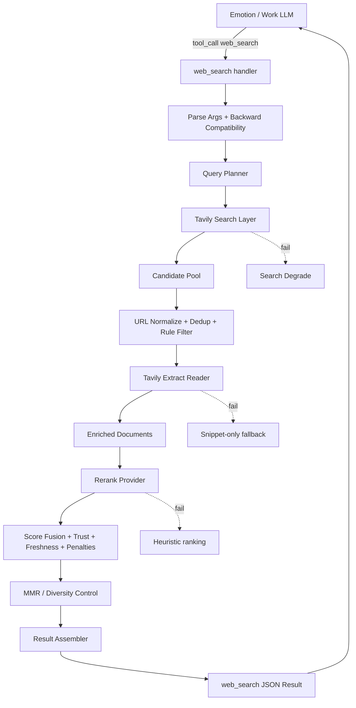

# EmoAgent 网页搜索能力改造工程实施 Spec

> Document status: Implementation Spec  
> Version: 0.1  
> Date: 2026-06-15  
> Target repo: `LongYiSang/EmoAgent`  
> Target path suggestion: `docs/architecture/web_search_refactor_spec.md`  
> Primary implementation scope: `internal/tool/builtin/web_search`, `internal/tool/builtin/websearch`, `internal/tool/builtin/webfetch`, `internal/config`, optional `internal/rerank` / `internal/webretrieval`  
> Primary design goal: 较明显提升网页搜索质量，同时控制工程复杂度，不引入复杂爬虫或默认 sidecar。

---

## 0. 一句话定义

把 EmoAgent 的网页搜索从当前的单层 SERP snippet 调用，改造为一个兼容现有 `web_search` 工具入口的三层证据检索流水线：

```text
User / LLM tool_call
        ↓
web_search
        ↓
Query Planner
        ↓
Tavily Advanced Search
        ↓
Candidate Clean / Dedup / Trust Score
        ↓
Tavily Extract Reader
        ↓
Remote Rerank Provider
  default: SiliconFlow / BAAI/bge-reranker-v2-m3
        ↓
Score Fusion / Diversity / Result Assembly
        ↓
ranked evidence results returned to LLM
```

此方案不改变 EmoAgent 的主交互范式：Emotion 仍然是唯一对话者，Work 仍然是任务执行代理；`web_search` 仍是工具调用入口，但内部实现从“一次搜索返回 snippet”升级为“搜索发现 + 定向阅读 + 可信重排”。

---

## 1. 背景与现状

### 1.1 当前仓库状态

当前公开仓库中的 `web_search` 具有以下特点：

```text
tool name: web_search
scope: ScopeBoth
parameters: query, max_results
hard cap: max_results <= 10
handler behavior: provider.Search(ctx, query, websearch.Options{MaxResults: n})
```

当前 `web_search` 对 Emotion 和 Work 都可见，但传给 provider 的参数只有 `MaxResults`。底层 `websearch.Options` 已经有 `SearchDepth / IncludeDomains / ExcludeDomains` 字段，但 handler 没有使用它们。

当前 Tavily provider 在 `opts.SearchDepth == ""` 时默认使用 `basic`。因此在当前路径下，大多数搜索实际走的是 Tavily basic search，而不是 advanced search。

当前 `web_fetch` 是 Work-only 工具，面向指定 URL 获取 readable text。它应继续保留为 Work 在需要完整页面、表格、代码块或精确原文时使用的二次读取工具，但不应作为 Emotion 日常搜索质量提升的主路径。

### 1.2 主要问题

当前搜索质量问题主要来自以下工程限制：

1. **工具接口太薄**：`web_search` 只暴露 `query/max_results`，没有 profile、时间范围、域名过滤、新闻/文档倾向等信息。
2. **Tavily 高级能力未被充分使用**：当前 handler 不传 `SearchDepth`，provider 默认回落到 `basic`。
3. **搜索与阅读没有串起来**：Emotion 直接调用 `web_search` 时往往只拿 snippet；`web_fetch` 虽然可读正文，但只对 Work 可见。
4. **缺少去噪和可信重排**：没有 URL 归一化、重复结果合并、域名信任、正文抽取质量、rerank 分数和多样性控制。
5. **LLM 负担过重**：当前把“判断哪些搜索结果可信、哪些片段相关”交给主模型隐式完成，容易被 SEO 垃圾或低质内容误导。
6. **无明确降级策略**：Tavily / Extract / Rerank 任一层失败时，缺少稳定的 fallback 行为和可观测性。

---

## 2. 目标与非目标

### 2.1 目标

本次改造必须达到以下状态：

1. `web_search` 对外保持向后兼容，旧调用 `{query, max_results}` 继续可用。
2. 默认搜索路径支持 Tavily `advanced`，并能按查询类型选择 `basic / advanced / news / official_docs` 等策略。
3. 对 top URL 自动使用 Tavily Extract 做定向阅读，返回 query-relevant evidence chunks。
4. Rerank 层可插拔，默认通过远程 Provider 使用 SiliconFlow 的 `BAAI/bge-reranker-v2-m3`，而不是本地模型或 sidecar。
5. Rerank Provider 可以未来替换为其他服务、本地 sidecar、LLM judge 或禁用后的 heuristic ranker。
6. 返回给 LLM 的结果包含更有用的证据字段：`score / source_quality / reasons / evidence / needs_fetch / fetch_hint`。
7. 工具输出不自动进入长期记忆；网页结果只作为工具证据或 Work 任务材料，长期记忆写入仍必须走 Memory policy。
8. 具备基本可观测性：搜索请求数、Extract 成功率、Rerank 可用性、fallback 次数、最终结果数。
9. 不建设大型评测集；只做单元测试、fake provider 集成测试、少量手工 smoke scenarios。

### 2.2 非目标

本轮不做：

1. 不引入复杂浏览器自动化、代理池、验证码处理、cookie/session 爬虫逻辑。
2. 不默认引入 Python sidecar 承载 reranker。
3. 不本地部署 `bge-reranker-v2-m3`。
4. 不引入大型搜索评测集或 A/B 评测平台。
5. 不重写 Emotion / Work 双核架构。
6. 不把搜索结果自动写入长期记忆。
7. 不实现深度研究 agent、多子 agent 并发研究、浏览器点击操作。
8. 不强制模型每次都搜索；默认仍由 LLM 工具调用机制触发，但工具描述与内部能力增强。

---

## 3. 总体设计决策

### D1. 保持 `web_search` 工具名与基础参数兼容

旧参数继续支持：

```json
{
  "query": "string",
  "max_results": 5
}
```

新增参数必须全部可选，且缺省时自动进入 `profile=auto`。

### D2. 对 LLM 暴露少量高层参数，不直接暴露所有 Tavily 原始参数

为了让 Tavily 更有价值，但不让 LLM 面对过多底层旋钮，推荐对外暴露：

```json
{
  "query": "string",
  "max_results": "integer",
  "profile": "auto | fast | deep | news | official_docs",
  "include_domains": ["string"],
  "exclude_domains": ["string"],
  "time_range": "day | week | month | year",
  "start_date": "YYYY-MM-DD",
  "end_date": "YYYY-MM-DD",
  "exact_match": "boolean"
}
```

内部 planner 再把这些参数映射为 Tavily 的：

```text
search_depth
topic
time_range
start_date / end_date
include_domains / exclude_domains
exact_match
chunks_per_source
```

### D3. `web_search` 内部使用 pipeline provider

新增 provider，例如：

```text
provider: pipeline
search_provider: tavily
reader_provider: tavily_extract
rerank_provider: siliconflow
```

`registerWebSearch` 不需要理解 pipeline 细节，只需按 config 创建 provider。Pipeline provider 内部组合 Search / Reader / Rerank / Assembler。

### D4. Rerank 不使用 sidecar，默认使用远程 Provider

因为当前决策是使用 Provider 提供的 SiliconFlow `BAAI/bge-reranker-v2-m3`，MVP 不需要 sidecar。

实现方式：

```text
internal/rerank.Provider
  ├── siliconflow.Provider
  ├── heuristic.Provider
  ├── disabled.Provider
  └── future sidecar.Provider
```

如果现有 `internal/llm.Client` 只适合 Chat Completions，不要强行复用为 rerank。Rerank 是独立检索能力，应该用独立 interface。可以复用 provider config 的思想，但不要污染聊天抽象。

### D5. Reader 使用 Tavily Extract，不引入 Jina

Reader provider 默认只实现：

```text
tavily_extract
```

Jina 不作为 fallback。后续如果需要更强阅读 fallback，优先考虑 Firecrawl 或新的 reader provider，但本轮不实现。

### D6. `web_fetch` 保持 Work-only

`web_fetch` 仍用于 Work Agent 对特定 URL 做完整读取。`web_search` 的返回结果中增加 `needs_fetch/fetch_hint`，帮助 Work 决定是否二次 fetch。

### D7. 搜索缓存不属于长期记忆

新增搜索缓存时，必须独立于 MemoryGraph：

```text
web_search_cache
web_extract_cache
```

它们是工具层缓存，不是用户长期记忆，不参与 MemoryGraph，不被 Emotion 当作关系记忆。

---

## 4. 目标架构



模块职责：

| 模块 | 建议包 | 职责 |
|---|---|---|
| Tool Handler | `internal/tool/builtin/web_search.go` | 参数解析、兼容旧调用、调用 provider |
| Provider Interface | `internal/tool/builtin/websearch/provider.go` | 扩展 Options / Result / Response |
| Pipeline Provider | `internal/tool/builtin/websearch/pipeline.go` 或 `internal/webretrieval` | 编排 Search → Reader → Rerank |
| Query Planner | `internal/tool/builtin/websearch/planner.go` | 生成 search plan、profile、子查询 |
| Tavily Search | `internal/tool/builtin/websearch/tavily.go` | 调用 Tavily `/search` |
| Tavily Extract Reader | `internal/tool/builtin/websearch/reader_tavily.go` 或复用 `webfetch` client | 批量 Extract top URLs |
| Cleaner | `internal/tool/builtin/websearch/cleaner.go` | URL 去重、过滤、source trust |
| Rerank Interface | `internal/rerank/provider.go` | 可插拔重排接口 |
| SiliconFlow Rerank | `internal/rerank/siliconflow.go` | 调用远程 rerank API |
| Heuristic Rerank | `internal/rerank/heuristic.go` | Rerank 不可用时降级 |
| Assembler | `internal/tool/builtin/websearch/assembler.go` | 生成兼容旧 response 的增强 JSON |
| Metrics | `internal/tool/builtin/websearch/metrics.go` | latency / counts / fallback logging |

---

## 5. 外部工具接口设计

### 5.1 `web_search` Tool Spec v2

保持 required 只有 `query`。

```json
{
  "type": "object",
  "properties": {
    "query": {
      "type": "string",
      "description": "Natural language search query."
    },
    "max_results": {
      "type": "integer",
      "description": "Maximum ranked results to return. Default from config. Hard cap from config."
    },
    "profile": {
      "type": "string",
      "enum": ["auto", "fast", "deep", "news", "official_docs"],
      "description": "Search profile. Omit unless you know the desired source type."
    },
    "include_domains": {
      "type": "array",
      "items": {"type": "string"},
      "description": "Preferred domains, useful for official docs or known authoritative sites."
    },
    "exclude_domains": {
      "type": "array",
      "items": {"type": "string"},
      "description": "Domains to exclude."
    },
    "time_range": {
      "type": "string",
      "enum": ["day", "week", "month", "year"],
      "description": "Recency filter for current events."
    },
    "start_date": {
      "type": "string",
      "description": "Optional YYYY-MM-DD lower bound."
    },
    "end_date": {
      "type": "string",
      "description": "Optional YYYY-MM-DD upper bound."
    },
    "exact_match": {
      "type": "boolean",
      "description": "Use for exact phrases, unique names, errors, titles, or quoted terms."
    }
  },
  "required": ["query"],
  "additionalProperties": false
}
```

推荐 tool description：

```text
Search the web for current or external facts. Returns a curated list of sources after selective reading, deduplication, and reranking. Prefer this tool when the answer depends on recent facts, official documentation, source-dependent claims, or external evidence. Use web_fetch only when you need the full content of a specific URL beyond the returned evidence snippets.
```

### 5.2 `web_fetch` 不改 scope

`web_fetch` 继续 `ScopeWork`，不作为 Emotion 日常搜索主路径。后续可根据产品策略另行讨论是否开放给 Emotion。

---

## 6. 内部数据契约

### 6.1 SearchOptions

扩展 `websearch.Options`：

```go
type Options struct {
    MaxResults      int
    Profile         string // auto | fast | deep | news | official_docs
    SearchDepth     string // basic | advanced
    Topic           string // general | news
    TimeRange       string // day | week | month | year
    StartDate       string // YYYY-MM-DD
    EndDate         string // YYYY-MM-DD
    IncludeDomains  []string
    ExcludeDomains  []string
    ExactMatch      bool

    // Pipeline controls
    ReaderTopN      int
    ExtractDepth    string // basic | advanced
    ChunksPerSource int
    RerankTopN      int
    ReturnEvidence  bool
}
```

### 6.2 SearchPlan

```go
type SearchPlan struct {
    OriginalQuery string
    Profile       string
    SubQueries    []SearchQuery
    ReaderTopN    int
    RerankTopN    int
    ReturnTopK    int
}

type SearchQuery struct {
    Query          string
    SearchDepth    string
    Topic          string
    TimeRange      string
    StartDate      string
    EndDate        string
    IncludeDomains []string
    ExcludeDomains []string
    ExactMatch     bool
    MaxResults     int
}
```

### 6.3 Result

扩展 `websearch.Result`，保持旧字段不变：

```go
type Result struct {
    Title   string  `json:"title"`
    URL     string  `json:"url"`
    Snippet string  `json:"snippet"`
    Score   float64 `json:"score,omitempty"`

    Domain         string   `json:"domain,omitempty"`
    SourceType     string   `json:"source_type,omitempty"` // official | news | docs | blog | forum | unknown
    PublishedAt    string   `json:"published_at,omitempty"`
    TavilyScore    float64  `json:"tavily_score,omitempty"`
    RerankScore    float64  `json:"rerank_score,omitempty"`
    TrustScore     float64  `json:"trust_score,omitempty"`
    FreshnessScore float64  `json:"freshness_score,omitempty"`
    FinalScore     float64  `json:"final_score,omitempty"`

    Evidence       []EvidenceChunk `json:"evidence,omitempty"`
    Reasons        []string        `json:"reasons,omitempty"`
    NeedsFetch     bool            `json:"needs_fetch,omitempty"`
    FetchHint      string          `json:"fetch_hint,omitempty"`
}

type EvidenceChunk struct {
    Text       string  `json:"text"`
    Source    string  `json:"source"` // search_snippet | tavily_extract
    Score      float64 `json:"score,omitempty"`
    Truncated  bool    `json:"truncated,omitempty"`
}
```

### 6.4 Response

```go
type Response struct {
    Query       string   `json:"query"`
    Answer      string   `json:"answer,omitempty"`
    Results     []Result `json:"results"`

    Provider    string        `json:"provider,omitempty"` // pipeline/tavily
    SearchMode  string        `json:"search_mode,omitempty"` // auto/fast/deep/news/official_docs
    Usage       *SearchUsage  `json:"usage,omitempty"`
    Warnings    []string      `json:"warnings,omitempty"`
    Debug       *SearchDebug  `json:"debug,omitempty"`
}

type SearchUsage struct {
    SearchRequests  int `json:"search_requests"`
    ExtractURLs     int `json:"extract_urls"`
    RerankDocuments int `json:"rerank_documents"`
}

type SearchDebug struct {
    SubQueries []string `json:"sub_queries,omitempty"`
    Fallbacks  []string `json:"fallbacks,omitempty"`
}
```

---

## 7. Query Planner 设计

### 7.1 Profile 规则

| Profile | SearchDepth | Topic | Reader | Rerank | 适用场景 |
|---|---|---|---|---|---|
| `fast` | `basic` | `general` | off or top2 | optional | 低成本、简单事实 |
| `deep` | `advanced` | `general` | top4 | on | 技术方案、比较、外部事实 |
| `news` | `advanced` | `news` | top4 | on | 最新事件、政策、产品发布 |
| `official_docs` | `advanced` | `general` | top4 | on | API、SDK、文档、规范 |
| `auto` | planner decides | planner decides | planner decides | planner decides | 默认 |

### 7.2 Auto Profile 规则

MVP 用启发式，不用 LLM 子代理。

```text
if query contains “最新/今天/昨天/本周/release/changelog/news/政策/价格/2026”:
    profile = news or deep with time_range

else if query contains “API/docs/文档/参数/SDK/配置/错误码/GitHub/版本”:
    profile = official_docs

else if query length > 80 or contains “比较/研究/方案/为什么/怎么实现/优缺点”:
    profile = deep

else:
    profile = fast
```

### 7.3 子查询策略

MVP 控制复杂度：

```text
max_subqueries = 1 by default
max_subqueries = 2 for deep/news/official_docs
```

不要做 5 路以上 fan-out。子查询可由模板生成，不调用 LLM：

```text
official_docs:
  1. "{query}"
  2. "{main_entity} official docs {key_terms}"

news:
  1. "{query}"
  2. "{main_entity} {event_terms} latest"

deep:
  1. "{query}"
  2. "{query} official source"
```

子查询融合使用 RRF：

```text
rrf_score = Σ 1 / (k + rank_i), default k = 60
```

---

## 8. Search Layer 设计

### 8.1 Tavily Search Request

扩展当前 `tavilyRequest`：

```go
type tavilyRequest struct {
    Query          string   `json:"query"`
    SearchDepth    string   `json:"search_depth"`
    Topic          string   `json:"topic,omitempty"`
    MaxResults     int      `json:"max_results"`
    IncludeAnswer  bool     `json:"include_answer"`
    IncludeDomains []string `json:"include_domains"`
    ExcludeDomains []string `json:"exclude_domains"`
    TimeRange      string   `json:"time_range,omitempty"`
    StartDate      string   `json:"start_date,omitempty"`
    EndDate        string   `json:"end_date,omitempty"`
    ExactMatch     bool     `json:"exact_match,omitempty"`
    ChunksPerSource int     `json:"chunks_per_source,omitempty"`
}
```

### 8.2 默认参数

```yaml
websearch:
  pipeline:
    search:
      default_profile: auto
      default_depth: advanced
      fast_depth: basic
      max_subqueries: 2
      per_query_max_results: 6
      candidate_cap: 12
      timeout_sec: 15
```

### 8.3 429 / timeout 处理

```text
1. Tavily 429: honor Retry-After if present; retry once.
2. Advanced timeout: retry same query with basic, once.
3. All search failed: return structured error with warnings; do not fabricate results.
```

---

## 9. Reader Layer 设计

### 9.1 Tavily Extract Reader

Reader 只读取清洗后的 Top-N URL。

```go
type Reader interface {
    Name() string
    Read(ctx context.Context, req ReaderRequest) (*ReaderResponse, error)
}

type ReaderRequest struct {
    Query        string
    URLs         []string
    ExtractDepth string
    Format       string // markdown
    Timeout      time.Duration
}

type ReaderDocument struct {
    URL          string
    FinalURL     string
    Text         string
    Chunks       []EvidenceChunk
    ExtractOK    bool
    FailedReason string
    RequestID    string
}
```

### 9.2 Reader 默认行为

```yaml
websearch:
  pipeline:
    reader:
      enabled: true
      provider: tavily_extract
      top_n: 4
      extract_depth: basic
      format: markdown
      timeout_sec: 15
      max_chars_per_doc: 6000
      max_chunk_chars: 1200
```

### 9.3 Extract 失败策略

```text
if URL extract failed:
    keep original search snippet
    mark reason: extract_failed
    lower extract_quality_score
    do not drop result solely because extract failed
```

### 9.4 Evidence chunk 生成

MVP 不引入复杂分块模型：

1. 优先使用 Tavily 返回的 query-relevant chunks。
2. 如果只拿到 raw markdown，则按段落切分。
3. 按 query term overlap + position + heading proximity 选 top 1–2 chunks。
4. 拼装给 reranker 的文本长度限制在 `max_doc_chars` 内。

---

## 10. Cleaner / Trust Scorer 设计

### 10.1 URL 归一化

```text
- lowercase host
- remove fragment
- remove utm_*, ref, fbclid, gclid 等 tracking params
- remove default port
- normalize trailing slash
```

### 10.2 去重

```text
1. canonical URL exact dedup
2. normalized URL dedup
3. same domain + similar path + same title dedup
```

### 10.3 Rule filter

可配置：

```yaml
websearch:
  pipeline:
    cleaner:
      block_domains: []
      prefer_domains: []
      min_snippet_chars: 30
      min_extracted_chars: 150
      seo_title_patterns:
        - "best .* in 20"
        - "top \\d+"
```

MVP 不要过度封杀。只做明显垃圾过滤，更多交给 trust score 和 rerank。

### 10.4 Trust score

```text
trust_score = base_by_domain_type + prefer_domain_boost - penalties
```

Domain type 估计：

| 类型 | trust_score 初始值 |
|---|---:|
| official_docs / vendor docs | 0.95 |
| gov / edu / standards / arxiv / official repo | 0.90 |
| mainstream news | 0.75 |
| normal blog / community | 0.55 |
| aggregator / SEO / unknown | 0.30 |

不要把 trust score 当成真实性保证。它只是排序特征。

---

## 11. Rerank Layer 设计

### 11.1 是否需要 sidecar

MVP 不需要 sidecar。

原因：

1. 用户明确将 `BAAI/bge-reranker-v2-m3` 放在现有 Provider 上使用。
2. 远程 rerank 是独立 API 调用，不需要本地 GPU / Python runtime。
3. Go 侧 HTTP client 更易部署、更易配置、更符合当前目标“明显提升质量但控制复杂度”。

Sidecar 只作为未来 provider：

```yaml
rerank:
  provider: sidecar
```

### 11.2 Rerank Provider Interface

```go
package rerank

type Provider interface {
    Name() string
    Rerank(ctx context.Context, req Request) (*Response, error)
}

type Request struct {
    Model     string
    Query     string
    Documents []Document
    TopK      int
}

type Document struct {
    ID     string
    Text   string
    Meta   map[string]string
}

type Response struct {
    Results []Result
    Usage   *Usage
}

type Result struct {
    ID    string
    Index int
    Score float64
}

type Usage struct {
    InputTokens int
    TotalTokens int
}
```

### 11.3 SiliconFlow Provider

新增：

```text
internal/rerank/siliconflow.go
```

配置不要把 endpoint 写死在代码中：

```yaml
websearch:
  pipeline:
    rerank:
      enabled: true
      provider: siliconflow
      model: BAAI/bge-reranker-v2-m3
      api_key_env: SILICONFLOW_API_KEY
      base_url: https://api.siliconflow.cn
      path: /v1/rerank
      timeout_sec: 15
      input_top_n: 8
      top_k: 5
      max_doc_chars: 2500
      score_normalization: sigmoid
      fallback: heuristic
```

注意：具体 `path` 和 request/response wire format 以 SiliconFlow 当前文档或项目已有 Provider 封装为准。Spec 只要求封装在 `rerank.Provider` 后，不让上层 pipeline 依赖厂商字段。

### 11.4 Rerank 输入文本模板

```text
[Title]
{title}

[Domain]
{domain}

[URL]
{normalized_url}

[Snippet]
{search_snippet}

[Extracted Evidence]
{top_chunks_joined}
```

`top_chunks_joined` 只放 1–2 个 evidence chunks，避免把整页正文塞给 reranker。

### 11.5 Score Fusion

```text
final_score =
  0.60 * normalized_rerank_score
+ 0.20 * normalized_tavily_score
+ 0.15 * trust_score
+ 0.05 * freshness_score
- penalties
```

若 rerank 不可用：

```text
final_score =
  0.55 * normalized_tavily_score
+ 0.30 * trust_score
+ 0.10 * freshness_score
+ 0.05 * extract_quality_score
- penalties
```

Penalties:

```text
duplicate_penalty
extract_failed_penalty
low_text_quality_penalty
blocked_or_suspicious_domain_penalty
stale_result_penalty
```

### 11.6 Diversity / MMR

对 final top-k 做轻量多样性控制：

```text
lambda = 0.75
avoid returning >2 results from same domain by default
avoid near-duplicate titles
```

---

## 12. Result Assembler 设计

### 12.1 输出原则

返回给 LLM 的结果应满足：

1. 能直接用于回答，但不把长正文塞满上下文。
2. 每条结果都有 URL、标题、摘要、证据片段、排序原因。
3. 标明是否建议进一步 `web_fetch`。
4. 如果证据不足，显式返回 warnings，而不是输出看似确定的结果。

### 12.2 示例输出

```json
{
  "query": "Tavily Extract query chunks_per_source",
  "provider": "pipeline",
  "search_mode": "official_docs",
  "results": [
    {
      "title": "Tavily Extract - Tavily Docs",
      "url": "https://docs.tavily.com/documentation/api-reference/endpoint/extract",
      "domain": "docs.tavily.com",
      "snippet": "Extract web page content from one or more specified URLs...",
      "score": 0.91,
      "tavily_score": 0.82,
      "rerank_score": 0.94,
      "trust_score": 0.95,
      "reasons": ["official_domain", "extract_ok", "query_chunk_match"],
      "evidence": [
        {
          "text": "Extract can return query-relevant chunks...",
          "source": "tavily_extract",
          "score": 0.88
        }
      ],
      "needs_fetch": false
    }
  ],
  "usage": {
    "search_requests": 2,
    "extract_urls": 4,
    "rerank_documents": 8
  },
  "warnings": []
}
```

---

## 13. 配置设计

### 13.1 Backward compatible config

保留现有：

```yaml
websearch:
  enabled: true
  provider: tavily
  api_key_env: TAVILY_API_KEY
  max_results: 5
  timeout_sec: 30
```

新增 pipeline 模式：

```yaml
websearch:
  enabled: true
  provider: pipeline
  api_key_env: TAVILY_API_KEY
  max_results: 5
  timeout_sec: 30

  pipeline:
    enabled: true
    search_provider: tavily
    reader_provider: tavily_extract

    search:
      default_profile: auto
      default_depth: advanced
      fast_depth: basic
      max_subqueries: 2
      per_query_max_results: 6
      candidate_cap: 12
      hard_cap_results: 10
      timeout_sec: 15

    reader:
      enabled: true
      top_n: 4
      extract_depth: basic
      format: markdown
      timeout_sec: 15
      max_chars_per_doc: 6000
      max_chunk_chars: 1200

    rerank:
      enabled: true
      provider: siliconflow
      model: BAAI/bge-reranker-v2-m3
      api_key_env: SILICONFLOW_API_KEY
      base_url: https://api.siliconflow.cn
      path: /v1/rerank
      timeout_sec: 15
      input_top_n: 8
      top_k: 5
      max_doc_chars: 2500
      fallback: heuristic

    cleaner:
      block_domains: []
      prefer_domains:
        - docs.tavily.com
        - github.com
      min_extracted_chars: 150

    cache:
      enabled: true
      search_ttl_sec: 900
      extract_ttl_sec: 86400
      max_entries: 1000

    observability:
      log_query_text: false
      log_url: true
      log_scores: true
      debug_return_score_breakdown: false
```

### 13.2 默认安全建议

```text
log_query_text=false
```

查询可能包含用户隐私。开发环境可开，生产环境默认记录 query hash 和 request_id。

---

## 14. 与 MemoryGraph / Work 的边界

### 14.1 不自动写长期记忆

`web_search` / `web_fetch` 输出默认都是工具证据，不是长期记忆。

禁止：

```text
web_search result -> facts
web_fetch raw_content -> facts
search cache -> MemoryGraph
```

允许：

```text
Work task summary -> memory_candidates -> Emotion/Memory policy -> extraction/consolidation
```

### 14.2 与未来 Memory Retrieval 的关系

本次改造的是“外部网页证据检索”，不是 MemoryGraph 内部长期记忆检索。但两者应共享部分工程思想：

```text
candidate recall
authority / policy filter
final ranking
MMR diversity
prompt assembly
observability
```

后续可以抽出公共小库，例如 URL normalization、score breakdown、MMR selector，但本轮不要提前过度抽象。

### 14.3 web_fetch 协同

`web_search` 返回：

```json
{
  "needs_fetch": true,
  "fetch_hint": "The official spec likely contains a parameter table not captured by Extract."
}
```

Work prompt 建议：

```text
When facts may be current, source-dependent, or uncertain, use web_search first. Trust the returned ranked results and reasons. Use web_fetch only for the top 1-2 URLs when you need tables, code blocks, or exact wording not already present in the web_search output.
```

---

## 15. 降级与失败策略

| 层 | 失败 | 行为 |
|---|---|---|
| Planner | profile 判断失败 | fallback `auto -> deep` or `fast` by config |
| Search | Tavily 429 | retry once with Retry-After if available |
| Search | advanced timeout | retry with basic once |
| Search | all failed | return no results + warning |
| Cleaner | all filtered | relax non-critical filters once |
| Reader | some URL failed | keep snippet-only result with penalty |
| Reader | all failed | continue with search snippets |
| Rerank | provider timeout/error | use heuristic ranking |
| Assembler | too much content | truncate evidence, keep URL/title/score |
| Config | pipeline disabled | old provider path |

Fallback 必须显式记录在 `warnings` 和 logs 中。

---

## 16. 观测与日志

### 16.1 必须记录的结构化日志

```text
request_id
provider=pipeline
profile
subquery_count
candidate_count
cleaned_count
extract_attempt_count
extract_success_count
rerank_provider
rerank_enabled
rerank_success
fallbacks
latency_ms by stage
```

### 16.2 不默认记录

```text
full user query
full extracted page text
API keys
raw provider response
```

### 16.3 Metrics 建议

```text
websearch_requests_total
websearch_errors_total
websearch_latency_ms
websearch_tavily_search_requests_total
websearch_extract_urls_total
websearch_extract_success_ratio
websearch_rerank_requests_total
websearch_rerank_failures_total
websearch_fallback_total{stage=...}
```

若项目尚未接入 metrics 系统，先用 structured log 实现。

---

## 17. 测试方案

用户暂不做大型评测集，因此测试聚焦工程正确性和可回归性。

### 17.1 Unit tests

```text
planner_test.go
  - auto profile detection
  - official_docs/news/deep/fast mapping
  - max_subqueries cap

cleaner_test.go
  - URL normalize
  - tracking params removed
  - duplicate detection
  - block/prefer domain score

score_test.go
  - final score fusion
  - rerank unavailable fallback
  - same-domain diversity cap

assembler_test.go
  - old fields preserved
  - evidence included
  - needs_fetch/fetch_hint emitted
```

### 17.2 Fake provider integration tests

不要依赖真实 Tavily/SiliconFlow。

```text
pipeline_provider_test.go
  - fake search returns 10 candidates
  - fake extract returns text for 4 URLs
  - fake rerank reorders docs
  - final response has top_k and score fields

pipeline_degrade_test.go
  - fake rerank fails -> heuristic
  - fake extract fails -> snippet only
  - fake search 429 -> retry path
```

### 17.3 Manual smoke scenarios

保留一个 `docs/architecture/web_search_refactor_smoke.md` 或 `scripts/smoke_web_search.md`，包含少量人工问题：

```text
1. 最新动态型：某产品最近 release / changelog
2. 官方文档型：某 API 参数是否支持
3. 精确实体型：唯一错误码或论文标题
4. 垃圾过滤型：容易搜到 SEO 文章的问题
```

不做 gold dataset，不做 CI 调用真实外部服务。

---

## 18. 分阶段实施计划

### Phase 0: 现状保护与基线

目标：

```text
在改造前保护现有行为，确认旧 tool 调用仍可用。
```

任务：

1. 给 `web_search` 现有 handler 增加单元测试。
2. 记录旧 JSON schema。
3. 建立 fake provider 测试。
4. 新增本文档到 `docs/architecture/`。

验收：

```text
go test ./internal/tool/builtin/... 通过
旧调用 {query,max_results} 测试通过
```

---

### Phase 1: Search Options 与 Pipeline Skeleton

目标：

```text
支持 Tavily advanced、profile、domain/time filters，但暂不接 Reader/Rerank。
```

任务：

1. 扩展 `websearch.Options`。
2. 扩展 `WebSearchSpec` 可选参数。
3. 扩展 Tavily request 字段。
4. 新增 `PipelineProvider`，第一版只调用 Tavily Search。
5. 实现 planner、URL normalize、dedup、trust score。
6. 增加 config `provider: pipeline`，保留 `provider: tavily` 回退。

验收：

```text
websearch.Options 能传 SearchDepth/Topic/TimeRange/IncludeDomains/ExcludeDomains
默认 deep/news/official_docs 可使用 advanced
pipeline disabled 时旧 Tavily provider 可用
```

---

### Phase 2: Tavily Extract Reader

目标：

```text
Search top URLs 自动定向阅读，生成 evidence chunks。
```

任务：

1. 封装 `Reader` interface。
2. 实现 `TavilyExtractReader`。
3. Pipeline 对 cleaned top-N URL 调 Extract。
4. 组装 `EvidenceChunk`。
5. Extract 失败时降级为 snippet-only。
6. 增加 extract cache，可先用 in-memory LRU。

验收：

```text
fake extract test 通过
web_search 返回 evidence 字段
extract 失败不导致整个 web_search 失败
```

---

### Phase 3: Remote Rerank Provider

目标：

```text
接入可插拔 rerank，默认 SiliconFlow / BAAI/bge-reranker-v2-m3。
```

任务：

1. 新增 `internal/rerank.Provider` interface。
2. 新增 `siliconflow` provider。
3. 新增 `heuristic` provider。
4. Pipeline 对 top documents 调 rerank。
5. 实现 score normalization 和 score fusion。
6. Rerank 超时/失败时走 heuristic。

验收：

```text
fake rerank 能改变排序
rerank provider error 时返回结果不失败
配置切换 provider 不影响 web_search 上层代码
不需要 Python sidecar
```

---

### Phase 4: Result Assembly 与 Work 协同

目标：

```text
让结果更适合 LLM 使用，并减少无差别 web_fetch。
```

任务：

1. 增加 `needs_fetch/fetch_hint`。
2. 增加 `reasons`。
3. 更新 tool description。
4. 更新 Work prompt 中 web_search/web_fetch 使用说明。
5. 控制 snippet/evidence 长度，避免 token 过大。

验收：

```text
结果包含 reasons/evidence/needs_fetch
Work prompt 明确先 web_search 后按需 web_fetch
旧结果字段 title/url/snippet/score 仍存在
```

---

### Phase 5: Observability / Cache / Hardening

目标：

```text
让 pipeline 可观察、可降级、可回滚。
```

任务：

1. 结构化日志。
2. stage latency。
3. search/extract/rerank usage 统计。
4. cache TTL。
5. prod 默认不记录明文 query。
6. 配置文档和 `.env.example` 更新。

验收：

```text
每次 web_search 可看到 stage 统计
API key 不进入日志
禁用 pipeline 可以快速回滚
```

---

### Phase 6: 后续可选能力

不属于 MVP：

```text
Search fallback provider: Brave / Exa / SerpAPI
Reader fallback provider: Firecrawl
Browser automation fallback
多轮 research agent
大型 eval set
MemoryGraph 搜索缓存融合
```

---

## 19. Codex 实施建议

### 19.1 推荐工作顺序

```text
1. Read current tool files:
   - internal/tool/builtin/web_search.go
   - internal/tool/builtin/web_fetch.go
   - internal/tool/builtin/websearch/provider.go
   - internal/tool/builtin/websearch/tavily.go
   - internal/tool/builtin/register.go
   - internal/config/*

2. Add tests for current behavior.

3. Implement config and options changes.

4. Implement pipeline provider with fake providers first.

5. Add Tavily advanced fields.

6. Add Tavily Extract reader.

7. Add rerank provider interface and fake reranker.

8. Add SiliconFlow rerank adapter behind config.

9. Add score fusion, evidence assembly, logging.

10. Update docs and examples.
```

### 19.2 Codex 不应做的事

```text
- 不要删除现有 tavily provider。
- 不要把 web_fetch 改成 ScopeBoth，除非另行确认。
- 不要把网页结果写入 MemoryGraph。
- 不要引入 Playwright、Browserbase、Firecrawl 等新重依赖。
- 不要把 SiliconFlow API key 写死。
- 不要假设 SiliconFlow wire format；应通过 config 或 adapter 隔离。
- 不要让 rerank 失败导致 web_search 整体失败。
```

---

## 20. 风险与回滚

### 20.1 风险

| 风险 | 缓解 |
|---|---|
| Tavily credits 增加 | profile=fast、reader_top_n 限制、cache |
| latency 增加 | 子查询 cap=2、extract top_n=4、rerank input_top_n=8 |
| rerank provider 不稳定 | heuristic fallback |
| 结果字段变多影响 LLM | 保留旧字段，新增字段短而解释性强 |
| 过度过滤导致召回不足 | filter 先轻量，更多用降权 |
| provider API 变化 | adapter 隔离，config path 可调整 |

### 20.2 回滚

必须支持：

```yaml
websearch:
  provider: tavily
```

或：

```yaml
websearch:
  pipeline:
    enabled: false
```

回滚后旧 `web_search` 行为可恢复。

---

## 21. 最终验收清单

MVP 完成时必须满足：

```text
[ ] web_search 旧参数 query/max_results 兼容。
[ ] web_search 新参数 profile/include_domains/exclude_domains/time_range 可用。
[ ] Tavily Search 可按 profile 使用 advanced/basic/news。
[ ] Tavily Extract Reader 能对 top URLs 返回 evidence chunks。
[ ] Rerank Provider interface 已实现。
[ ] SiliconFlow rerank adapter 可通过配置启用。
[ ] Rerank 失败可降级 heuristic。
[ ] 输出包含 title/url/snippet/score，且兼容旧字段。
[ ] 输出包含 evidence/reasons/needs_fetch/fetch_hint。
[ ] 不需要 sidecar 即可完成远程 rerank。
[ ] 不自动写长期记忆。
[ ] fake provider 集成测试通过。
[ ] pipeline 可通过 config 禁用。
[ ] docs/config 示例更新。
```

---

## 22. 附录：建议文件变更清单

```text
docs/architecture/web_search_refactor_spec.md

internal/tool/builtin/web_search.go
internal/tool/builtin/websearch/provider.go
internal/tool/builtin/websearch/tavily.go
internal/tool/builtin/websearch/pipeline.go
internal/tool/builtin/websearch/planner.go
internal/tool/builtin/websearch/cleaner.go
internal/tool/builtin/websearch/reader.go
internal/tool/builtin/websearch/reader_tavily.go
internal/tool/builtin/websearch/assembler.go
internal/tool/builtin/websearch/score.go
internal/tool/builtin/websearch/cache.go
internal/tool/builtin/websearch/*_test.go

internal/rerank/provider.go
internal/rerank/heuristic.go
internal/rerank/siliconflow.go
internal/rerank/*_test.go

internal/config/config.go
config.yaml
.env.example or docs/configuration.md
personas/*.yaml or work prompt file if tool guidance is centralized
```

---

## 23. 附录：最小 `/goal` 见单独输出

见 `Codex_Goal_WebSearch_Refactor.txt`。
