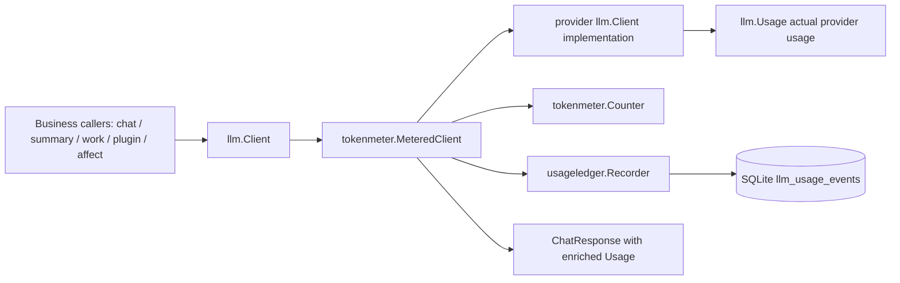

# EmoAgent TokenMeter & UsageLedger Implementation Spec

> **Document status**: Codex implementation spec  
> **Version**: 0.2  
> **Date**: 2026-06-26  
> **Target path suggestion**: `docs/architecture/tokenmeter_usageledger_implementation_spec.md`  
> **Repository baseline**: `LongYiSang/EmoAgent` main branch snapshot inspected via GitHub connector  
> **Primary goal**: Replace scattered token estimates with a unified token metering module and add a global token-only usage ledger.  
> **Explicit non-goal**: Do **not** implement pricing, cost, price cards, or billing money calculations in this iteration.

---

## 0. Executive summary

EmoAgent currently has multiple token counting paths:

- Main chat/context uses `internal/context.EstimateTokens()` plus ad-hoc message overhead.
- Provider adapters normalize only `input_tokens` and `output_tokens` into `llm.Usage`.
- Plugin provider gateway keeps its own usage table and estimates request tokens by `(chars + 3) / 4`.
- Agent Affect, Work runtime, compact/snipping, and rerank each have local token logic or partial usage parsing.
- Main chat persists only the latest `context_stats` into session metadata; it does not keep a global per-call usage ledger.

The target architecture is:

```text
internal/llm
  Owns provider response parsing and the normalized llm.Usage struct.

internal/tokenmeter
  Owns pre-request token estimation, output fallback estimation,
  provider/model-aware counting strategy, usage-source resolution,
  and metered client decorator.

internal/usageledger
  Owns global token-only usage events, storage methods, summaries,
  and admin/API query contracts.
```

Core rule:

```text
Provider actual usage wins.
Estimator is for pre-request context budgeting and missing-provider-usage fallback.
Usage ledger records both estimated and actual fields, and exposes an effective token total for aggregation.
ContextStats remains a UI/context-budget object, not the source of truth for historical token usage.
```

---

## 1. External provider behavior to implement against

Use provider-returned usage whenever available.

### 1.1 OpenAI-compatible streaming

For OpenAI Chat Completions, when `stream_options: {"include_usage": true}` is set, the API emits an extra usage chunk before `[DONE]`; other chunks carry null usage, and an interrupted stream may miss the final usage chunk. Therefore `openaiPayload(req, stream=true)` should support provider capability-driven `stream_options.include_usage = true`, and fallback to estimation if the stream ends without usage.

### 1.2 DeepSeek

DeepSeek Chat Completion supports `stream_options.include_usage`; when enabled, a final chunk before `[DONE]` contains full request usage. Its usage object includes `completion_tokens`, `prompt_tokens`, `prompt_cache_hit_tokens`, `prompt_cache_miss_tokens`, `total_tokens`, and `completion_tokens_details.reasoning_tokens`. Map these into the expanded `llm.Usage` fields.

### 1.3 Kimi / Moonshot

Kimi/Moonshot Chat Completion returns `usage.prompt_tokens`, `usage.completion_tokens`, and `usage.total_tokens`. Non-streaming examples include `cached_tokens`; streaming examples show final chunk usage with prompt/completion/total tokens. Map top-level `cached_tokens` to `CachedInputTokens` and `CacheReadTokens`.

### 1.4 Anthropic

The current EmoAgent Anthropic adapter already maps `usage.input_tokens` and `usage.output_tokens` into `llm.Usage`. Keep that path and extend the schema to preserve future cache-related Anthropic fields if they appear in responses. If a field is not present, leave it zero and preserve raw usage where possible.

---

## 2. Current repository baseline

### 2.1 Main context estimator

Current main estimator is in `internal/context/budget.go`:

```go
func EstimateTokens(text string) int {
    cjk := 0
    other := 0
    for _, r := range text {
        if isCJK(r) { cjk++; continue }
        other++
    }
    tokens := int(math.Ceil(float64(cjk)*0.5 + float64(other)*0.25))
    ...
}
```

It is better than plain `/4`, but it is still a rough heuristic. `NewBudget`, `BuildContextStats`, `EstimateRequestTokens`, and `EstimateRawHistoryTokens` depend on it.

### 2.2 Current `ContextStats`

`internal/context/types.go` defines `ContextStats` with:

```go
EstimatedInputTokens
ProviderInputTokens
ProviderOutputTokens
RawHistoryEstimatedTokens
ContextLimitTokens
InputBudgetTokens
ReserveOutputTokens
MaxOutputTokens
Source
```

This is enough for the current context-budget UI but not for historical token analytics.

### 2.3 Current normalized usage is too narrow

`internal/llm/types.go` currently has:

```go
type Usage struct {
    InputTokens  int `json:"input_tokens"`
    OutputTokens int `json:"output_tokens"`
}
```

This loses:

```text
total_tokens
cached tokens / cache hit / cache miss
reasoning tokens
image/audio tokens
raw provider usage JSON
actual vs estimated source
```

### 2.4 Current OpenAI-compatible parser

`internal/llm/client.go` maps only:

```go
PromptTokens     -> Usage.InputTokens
CompletionTokens -> Usage.OutputTokens
```

The response structs only declare `prompt_tokens` and `completion_tokens`. Streaming code already reads `chunk.Usage` if present, but request payload does not automatically set `stream_options.include_usage`.

### 2.5 Current Anthropic parser

`internal/llm/anthropic.go` maps:

```go
input_tokens  -> Usage.InputTokens
output_tokens -> Usage.OutputTokens
```

Keep this behavior and extend it without breaking current tests.

### 2.6 Current plugin gateway is a partial local usage ledger

`internal/plugin/provider_gateway.go` builds `storage.PluginProviderUsage` and records `InputTokens`, `OutputTokens`, and `EstimatedTokens`. Its estimate function is currently character-count based:

```go
return (chars + 3) / 4
```

This path should be replaced with `tokenmeter.CountChatRequest()`, and global token events should be written to `llm_usage_events`. Keep `plugin_provider_usage` for compatibility during migration.

### 2.7 Current storage migration style

`internal/storage/schema.go` keeps an in-code `migrations = []Migration{...}` list and `ApplyMigrations` applies pending versions transactionally. The current highest visible version is `33`, so the usage ledger migration should be added as a new version after current head, normally `34`.

### 2.8 Current client construction is centralized enough to decorate

`AgentRuntimeService.modelRuntime()` calls `buildClientForProvider()`, and `buildClientForProvider()` calls `llm.NewClient(...)`. This is the best insertion point for a `tokenmeter.MeteredClient`, because it covers active agent main/summary clients and Work clients produced from the active runtime. Plugin provider gateway also resolves clients via `PluginService.providerClient`, so ensure plugin-created clients are wrapped as well.

---

## 3. Architecture changes from previous discussion

Previous draft included a Billing Center with price cards and cost fields. This implementation removes all money/pricing concepts.

### 3.1 Rename from billing to usage ledger

Use:

```text
internal/usageledger
llm_usage_events
LLMUsageEvent
LLMUsageSummary
```

Avoid:

```text
billing
price_card
cost_micros
currency
billing_tokens
```

### 3.2 Keep only token accounting

The ledger aggregates:

```text
request count
error count
input tokens
output tokens
total tokens
estimated input/output tokens
actual input/output tokens
cached input tokens
cache hit/miss tokens
reasoning tokens
image/audio tokens
provider/model/component/operation/session/plugin/task dimensions
```

No price table, no currency, no cost calculation.

### 3.3 Optimized split of responsibility



Important import direction:

```text
llm package must not import tokenmeter or usageledger.
tokenmeter may import llm.
usageledger may import storage-level primitives or be implemented as methods on storage.DB.
```

---

## 4. Package layout

### 4.1 `internal/llm`

Modify existing package:

```text
internal/llm/types.go
internal/llm/client.go
internal/llm/anthropic.go
internal/llm/provider_preset.go
internal/llm/provider_presets.yaml
```

Responsibilities:

- Expand `Usage` struct.
- Expand OpenAI-compatible response usage parsing.
- Expand Anthropic usage parsing where supported.
- Preserve raw usage JSON in `Usage.RawUsage`.
- Add provider usage capabilities to provider presets/config.
- Add streaming usage option support to OpenAI-compatible payloads.

### 4.2 `internal/tokenmeter`

New package:

```text
internal/tokenmeter/
  types.go
  scope.go
  counter.go
  heuristic.go
  chat_request_counter.go
  usage_resolver.go
  metered_client.go
  calibration.go            // optional, phase 7
  tokenmeter_test.go
  metered_client_test.go
```

Responsibilities:

- Token estimation before a request.
- Token estimation of response output when provider usage is missing.
- `UsageScope` context injection.
- `MeteredClient` decorator.
- `UsageSource` policy: provider, estimated, hybrid, unknown.
- Compatibility wrappers for current `context.EstimateTokens` and related code.

### 4.3 `internal/usageledger`

New package or storage-adjacent helper package:

```text
internal/usageledger/
  types.go
  recorder.go
  summary.go
  filters.go
  recorder_test.go
```

Use storage.DB methods for SQLite implementation:

```text
internal/storage/llm_usage.go
internal/storage/llm_usage_test.go
```

Responsibilities:

- Data model for global usage events.
- Recorder interface.
- Summary filters and aggregation contracts.
- No pricing.

### 4.4 API / Web

Add later phase:

```text
internal/web/usage_api.go
web/src/admin/usage/... or current settings/admin area
web/src/chat/protocol/wsTypes.ts  // context stats extension only
```

---

## 5. Expanded `llm.Usage`

Modify `internal/llm/types.go`.

### 5.1 Proposed struct

```go
type Usage struct {
    InputTokens  int `json:"input_tokens"`
    OutputTokens int `json:"output_tokens"`
    TotalTokens  int `json:"total_tokens,omitempty"`

    CachedInputTokens    int `json:"cached_input_tokens,omitempty"`
    CacheHitInputTokens  int `json:"cache_hit_input_tokens,omitempty"`
    CacheMissInputTokens int `json:"cache_miss_input_tokens,omitempty"`
    CacheReadTokens      int `json:"cache_read_tokens,omitempty"`
    CacheWriteTokens     int `json:"cache_write_tokens,omitempty"`

    ReasoningTokens int `json:"reasoning_tokens,omitempty"`
    ImageTokens     int `json:"image_tokens,omitempty"`
    AudioTokens     int `json:"audio_tokens,omitempty"`

    Source             string          `json:"source,omitempty"` // provider | estimated | hybrid | unknown
    EstimateMethod     string          `json:"estimate_method,omitempty"`
    EstimateConfidence float64         `json:"estimate_confidence,omitempty"`
    RawUsage           json.RawMessage `json:"raw_usage,omitempty"`
}
```

### 5.2 Helper methods

Add helpers in `internal/llm` or `internal/tokenmeter`:

```go
func (u Usage) HasProviderTokens() bool
func (u Usage) EffectiveTotal() int
func (u Usage) NormalizeTotals() Usage
```

Rules:

```text
If TotalTokens == 0 and input/output > 0, TotalTokens = InputTokens + OutputTokens.
If cached tokens exist but provider input includes cached tokens, keep InputTokens as provider prompt/input total.
Do not subtract cache hits from InputTokens; token stats should show total observed provider usage and cache breakdown separately.
```

---

## 6. Provider usage parsing

### 6.1 OpenAI-compatible usage struct

In `internal/llm/client.go`, update both non-streaming and streaming usage structs.

```go
type openaiUsage struct {
    PromptTokens     int `json:"prompt_tokens"`
    CompletionTokens int `json:"completion_tokens"`
    TotalTokens      int `json:"total_tokens"`

    CachedTokens int `json:"cached_tokens"` // Kimi/Moonshot top-level

    PromptCacheHitTokens  int `json:"prompt_cache_hit_tokens"`  // DeepSeek
    PromptCacheMissTokens int `json:"prompt_cache_miss_tokens"` // DeepSeek

    PromptTokensDetails struct {
        CachedTokens int `json:"cached_tokens"`
    } `json:"prompt_tokens_details"`

    CompletionTokensDetails struct {
        ReasoningTokens int `json:"reasoning_tokens"`
    } `json:"completion_tokens_details"`
}
```

Add:

```go
func normalizeOpenAIUsage(raw openaiUsage, rawJSON json.RawMessage) Usage
```

Mapping:

```text
PromptTokens               -> InputTokens
CompletionTokens           -> OutputTokens
TotalTokens                -> TotalTokens
CachedTokens               -> CachedInputTokens + CacheReadTokens
PromptTokensDetails.Cached -> CachedInputTokens + CacheReadTokens, if larger than existing cached
PromptCacheHitTokens       -> CacheHitInputTokens + CacheReadTokens
PromptCacheMissTokens      -> CacheMissInputTokens
CompletionTokensDetails.ReasoningTokens -> ReasoningTokens
Raw JSON                   -> RawUsage
Source                     -> provider
```

When both Kimi `cached_tokens` and OpenAI `prompt_tokens_details.cached_tokens` exist, keep the maximum to avoid double counting.

### 6.2 Streaming usage

Current stream loop already assigns `chatResp.Usage` when chunk usage exists. After expanding fields:

- Preserve the last non-nil usage chunk.
- If there are multiple usage chunks, ignore null usage chunks and overwrite only when non-zero or total fields exist.
- For OpenAI-compatible providers requiring `include_usage`, add request capability.

### 6.3 `stream_options.include_usage`

Add provider capability:

```go
type ProviderUsageCapabilities struct {
    UsageFormat      string `yaml:"usage_format" json:"usage_format,omitempty"`
    StreamUsageMode  string `yaml:"stream_usage_mode" json:"stream_usage_mode,omitempty"`
}
```

Possible values:

```text
usage_format:
  openai_chat
  anthropic_messages
  siliconflow_rerank
  unknown

stream_usage_mode:
  openai_include_usage       // send stream_options.include_usage=true
  final_chunk_usage          // provider sends usage on final normal chunk, no stream_options needed
  none                       // do not expect stream usage
  unknown                    // do not mutate request
```

Presets:

```yaml
openai:
  capabilities:
    usage_format: openai_chat
    stream_usage_mode: openai_include_usage

deepseek:
  capabilities:
    usage_format: openai_chat
    stream_usage_mode: openai_include_usage

moonshot:
  capabilities:
    usage_format: openai_chat
    stream_usage_mode: final_chunk_usage

anthropic:
  capabilities:
    usage_format: anthropic_messages
    stream_usage_mode: final_chunk_usage
```

Implementation in `openaiPayload(req, stream)`:

```go
if stream && c.usageCaps.StreamUsageMode == "openai_include_usage" {
    if _, exists := payload["stream_options"]; !exists {
        payload["stream_options"] = map[string]any{"include_usage": true}
    }
}
```

Do not overwrite explicit `stream_options` passed via `Params.Extra`.

---

## 7. TokenMeter design

### 7.1 Core types

```go
type UsageScope struct {
    Component string // emotion_chat | context_summary | work_runtime | work_summary | agent_affect | plugin | rerank | memory | unknown
    Operation string // chat_stream | chat | summary_update | work_round | affect_eval | plugin_generate | rerank

    SessionID string
    TurnID    string
    RequestID string
    AgentID   string
    PersonaKey string
    PluginID string
    TaskID   string

    ProviderID   string
    ProviderName string
    Protocol     string
    Model        string
}
```

Context helpers:

```go
func WithUsageScope(ctx context.Context, scope UsageScope) context.Context
func UsageScopeFromContext(ctx context.Context) (UsageScope, bool)
func MergeUsageScope(ctx context.Context, patch UsageScope) context.Context
```

### 7.2 Counting request

```go
type CountRequest struct {
    ProviderID string
    Protocol   string
    Model      string
    Purpose    string

    System   string
    Messages []llm.Message
    Tools    []llm.ToolDef
    Params   llm.RequestParams

    BudgetMode bool // use conservative p95 calibration when available
}

type CountResult struct {
    InputTokens int
    Method      string  // heuristic_cjk | openai_wire_heuristic | tokenizer_bpe | calibrated_heuristic
    Confidence  float64
    Warnings    []string
}
```

### 7.3 Counter interface

```go
type Counter interface {
    CountText(ctx context.Context, providerID, model, text string) CountResult
    CountMessages(ctx context.Context, providerID, model string, messages []llm.Message) CountResult
    CountChatRequest(ctx context.Context, req CountRequest) CountResult
    CountChatResponse(ctx context.Context, providerID, model string, resp *llm.ChatResponse) CountResult
}
```

### 7.4 Initial estimator strategy

MVP order:

1. Provider actual usage when available. This is not estimator; it is truth source.
2. Request estimate from current CJK-aware heuristic, but centralized in `tokenmeter`.
3. For ChatRequest, estimate system + messages + tools + message overhead consistently.
4. For output fallback, estimate visible content + reasoning content + tool call arguments.
5. Later add provider/model BPE tokenizer behind same interface.
6. Later add calibration table.

Rationale:

```text
Most accuracy comes from provider actual usage.
BPE tokenizer is useful for missing-usage providers and pre-request budget,
but should not block ledger implementation.
```

### 7.5 Backward-compatible wrappers

Keep existing function names short term:

```go
// internal/context/budget.go
func EstimateTokens(text string) int {
    return tokenmeter.DefaultCounter().CountText(context.Background(), "", "", text).InputTokens
}
```

Then progressively replace direct imports.

---

## 8. UsageLedger data model

### 8.1 Migration `0034_llm_usage_events`

Add to `internal/storage/schema.go` as a new migration after current head.

```sql
CREATE TABLE IF NOT EXISTS llm_usage_events (
    id TEXT PRIMARY KEY,

    request_id TEXT NOT NULL DEFAULT '',
    provider_request_id TEXT NOT NULL DEFAULT '',

    session_id TEXT NOT NULL DEFAULT '',
    turn_id TEXT NOT NULL DEFAULT '',
    agent_id TEXT NOT NULL DEFAULT '',
    persona_key TEXT NOT NULL DEFAULT '',
    plugin_id TEXT NOT NULL DEFAULT '',
    task_id TEXT NOT NULL DEFAULT '',

    component TEXT NOT NULL DEFAULT 'unknown',
    operation TEXT NOT NULL DEFAULT '',

    provider_id TEXT NOT NULL DEFAULT '',
    provider_name TEXT NOT NULL DEFAULT '',
    protocol TEXT NOT NULL DEFAULT '',
    model TEXT NOT NULL DEFAULT '',
    endpoint TEXT NOT NULL DEFAULT '',
    stream INTEGER NOT NULL DEFAULT 0 CHECK (stream IN (0,1)),

    status TEXT NOT NULL DEFAULT 'success'
        CHECK (status IN ('success','error','cancelled','interrupted','unknown')),
    error_kind TEXT NOT NULL DEFAULT '',
    error_message TEXT NOT NULL DEFAULT '',
    duration_ms INTEGER NOT NULL DEFAULT 0,

    -- Effective tokens used for token-only statistics.
    -- Use actual provider usage when available; otherwise fallback estimates.
    input_tokens INTEGER NOT NULL DEFAULT 0,
    output_tokens INTEGER NOT NULL DEFAULT 0,
    total_tokens INTEGER NOT NULL DEFAULT 0,

    -- Estimates, always filled when estimation was possible.
    estimated_input_tokens INTEGER NOT NULL DEFAULT 0,
    estimated_output_tokens INTEGER NOT NULL DEFAULT 0,
    estimated_total_tokens INTEGER NOT NULL DEFAULT 0,
    estimate_method TEXT NOT NULL DEFAULT '',
    estimate_confidence REAL NOT NULL DEFAULT 0,

    -- Provider actuals, zero when missing.
    actual_input_tokens INTEGER NOT NULL DEFAULT 0,
    actual_output_tokens INTEGER NOT NULL DEFAULT 0,
    actual_total_tokens INTEGER NOT NULL DEFAULT 0,

    cached_input_tokens INTEGER NOT NULL DEFAULT 0,
    cache_hit_input_tokens INTEGER NOT NULL DEFAULT 0,
    cache_miss_input_tokens INTEGER NOT NULL DEFAULT 0,
    cache_read_tokens INTEGER NOT NULL DEFAULT 0,
    cache_write_tokens INTEGER NOT NULL DEFAULT 0,

    reasoning_tokens INTEGER NOT NULL DEFAULT 0,
    image_tokens INTEGER NOT NULL DEFAULT 0,
    audio_tokens INTEGER NOT NULL DEFAULT 0,

    usage_source TEXT NOT NULL DEFAULT 'unknown'
        CHECK (usage_source IN ('provider_usage','estimated','hybrid','unknown')),
    raw_usage_json TEXT NOT NULL DEFAULT '{}',

    prompt_hash TEXT NOT NULL DEFAULT '',
    completion_hash TEXT NOT NULL DEFAULT '',

    created_at TEXT NOT NULL DEFAULT (datetime('now'))
);

CREATE INDEX IF NOT EXISTS idx_llm_usage_events_provider_time
    ON llm_usage_events(provider_id, model, created_at DESC);

CREATE INDEX IF NOT EXISTS idx_llm_usage_events_component_time
    ON llm_usage_events(component, operation, created_at DESC);

CREATE INDEX IF NOT EXISTS idx_llm_usage_events_session_time
    ON llm_usage_events(session_id, created_at DESC);

CREATE INDEX IF NOT EXISTS idx_llm_usage_events_plugin_time
    ON llm_usage_events(plugin_id, created_at DESC);

CREATE INDEX IF NOT EXISTS idx_llm_usage_events_request
    ON llm_usage_events(request_id, created_at DESC);
```

### 8.2 Optional calibration table

Add in same migration or later `0035`:

```sql
CREATE TABLE IF NOT EXISTS token_estimator_calibrations (
    id TEXT PRIMARY KEY,
    provider_id TEXT NOT NULL,
    model TEXT NOT NULL,
    method TEXT NOT NULL,
    sample_count INTEGER NOT NULL DEFAULT 0,
    input_ratio_p50 REAL NOT NULL DEFAULT 1.0,
    input_ratio_p95 REAL NOT NULL DEFAULT 1.0,
    output_ratio_p50 REAL NOT NULL DEFAULT 1.0,
    updated_at TEXT NOT NULL DEFAULT (datetime('now')),
    UNIQUE(provider_id, model, method)
);
```

This table is token-only and acceptable. It improves future estimates but is not required in MVP.

### 8.3 Storage structs

Add `internal/storage/llm_usage.go`:

```go
type LLMUsageEvent struct {
    ID string
    RequestID string
    ProviderRequestID string
    SessionID string
    TurnID string
    AgentID string
    PersonaKey string
    PluginID string
    TaskID string
    Component string
    Operation string
    ProviderID string
    ProviderName string
    Protocol string
    Model string
    Endpoint string
    Stream bool
    Status string
    ErrorKind string
    ErrorMessage string
    DurationMS int64

    InputTokens int
    OutputTokens int
    TotalTokens int

    EstimatedInputTokens int
    EstimatedOutputTokens int
    EstimatedTotalTokens int
    EstimateMethod string
    EstimateConfidence float64

    ActualInputTokens int
    ActualOutputTokens int
    ActualTotalTokens int

    CachedInputTokens int
    CacheHitInputTokens int
    CacheMissInputTokens int
    CacheReadTokens int
    CacheWriteTokens int

    ReasoningTokens int
    ImageTokens int
    AudioTokens int

    UsageSource string
    RawUsageJSON string
    PromptHash string
    CompletionHash string
    CreatedAt string
}
```

Storage methods:

```go
func (d *DB) RecordLLMUsageEvent(ctx context.Context, event LLMUsageEvent) error
func (d *DB) ListLLMUsageEvents(ctx context.Context, filter LLMUsageFilter) ([]LLMUsageEvent, error)
func (d *DB) SummarizeLLMUsage(ctx context.Context, filter LLMUsageFilter, groupBy []string) ([]LLMUsageSummary, error)
```

### 8.4 Summary struct

```go
type LLMUsageSummary struct {
    ProviderID string `json:"provider_id,omitempty"`
    Model string `json:"model,omitempty"`
    Component string `json:"component,omitempty"`
    Operation string `json:"operation,omitempty"`
    PluginID string `json:"plugin_id,omitempty"`
    SessionID string `json:"session_id,omitempty"`

    RequestCount int `json:"request_count"`
    ErrorCount int `json:"error_count"`

    InputTokens int `json:"input_tokens"`
    OutputTokens int `json:"output_tokens"`
    TotalTokens int `json:"total_tokens"`

    ActualInputTokens int `json:"actual_input_tokens"`
    ActualOutputTokens int `json:"actual_output_tokens"`
    EstimatedInputTokens int `json:"estimated_input_tokens"`
    EstimatedOutputTokens int `json:"estimated_output_tokens"`

    CachedInputTokens int `json:"cached_input_tokens"`
    CacheHitInputTokens int `json:"cache_hit_input_tokens"`
    CacheMissInputTokens int `json:"cache_miss_input_tokens"`
    ReasoningTokens int `json:"reasoning_tokens"`
    ImageTokens int `json:"image_tokens"`
    AudioTokens int `json:"audio_tokens"`

    ProviderUsageCount int `json:"provider_usage_count"`
    EstimatedUsageCount int `json:"estimated_usage_count"`
    HybridUsageCount int `json:"hybrid_usage_count"`
}
```

---

## 9. `MeteredClient` design

### 9.1 Interface

```go
type UsageRecorder interface {
    RecordLLMUsageEvent(ctx context.Context, event storage.LLMUsageEvent) error
}

type MeteredClient struct {
    inner llm.Client
    counter tokenmeter.Counter
    recorder usageledger.Recorder

    providerID string
    providerName string
    protocol string
    endpoint string
    modelDefault string
    logger *slog.Logger
}
```

### 9.2 Request flow

For `Chat` and `ChatStream`:

```text
1. Read UsageScope from ctx.
2. Merge provider/model defaults.
3. Count estimated input tokens before calling provider.
4. Start timer.
5. Call inner client.
6. If response usage has actual tokens, use provider usage.
7. If provider usage missing, estimate output tokens from response.
8. Build LLMUsageEvent.
9. Record with context.WithoutCancel(ctx), but never fail the LLM call because recording failed.
10. Return original response with Usage.Source and estimate fields filled.
```

### 9.3 Error flow

If provider call returns error:

```text
Record event with:
  status='error'
  estimated_input_tokens filled
  input_tokens = estimated_input_tokens
  output_tokens = 0
  usage_source='estimated'
  error_kind/error_message
Then return original error.
```

If context cancellation occurred:

```text
status='cancelled' if ctx.Err() != nil
status='interrupted' if stream ended without final usage but response partially exists
```

### 9.4 Effective token rules

```go
if actual input/output/total available:
    usage_source = "provider_usage"
    event.InputTokens = actual.InputTokens
    event.OutputTokens = actual.OutputTokens
    event.TotalTokens = actual.TotalTokens or input+output
else if some actual fields and some estimated fields:
    usage_source = "hybrid"
    event.InputTokens = actual input if >0 else estimated input
    event.OutputTokens = actual output if >0 else estimated output
else:
    usage_source = "estimated"
    event.InputTokens = estimated input
    event.OutputTokens = estimated output
    event.TotalTokens = estimated total
```

### 9.5 Hashes

Do not store raw prompt/completion text in ledger. Store optional hashes:

```go
prompt_hash = sha256(canonical request summary)
completion_hash = sha256(resp.Content + resp.ReasoningContent + tool call names/args hash)
```

Keep raw provider usage JSON only; it should not contain prompt content.

---

## 10. Integration points

### 10.1 Agent runtime client creation

Modify `AgentRuntimeService.buildClientForProvider()` to wrap clients:

```go
client, err := llm.NewClient(...)
if err != nil { return nil, err }
return tokenmeter.NewMeteredClient(tokenmeter.MeteredClientConfig{
    Inner: client,
    Counter: s.infra.TokenMeter, // or tokenmeter.DefaultCounter()
    Recorder: s.infra.UsageLedger,
    ProviderID: provider.ID,
    ProviderName: provider.Name,
    Protocol: provider.Protocol,
    Logger: s.infra.Logger,
}), nil
```

If adding fields to `Infra` is too invasive, instantiate recorder from `s.infra.DB`.

### 10.2 Main chat

In `internal/chat/engine.go` before `client.ChatStream(...)`, wrap ctx:

```go
ctx = tokenmeter.MergeUsageScope(ctx, tokenmeter.UsageScope{
    Component: "emotion_chat",
    Operation: "chat_stream",
    SessionID: sessionID,
    TurnID: memoryAnchor.turnID,
    RequestID: requestID,
    AgentID: agentID,
    PersonaKey: personaKey,
    ProviderID: providerID,
    ProviderName: providerName,
    Protocol: provider,
    Model: model,
})
```

Keep `ContextStats` logic, but enrich it from `resp.Usage` after provider response.

### 10.3 Context summary

Find the functions that call `summaryClient.Chat` or `summaryClient.ChatStream` inside `internal/context` summary update paths. Add scope:

```go
Component: "context_summary"
Operation: "summary_update" or "summary_repair"
SessionID, TurnID, RequestID when available
Model: summaryModel
```

If request ID is not available in summary functions, pass it from `engine.go` through existing summary update inputs or add optional field to report input.

### 10.4 Work runtime

In `internal/work/runtime.go` around main LLM calls and summary compression calls:

```go
Component: "work_runtime"
Operation: "work_round" | "work_summary" | "work_decider"
SessionID from work.WithSessionID(ctx)
TaskID from brief/task context
Model from runtime config
```

Do not only record Work main calls; record Work summary/compression/decider calls as separate operations if they use LLM.

### 10.5 Plugin provider gateway

In `internal/plugin/provider_gateway.go`:

- Replace `estimatePluginRequestTokens` with `tokenmeter.CountChatRequest`.
- Wrap context before calling `client.Chat`:

```go
ctx = tokenmeter.MergeUsageScope(ctx, tokenmeter.UsageScope{
    Component: "plugin",
    Operation: "plugin_generate",
    PluginID: pluginID,
    ProviderID: providerID,
    Model: model,
})
```

Keep `plugin_provider_usage` writes for backward compatibility, but source token numbers from `resp.Usage` and the tokenmeter estimate. Later, plugin admin summary can query `llm_usage_events` instead.

### 10.6 Agent Affect evaluator

In `internal/agentaffect/evaluator_llm.go`, before `e.client.Chat(...)`:

```go
ctx = tokenmeter.MergeUsageScope(ctx, tokenmeter.UsageScope{
    Component: "agent_affect",
    Operation: "affect_eval",
    SessionID: req.SessionID,
    TurnID: req.TurnID,
    ProviderID: e.cfg.Evaluator.ProviderID,
    Model: e.cfg.Evaluator.Model,
})
```

Keep existing `result.Usage` and SQLite evaluation fields, but global usage event is written by `MeteredClient`.

### 10.7 Rerank

`internal/rerank/siliconflow.go` does not use `llm.Client`, so `MeteredClient` will not see it. Add direct usageledger recording where the rerank provider is invoked, or expose a `usageledger.Recorder` in rerank config. Use component `rerank`, operation `siliconflow_rerank`.

---

## 11. ContextStats changes

Keep `ContextStats` as a context-budget display object.

Extend with optional fields only:

```go
TotalTokens       int `json:"total_tokens,omitempty"`
CachedInputTokens int `json:"cached_input_tokens,omitempty"`
ReasoningTokens   int `json:"reasoning_tokens,omitempty"`
EstimateMethod    string `json:"estimate_method,omitempty"`
EstimateConfidence float64 `json:"estimate_confidence,omitempty"`
UsageEventID      string `json:"usage_event_id,omitempty"`
```

Do not make `ContextStats` the ledger. It can reference the last usage event ID if easy, but historical usage must come from `llm_usage_events`.

---

## 12. Admin/API design, token-only

Add read-only endpoints later phase:

```text
GET /api/admin/usage/summary?from=&to=&group_by=provider,model,component
GET /api/admin/usage/events?from=&to=&provider_id=&component=&model=&limit=
GET /api/admin/usage/sessions/{session_id}
GET /api/admin/usage/plugins/{plugin_id}
```

Response examples:

```json
{
  "from": "2026-06-01T00:00:00Z",
  "to": "2026-06-26T23:59:59Z",
  "group_by": ["provider", "model", "component"],
  "items": [
    {
      "provider_id": "deepseek",
      "model": "deepseek-v4-pro",
      "component": "emotion_chat",
      "request_count": 123,
      "error_count": 2,
      "input_tokens": 456789,
      "output_tokens": 98765,
      "total_tokens": 555554,
      "cached_input_tokens": 120000,
      "reasoning_tokens": 34000,
      "provider_usage_count": 118,
      "estimated_usage_count": 5
    }
  ]
}
```

No cost fields.

---

## 13. Phased implementation plan for Codex

### Phase 0 — Baseline and guardrails

**Goal**: Add tests and verify current behavior before changing core usage structs.

Tasks:

1. Add tests for current `context.EstimateTokens`, `EstimateRequestTokens`, tool blocks, and `ContextStats` build.
2. Add tests for existing OpenAI-compatible usage mapping.
3. Add tests for plugin provider gateway estimate behavior, then update tests in later phases.
4. Add a developer note in the spec or docs that price/cost is out of scope.

Acceptance:

```text
go test ./internal/context ./internal/llm ./internal/plugin ./internal/storage
```

No behavior changes yet.

---

### Phase 1 — Expand `llm.Usage` and provider parsing

**Goal**: Preserve actual provider usage more completely.

Files:

```text
internal/llm/types.go
internal/llm/client.go
internal/llm/anthropic.go
internal/llm/provider_preset.go
internal/llm/provider_presets.yaml
internal/llm/openai_test.go
```

Tasks:

1. Extend `llm.Usage` with total/cache/reasoning/image/audio/raw/source fields.
2. Add OpenAI-compatible usage struct with Kimi and DeepSeek fields.
3. Add `normalizeOpenAIUsage` tests:
   - standard OpenAI usage
   - Kimi `cached_tokens`
   - DeepSeek `prompt_cache_hit_tokens`, `prompt_cache_miss_tokens`, `reasoning_tokens`
   - missing `total_tokens` computes total
4. Preserve `RawUsage`.
5. Add usage capabilities to provider presets and resolved config.
6. Add stream usage request behavior for `openai_include_usage`.
7. Do not overwrite user-supplied `stream_options` in `Params.Extra`.

Acceptance:

```text
- Existing callers compiling against InputTokens/OutputTokens continue to compile.
- OpenAI-compatible streaming requests for OpenAI/DeepSeek include stream_options.include_usage=true.
- Moonshot/Kimi does not get forced include_usage unless configured later.
- Tests prove mapping of cached and reasoning fields.
```

---

### Phase 2 — Add `internal/tokenmeter`

**Goal**: Centralize token estimation without changing all call sites yet.

Files:

```text
internal/tokenmeter/types.go
internal/tokenmeter/scope.go
internal/tokenmeter/heuristic.go
internal/tokenmeter/chat_request_counter.go
internal/tokenmeter/usage_resolver.go
internal/tokenmeter/tokenmeter_test.go
internal/context/budget.go
```

Tasks:

1. Move current CJK-aware text heuristic into `tokenmeter`.
2. Implement `CountText`, `CountMessages`, `CountChatRequest`, `CountChatResponse`.
3. Include role/content block/tool block overhead in one place.
4. Implement `UsageScope` context helpers.
5. Update `internal/context.EstimateTokens` to wrap tokenmeter, not duplicate logic.
6. Keep public behavior close to existing tests.

Acceptance:

```text
- All old context tests pass.
- New tokenmeter tests cover CJK, English, mixed text, empty string, tool_use, tool_result, tools JSON.
- No import cycle: llm does not import tokenmeter.
```

---

### Phase 3 — Add global usage ledger storage

**Goal**: Create token-only usage event persistence.

Files:

```text
internal/storage/schema.go
internal/storage/llm_usage.go
internal/storage/llm_usage_test.go
internal/usageledger/types.go
internal/usageledger/recorder.go
```

Tasks:

1. Add migration for `llm_usage_events`.
2. Optionally add `token_estimator_calibrations`.
3. Add storage structs and methods.
4. Implement `RecordLLMUsageEvent` with validation defaults:
   - generate UUID if ID empty
   - normalize status
   - compute total if missing
   - raw_usage_json defaults to `{}`
5. Implement summary query with group_by support:
   - provider
   - model
   - component
   - operation
   - plugin
   - session
6. Unit test inserts, list filters, group-by summaries, and zero-cost/no-price schema.

Acceptance:

```text
- Migration applies on a fresh database.
- Record/list/summary tests pass.
- No price/cost/currency columns exist.
```

---

### Phase 4 — Implement `MeteredClient`

**Goal**: Automatically record all LLM calls that pass through `llm.Client`.

Files:

```text
internal/tokenmeter/metered_client.go
internal/tokenmeter/metered_client_test.go
internal/app/agent_runtime_service.go
internal/app/kernel.go or infra wiring as needed
```

Tasks:

1. Implement `MeteredClient` decorator for `Chat` and `ChatStream`.
2. Use `CountChatRequest` before call.
3. Use provider actual usage if present.
4. Estimate output fallback if usage missing.
5. Record errors as estimated input token events.
6. Never fail the chat call because usage recording failed; log warning.
7. Wrap active agent clients in `AgentRuntimeService.buildClientForProvider()`.
8. Ensure tests can inject mock recorder/counter.

Acceptance:

```text
- Mock client returning provider usage records usage_source=provider_usage.
- Mock client returning no usage records usage_source=estimated.
- Mock client error records status=error and estimated input tokens.
- ChatStream records once per request, not per chunk.
```

---

### Phase 5 — Add usage scopes to call sites

**Goal**: Make ledger summaries useful by component/operation.

Files:

```text
internal/chat/engine.go
internal/context/*summary*.go or summary update call path
internal/work/runtime.go
internal/plugin/provider_gateway.go
internal/agentaffect/evaluator_llm.go
internal/rerank/siliconflow.go
```

Tasks:

1. Main chat: scope `emotion_chat/chat_stream`.
2. Context summary: scope `context_summary/summary_update` and repair if applicable.
3. Work runtime: scope `work_runtime/work_round`; Work summary/compression as `work_summary`.
4. Plugin provider gateway: scope `plugin/plugin_generate`, include `plugin_id`.
5. Agent Affect evaluator: scope `agent_affect/affect_eval`.
6. Rerank: direct `usageledger.Record` with `component=rerank`.
7. Preserve existing plugin usage table writes during this migration.

Acceptance:

```text
- Running chat creates llm_usage_events with component=emotion_chat.
- Plugin generate creates both plugin_provider_usage and llm_usage_events.
- Agent Affect evaluator creates llm_usage_events if it uses an LLM client.
- Work runtime creates scoped usage events for each LLM round.
```

---

### Phase 6 — Replace scattered estimators

**Goal**: Clean up old `/4` and local estimator implementations.

Files:

```text
internal/plugin/provider_gateway.go
internal/agentaffect/text_compact.go
internal/agentaffect/prompt_v3.go
internal/work/runtime.go
internal/context/compact.go
internal/context/budget.go
```

Tasks:

1. Replace `estimatePluginRequestTokens` with tokenmeter.
2. Replace Agent Affect local `estimateTokens` with tokenmeter or a package-local wrapper calling tokenmeter.
3. Replace Work `estimateMessagesTokens` with tokenmeter.CountMessages / CountChatRequest.
4. Replace `context.compact.go` local estimate loops with tokenmeter helper.
5. Leave wrapper functions temporarily if many tests depend on them.
6. Delete dead estimate functions only after tests pass.

Acceptance:

```text
- No direct `(chars+3)/4` estimator remains for LLM token accounting.
- All context/work/agentaffect/plugin tests pass.
- Behavior may differ slightly but should be safer/more consistent.
```

---

### Phase 7 — Usage API and front-end summary

**Goal**: Expose token-only usage center.

Files:

```text
internal/web/usage_api.go
internal/app/usage_service.go optional
web/src/... usage admin page optional
```

Tasks:

1. Add summary endpoint.
2. Add events endpoint with filters.
3. Add session/plugin-specific endpoints.
4. Add simple admin UI or reuse existing settings/admin area.
5. Show actual vs estimated counts.
6. Show provider/model/component breakdown.
7. Do not show money/cost.

Acceptance:

```text
- Admin can see token totals by provider/model/component.
- Events table shows usage_source provider_usage vs estimated.
- Existing ContextStats chat UI still works.
```

---

### Phase 8 — Calibration and precision improvements

**Goal**: Make fallback estimates progressively better.

Tasks:

1. Update calibration table after actual provider usage exists.
2. Track ratio:

```text
actual_input_tokens / estimated_input_tokens
actual_output_tokens / estimated_output_tokens
```

3. Maintain p50/p95 ratios by provider/model/method.
4. Budget estimates use p95 ratio.
5. Token-only fallback ledger uses p50 or p75 ratio.
6. Add optional provider/model tokenizer implementation behind interface.

Acceptance:

```text
- Estimation method is visible in ledger.
- Fallback estimates can be calibrated without changing call sites.
- Calibration never overrides provider actual usage.
```

---

## 14. Tests to add

### 14.1 `internal/llm`

```text
TestNormalizeOpenAIUsageStandard
TestNormalizeOpenAIUsageKimiCachedTokens
TestNormalizeOpenAIUsageDeepSeekCacheAndReasoning
TestOpenAIStreamPayloadIncludesUsageWhenConfigured
TestOpenAIStreamPayloadDoesNotOverrideExplicitStreamOptions
TestAnthropicUsageBackwardCompatible
```

### 14.2 `internal/tokenmeter`

```text
TestHeuristicCJKEnglishMixed
TestCountChatRequestIncludesSystemMessagesTools
TestCountChatResponseIncludesContentReasoningAndToolCalls
TestUsageScopeContextMerge
TestMeteredClientRecordsProviderUsage
TestMeteredClientRecordsEstimatedUsageWhenMissing
TestMeteredClientRecordsErrorEvent
TestMeteredClientRecordsStreamOnce
```

### 14.3 `internal/storage`

```text
TestLLMUsageMigrationFreshDB
TestRecordLLMUsageEventDefaults
TestListLLMUsageEventsFilters
TestSummarizeLLMUsageByProviderModelComponent
TestLLMUsageSchemaHasNoPricingColumns
```

### 14.4 Integration-ish tests

```text
TestChatEngineScopesUsageEvent
TestPluginProviderGatewayWritesGlobalUsageEvent
TestAgentAffectEvaluatorScopesUsageEvent
TestRerankRecordsUsageEvent
```

Use fakes/mocks rather than real provider calls.

---

## 15. Migration and compatibility notes

1. Existing `plugin_provider_usage` remains; do not drop it in this work.
2. Existing session metadata `last_context_stats` remains; do not migrate it into ledger retroactively.
3. Historical usage before this migration is unavailable globally except plugin local table and agent affect evaluation records.
4. `llm.Usage` field expansion is backward compatible for code reading only input/output.
5. Provider raw usage should be stored as JSON only when available and should not contain prompt/completion text.
6. New admin usage summary must clearly distinguish `provider_usage`, `estimated`, and `hybrid`.
7. Do not add price/cost/currency fields in any schema, DTO, UI, or API response.

---

## 16. Codex implementation checklist

Use this checklist as the working order:

```text
[ ] Add expanded llm.Usage fields.
[ ] Expand OpenAI-compatible usage structs and tests.
[ ] Add provider usage capabilities and stream include_usage behavior.
[ ] Add internal/tokenmeter with heuristic counter and scope helpers.
[ ] Add llm_usage_events migration and storage methods.
[ ] Add MeteredClient and tests.
[ ] Wrap clients in AgentRuntimeService and plugin client resolver.
[ ] Add usage scopes in chat, summary, work, plugin, agent affect.
[ ] Add direct rerank usage recording.
[ ] Replace plugin `(chars+3)/4` estimate.
[ ] Replace Agent Affect local estimator.
[ ] Replace Work/context local estimate helpers.
[ ] Extend ContextStats optional fields.
[ ] Add API summary endpoints.
[ ] Run go test ./...
[ ] Manually smoke test one chat turn with streaming provider usage.
[ ] Manually smoke test missing-usage fake provider fallback.
```

---

## 17. Done definition

The implementation is complete when:

```text
1. All LLM calls through llm.Client are automatically metered.
2. Provider actual usage is preserved with cache/reasoning/total fields when available.
3. Missing usage falls back to one unified tokenmeter estimate path.
4. Main chat, summary, Work, plugin gateway, Agent Affect, and rerank usage appear in llm_usage_events.
5. Admin/API can summarize tokens by provider/model/component.
6. Existing ContextStats UI still shows estimate vs provider usage.
7. No price, cost, price card, currency, or billing-money logic exists.
8. Scattered `/4` token estimate paths have been removed or converted to tokenmeter wrappers.
9. Tests cover provider usage parsing, metered client recording, storage summaries, and old behavior compatibility.
```
